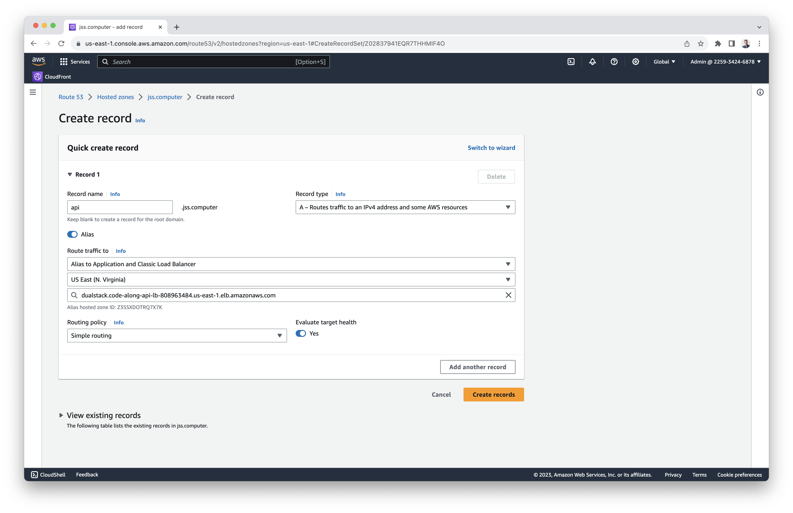
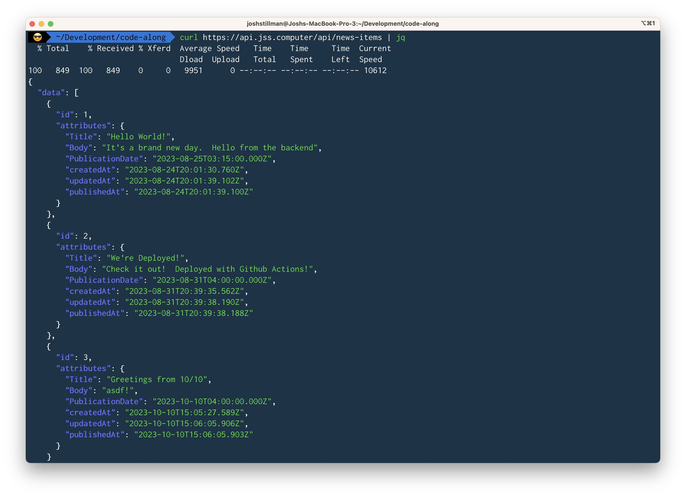
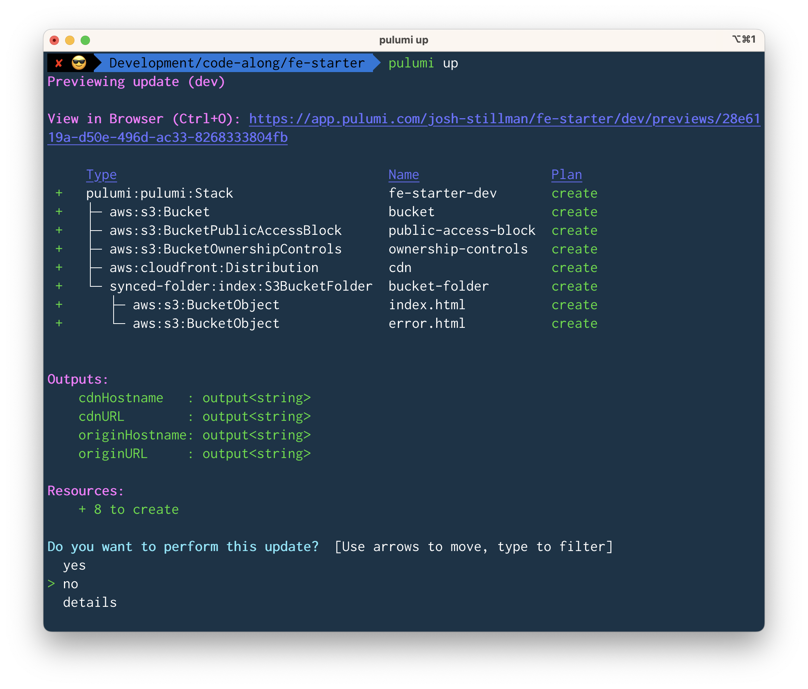

# DevOps for TypeScript Developers <!-- omit from toc -->

Welcome to DevOps for TypeScript Developers!  In this tutorial, we'll learn DevOps fundamentals by deploying a full-stack web app with AWS, Next.js, and Strapi. We'll deploy our first environment through the AWS console to learn the concepts, then we'll deploy our second environment using Pulumi, an infrastructure as code tool for TypeScript.  The app we'll deploy may be simple, but we'll learn most of the fundamental building blocks of AWS along the way.

This repo contains the Pulumi infrastructure code, and the course materials are below.  The frontend repo is [here](https://github.com/josh-stillman/devops-for-typescript-devs-frontend), and the backend repo is [here](https://github.com/josh-stillman/devops-for-typescript-devs-backend).

- [Introduction](#introduction)
  - [Why Learn DevOps as a Developer?](#why-learn-devops-as-a-developer)
  - [The Application](#the-application)
  - [Architecture](#architecture)
    - [Frontend](#frontend)
    - [Backend](#backend)
  - [Why AWS?](#why-aws)
  - [First Principles](#first-principles)
    - [Principle of Least Privilege](#principle-of-least-privilege)
    - [Tradeoffs and Cost](#tradeoffs-and-cost)
      - [AWS Free Tier](#aws-free-tier)
  - [Game Plan](#game-plan)
- [Build the Frontend Locally](#build-the-frontend-locally)
  - [Why Next.js](#why-nextjs)
  - [Create Next project](#create-next-project)
    - [Setup your project and GitHub Repository](#setup-your-project-and-github-repository)
    - [Create your first route](#create-your-first-route)
    - [Build a static site for production](#build-a-static-site-for-production)
- [Setup your AWS account](#setup-your-aws-account)
  - [A note on AWS Regions](#a-note-on-aws-regions)
  - [Sign up](#sign-up)
  - [Setup billing alerts](#setup-billing-alerts)
  - [Create account alias](#create-account-alias)
  - [Setup MFA](#setup-mfa)
  - [Create our Admin user](#create-our-admin-user)
  - [Login as Admin and add MFA](#login-as-admin-and-add-mfa)
- [Register a domain](#register-a-domain)
- [Upload our frontend build directory to s3](#upload-our-frontend-build-directory-to-s3)
  - [Create a bucket for your site](#create-a-bucket-for-your-site)
  - [Add a bucket policy allowing access](#add-a-bucket-policy-allowing-access)
  - [Upload our frontend assets](#upload-our-frontend-assets)
  - [Enable Static Website Hosting](#enable-static-website-hosting)
- [Setup the AWS CLI](#setup-the-aws-cli)
- [Setup Route 53 (DNS)](#setup-route-53-dns)
- [Setup HTTPS with ACM](#setup-https-with-acm)
- [Setup CloudFront (CDN)](#setup-cloudfront-cdn)
  - [Create CloudFront Distribution](#create-cloudfront-distribution)
    - [Origin and Origin Access Control](#origin-and-origin-access-control)
    - [Default Cache Behavior and Web Application Firewall](#default-cache-behavior-and-web-application-firewall)
    - [Settings](#settings)
  - [Custom Error Response](#custom-error-response)
  - [Update Bucket Policy](#update-bucket-policy)
  - [Double-check behavior](#double-check-behavior)
  - [Seal off your bucket](#seal-off-your-bucket)
- [Setup routing with Lambda@Edge Function](#setup-routing-with-lambdaedge-function)
  - [Create Function](#create-function)
  - [Create Role](#create-role)
  - [Create Trigger](#create-trigger)
    - [Origin vs. Viewer Request Triggers](#origin-vs-viewer-request-triggers)
  - [Test it](#test-it)
- [Frontend CI/CD pipeline](#frontend-cicd-pipeline)
  - [Create Pipeline User](#create-pipeline-user)
    - [Create Policy](#create-policy)
    - [Create User](#create-user)
    - [Create Access Key](#create-access-key)
  - [Update s3 Bucket Policy](#update-s3-bucket-policy)
  - [Create the GitHub Action](#create-the-github-action)
    - [Add Secrets to Frontend GitHub Repo](#add-secrets-to-frontend-github-repo)
    - [Push and Test](#push-and-test)
  - [Summing up the Frontend](#summing-up-the-frontend)
- [Setup Strapi Locally](#setup-strapi-locally)
  - [Bootstrap Strapi](#bootstrap-strapi)
  - [Create GitHub Repo](#create-github-repo)
  - [Dockerize Strapi](#dockerize-strapi)
    - [Create Dockerfile](#create-dockerfile)
    - [Add .dockerignore](#add-dockerignore)
    - [Test Docker Locally](#test-docker-locally)
- [Setup Elastic Container Registry (ECR)](#setup-elastic-container-registry-ecr)
  - [Push your image](#push-your-image)
- [Setup Secrets Manager](#setup-secrets-manager)
- [Setup ECS Service and Load Balancer](#setup-ecs-service-and-load-balancer)
  - [Create a Cluster](#create-a-cluster)
  - [Create a Task Definition](#create-a-task-definition)
    - [Intrastructure Requirements](#intrastructure-requirements)
    - [Container Definition](#container-definition)
    - [Environment Variables](#environment-variables)
  - [Allow ECS to Access Secrets](#allow-ecs-to-access-secrets)
  - [Create an ECS Service](#create-an-ecs-service)
    - [Environment](#environment)
    - [Deployment Configuration](#deployment-configuration)
    - [Networking](#networking)
      - [VPC](#vpc)
      - [Subnets and Availability Zones](#subnets-and-availability-zones)
      - [Security Groups](#security-groups)
      - [Setup](#setup)
    - [Load Balancing](#load-balancing)
  - [Update Healthcheck settings](#update-healthcheck-settings)
  - [Restrict Public Access to ECS Service](#restrict-public-access-to-ecs-service)
    - [Create Load Balancer Security Group](#create-load-balancer-security-group)
      - [IPv4 vs. IPv6](#ipv4-vs-ipv6)
      - [CIDR Blocks](#cidr-blocks)
    - [Attach Security Group to Load Balancer](#attach-security-group-to-load-balancer)
    - [Update ECS Security Group](#update-ecs-security-group)
- [Setup API DNS](#setup-api-dns)
- [Setup Backend CI/CD](#setup-backend-cicd)
  - [Create Backend Pipeline User](#create-backend-pipeline-user)
    - [Create Policy](#create-policy-1)
    - [Create User](#create-user-1)
    - [Create Access Key](#create-access-key-1)
  - [Commit Task Definition](#commit-task-definition)
  - [Add GitHub Action](#add-github-action)
  - [Add Backend Secrets to GitHub](#add-backend-secrets-to-github)
  - [Test](#test)
- [Call API from the Frontend](#call-api-from-the-frontend)
  - [Create Newsfeed component](#create-newsfeed-component)
  - [Add GitHub Environment Variables](#add-github-environment-variables)
  - [Test](#test-1)
- [Wrapping up Deploying Through the AWS Console](#wrapping-up-deploying-through-the-aws-console)
- [Enter Pulumi](#enter-pulumi)
  - [Infrastructure as Code](#infrastructure-as-code)
  - [Infrastructure as ***Code***](#infrastructure-as-code-1)
  - [Gameplan](#gameplan)
- [Install Pulumi](#install-pulumi)
- [Create Infrastructure Repo](#create-infrastructure-repo)
  - [Create Pulumi account](#create-pulumi-account)
  - [Follow the Prompts](#follow-the-prompts)
  - [Git](#git)
  - [Linting and Formatting](#linting-and-formatting)
  - [Take a Look at the Code](#take-a-look-at-the-code)
    - [Asynchronous Outputs and Inputs](#asynchronous-outputs-and-inputs)
    - [Unwrapping Outputs](#unwrapping-outputs)
  - [Deploy Hello World Page](#deploy-hello-world-page)
    - [Stack Outputs](#stack-outputs)
- [Frontend DNS and SSL](#frontend-dns-and-ssl)
  - [Pulumi Configuration](#pulumi-configuration)
  - [Add Domain to CloudFront Distribution](#add-domain-to-cloudfront-distribution)
  - [Add Route 53 Record for Subdomain](#add-route-53-record-for-subdomain)
  - [Get Existing SSL Certificate](#get-existing-ssl-certificate)
    - [Unwrap the Certificate ARN](#unwrap-the-certificate-arn)
  - [Add SSL Certificate to CloudFront](#add-ssl-certificate-to-cloudfront)
  - [Add Stack Output for URL and Deploy](#add-stack-output-for-url-and-deploy)
- [Restrict Public Access to s3](#restrict-public-access-to-s3)
  - [Public Access Block](#public-access-block)
  - [Add Bucket Policy](#add-bucket-policy)
    - [Attach Policy to Bucket](#attach-policy-to-bucket)
  - [Setup OAC](#setup-oac)
  - [Deploy](#deploy)
- [Add Lambda@Edge Routing](#add-lambdaedge-routing)
  - [Add Handler Function](#add-handler-function)
  - [Add permissions](#add-permissions)
  - [Create Lambda](#create-lambda)
  - [Attach Function to CloudFront](#attach-function-to-cloudfront)
  - [Deploy and Test](#deploy-and-test)
- [A Note on Pulumi Refresh](#a-note-on-pulumi-refresh)
  - [A note on editing resource names](#a-note-on-editing-resource-names)
- [Dev Frontend CI/CD](#dev-frontend-cicd)
  - [Delete Bucket Sync](#delete-bucket-sync)
  - [Create Pipeline User](#create-pipeline-user-1)
  - [Update Bucket Policy](#update-bucket-policy-1)
  - [Setup GitHub Actions Environments](#setup-github-actions-environments)
    - [Setup Production](#setup-production)
    - [Setup Dev](#setup-dev)
  - [Extract Reusable Workflow](#extract-reusable-workflow)
  - [Setup Calling Workflows](#setup-calling-workflows)
  - [Show Current Environment on Frontend](#show-current-environment-on-frontend)
  - [Push Your Code and Test](#push-your-code-and-test)
    - [Update error page](#update-error-page)
- [Wrapping up Pulumi Frontend Code](#wrapping-up-pulumi-frontend-code)
- [Pulumi Backend Setup](#pulumi-backend-setup)
  - [Checkout the Pulumi ECS Starter](#checkout-the-pulumi-ecs-starter)
  - [Create a Backend Function](#create-a-backend-function)
  - [Setup ECR Repo](#setup-ecr-repo)
  - [Push Image to Repo](#push-image-to-repo)
- [Setup Secrets Manager](#setup-secrets-manager-1)
  - [Create secrets file](#create-secrets-file)
  - [Create secrets manager](#create-secrets-manager)
- [Create ECS Service](#create-ecs-service)
  - [Create Cluster](#create-cluster)
  - [Create Task Definition](#create-task-definition)
    - [Reference latest image](#reference-latest-image)
    - [Add Task Definition](#add-task-definition)
    - [Allow Task Execution Role to access Secrets](#allow-task-execution-role-to-access-secrets)
  - [Create Load Balancer](#create-load-balancer)
  - [Create ECS Service Security Group](#create-ecs-service-security-group)
  - [Create ECS Service](#create-ecs-service-1)
- [Add Backend DNS](#add-backend-dns)
- [Add Stack Outputs](#add-stack-outputs)
- [Deploy Dev Backend Infrastructure](#deploy-dev-backend-infrastructure)
- [Add Dev Backend CI/CD](#add-dev-backend-cicd)
  - [Create Backend Pipeline User](#create-backend-pipeline-user-1)
  - [Setup Environments and Add Secrets to GitHub](#setup-environments-and-add-secrets-to-github)
  - [Setup Reusable Workflow](#setup-reusable-workflow)
  - [Commit Dev Task Definition](#commit-dev-task-definition)
  - [Push and Test](#push-and-test-1)
- [Tearing Down](#tearing-down)
- [Conclusion](#conclusion)
  - [Next Steps](#next-steps)


# Introduction

Welcome to DevOps for TypeScript Developers!  The goal of this tutorial is to gain practical DevOps experience by building and deploying a full-stack web app on Amazon Web Services (AWS), using TypeScript to create both our application and our infrastructure.

In this tutorial, we'll create and deploy a full stack application using Next.js to build a static frontend, and Strapi, a headless CMS, to serve as our backend.  We'll Dockerize Strapi, then we'll set up CI/CD pipelines with GitHub Actions.  We'll deploy our application's first environment through the AWS console to gain familiarity with the concepts.  Then we'll deploy a second development environment using Pulumi, an infrastructure-as-code framework that lets us use TypeScript to create cloud infrastructure.  We'll see how a tool like Pulumi can give us much more power and control when building cloud infrastructure.

The app we'll build is very simple. But this will allow us to focus on deployment, and learn most of the fundamental building blocks of AWS along the way.  We'll learn the basics of how to deploy frontend static assets with a CDN, how to setup DNS routing with HTTPS, how to deploy containerized server-side applications, how to route traffic using load balancers, how to secure our resources using security groups, how to manage users and permissions, how to manage secrets, how to setup CI/CD pipelines, and how to use Infrastructure as Code tools.  These tools and concepts will provide a foundation to deploy any modern web app on any cloud provider.

The course is more practical than theoretical. These are deep topics, but they will be presented as simply as possible here so we can focus on building.  I'll include some links to other great resources that will let you dive deeper and learn more about the concepts.  But I've found there's a huge gap between a conceptual understanding of these topics and actually hacking through the weeds to deploy a real application.  My hope is that this course demystifies DevOps and provides a practical foundation to start deploying your applications to the world.

## Why Learn DevOps as a Developer?

If we want our applications to reach our users, we have to deploy them!  It's a fact of life.  There are services with an amazing developer experience that will let you do this with very little work, like Netlify, Vercel, or Heroku (often called Platform as a Service or PaaS services). You click a few buttons, link up your GitHub repo, and the service takes care of the rest.

These services are great, but they come with big tradeoffs.  You give up a tremendous amount of control to the platform.  For complex applications, you often need that control to accomplish your goals.  For example, I built a mailing list sign-up website with a serverless backend on Netlify a few years ago and very quickly ran up against the limitations imposed by the platform.  It was easier to get up and running, but harder in the long run.

These services are also expensive at scale.  They are effectively reselling you AWS resources at a markup in exchange for a (much) nicer developer experience.  For client projects, cost concerns generally require us to use AWS or one of its competitors. Thus, if you want to understand how client projects are deployed to production, and perhaps do that deployment yourself or be able to improve the infrastructure, you need to understand how cloud platforms work. These Infrastructure as a Service (IaaS) platforms like AWS provide the low-level building blocks to host your application in the cloud, providing greater control but with a steeper learning curve.

There may not always be a dedicated DevOps engineer on a project, in which case the developers need to own the deployment.  But even if there are dedicated DevOps engineers, having an understanding of how all the moving pieces fit together is a huge asset as a developer.  As you plan your application's architecture, understanding how it will be deployed is a must to have an informed conversation with the DevOps team and make the best decisions.

And understanding DevOps can help tremendously with debugging your application in production.  I remember on a client project we faced a mysterious bug where the same API endpoint would return a different price for an item, seemingly at random.  This wasn't happening locally.  It turned out that there were two instances of the backend deployed into production behind a load balancer, and each had cached a different price in memory.  Understanding the deployed architecture made all the difference for the developers in fixing this bug.

I won't lie-standing up cloud infrastructure can be pretty tedious at first compared to writing application logic.  There are a lot of gotchas and foot-guns; forgetting small details like extra colons at the end of your secret manager URI can break your entire app. Debugging is generally slow because of the slow feedback loop between deploying and receiving an error message.  Documentation can be lacking or unclear.  But despite all that, it's incredibly rewarding and powerful to be able to deploy your application to the world.

My goal here is to make DevOps more accessible to Typescript developers, remove a lot of that initial pain of getting started (I already felt it for you!), and let you get up and running.  Using a tool like Pulumi lets us leverage everything we love about TypeScript and start to get a tighter feedback loop and greater control as we write our infrastructure code.

## The Application

The frontend will start out as a simple hello world page that shows the current environment.  It will be statically rendered using Next.  There will be two routes, the main page at `/` and a second page at `/foo`, so we can get a handle on routing.

The frontend will display items from a "news feed."  On the client, the app will make a call to our Strapi backend, which will serve the latest news items.  Strapi provides an admin dashboard allowing us to add more items and see them reflected on our frontend in real time.

## Architecture


Our application might not look like much, but there's a lot of complexity involved in getting it deployed to the cloud.  At a high level, here are all the moving pieces:

### Frontend

- Requests come in from the browser to our domain (for me, https://jss.computer  - a dev site that was available using my initials 😆). Route 53 routes those requests to our CloudFront Distribution.
  - Requests are served via https, using a SSL certificate provisioned in ACM.
- Cloudfront globally distributes our app for faster load times around the world.
- A Lambda@Edge Function is used to route requests correctly to our HTML files.
- Cloudfront accesses our static assets in an s3 bucket and returns them to the user (and caches them for faster load times for future users).
- Our s3 Bucket is sealed off from the public Internet for greater security, and only Cloudfront can access it through an "Origin Access Control," which is a special Authorization header.
- CI/CD: When new code is merged to our deployed branch in our GitHub repo, the GitHub Actions CI/CD pipeline replaces the old static assets with the new ones in our s3 Bucket.  It creates a Cloudfront "invalidation" telling Cloudfront to fetch the new assets from our s3 bucket on the next user request.

### Backend

- Requests to our backend come into a subdomain on our domain (https://api.jss.computer for me), again served on https using the same SSL certificate.
- Route 53 routes traffic to an Application Load Balancer (ALB), which we're using here primarily for routing.
- The ALB routes traffic to Elastic Container Service (ECS).
- Our ECS Service starts our Docker container for us.  It pulls the Docker image from Elastic Container Registry (ECR), and secrets from Amazon Secrets Manager, then starts a container as an ECS "Task."
- The request is routed to our Strapi backend, running in a Docker container as an ECS Task, and it responds to the request.
- Using Security Groups, ECS only accepts traffic from the Load Balancer.
- CI/CD: When new code is merged to our deployed branch in our backend Github Repo, the GitHub Actions CI/CD pipeline creates a new Docker image from the new code, pushes it up to our ECR repo, then edits our ECS Service to point to the newest image, triggering a redeployment of our Task.

## Why AWS?

You could do this course with any of the major cloud providers, and Pulumi allows you to use any of them.  I chose AWS because it is the most established and still has the [largest market share](https://www.statista.com/chart/18819/worldwide-market-share-of-leading-cloud-infrastructure-service-providers/), so you're more likely to encounter it.

## First Principles

### Principle of Least Privilege

One overriding principle you'll see in the diagram above and throughout the course is the [Principle of Least Privilege](https://www.techtarget.com/searchsecurity/definition/principle-of-least-privilege-POLP).  For security purposes, we want to provide the [bare minimum of access](https://docs.aws.amazon.com/IAM/latest/UserGuide/best-practices.html?ref=wellarchitected#grant-least-privilege) to accomplish our goals.  If we lose control of an access key to a hacker, we want to limit the blast radius. And hackers will exploit open ports and publicly accessible resources, so we want to lock our resources down as much as possible and require traffic to flow through only a single permitted entrypoint.  Some examples:

- When we create an access key for our CI/CD pipeline, we don't want to let it mess with every resource in our account-we want to limit it to only the necessary actions to get the job done, only on the individual resources it needs access to, and only in one environment.
- We don't want to use our root user (used for billing) to do our general admin tasks like creating resources, so we create an admin user with more limited privileges.
- When we expose our application to the Internet, we want to do so through a single point of entry, for control and monitoring.  We don't want to expose our s3 Bucket directly to the public Internet, but rather only allow access to our static assets through our Cloudfront distribution.
- We don't want to expose our backend ECS task directly to the public Internet either; instead we want to allow access only from our load balancer and only on the specified port.

AWS reflects this principle in its permissions model, which generally prohibits access to resources unless explicitly granted.  This is where a lot of the complexity comes in-you'll likely spend time debugging setting up the necessary permissions to accomplish your task.

### Tradeoffs and Cost

Every decision in DevOps comes with tradeoffs, often involving cost.  We can spend the time to stand up our own ECS cluster using our own EC2 virtual machines (more effort), or have AWS do it for us with Fargate (more cost).  We can let AWS assign a public IP to our ECS task so it can access other AWS resources through the public internet (less secure), or set up private VPC endpoints so that traffic doesn't leave Amazon's private network (more effort and cost).  We already discussed the tradeoffs between a service like Netlify (better experience, higher cost) and a lower-level service like AWS (greater control, lower cost).  The list goes on.  The challenge is to make the right tradeoff for your application's needs.

#### AWS Free Tier

The AWS [free tier](https://aws.amazon.com/free) is pretty generous for your first year.  Lots of services are covered up to a large amount of usage, but some other services aren't covered at all (mainly Fargate for our purposes).

I'll try to keep us within the AWS free tier as much as possible here, but doing so entirely is very difficult (see this meme).  You should be able to register a domain for $12, and if you tear down your infrastructure after the tutorial, the remaining costs should be well under $10.


## Game Plan

Here's the game plan:

- Setup a first environment (production) with the AWS console.
  - Build our frontend locally with Next and set up our GitHub repo.
  - Set up our AWS account.
  - Deploy our frontend through the AWS console.
  - Setup our frontend CI/CD pipeline.
  - Build our backend locally with Strapi and Docker, and set up our GitHub repo.
  - Deploy our backend through the AWS console.
  - Setup our backend CI/CD pipeline.
- Setup a second environment (development) with Pulumi.
  - frontend
  - backend
  - Multiple environments in our GitHub repos.

# Build the Frontend Locally

Let's start with building our frontend so we have something to deploy!

## Why Next.js

We'll be using Next.js to build our frontend, which is a framework built on top of React that provides things like routing and server-side rendering out of the box.  The official React docs [recommend](https://react.dev/learn/start-a-new-react-project) using a framework like Next.js for production applications, and it is becoming broadly adopted by the React community.

Compared to vanilla React app with create-react-app, Next provides much greater control over how your application is rendered.  Vanilla React is rendered on the client-only an empty HTML file is sent to the browser, the React app attaches to an empty div, and renders the entire application with JavaScript.  This poses challenges for SEO, since web crawlers may not render the JavaScript when indexing your site.  It also can lead to slower page loads for users.

> The body of a vanilla React app's `index.html` is just:
> ```html
>  <body>
>    <noscript>You need to enable JavaScript to run this app.</noscript>
>    <div id="root"></div>
> </body>
> ```
> ... Not very informative to web crawlers that might not execute JavaScript!

Next allows much more granular control over where and when your application and its components are rendered.  You can statically render pages to HTML at build time when the content changes infrequently, for the best performance.  You can server-render pages at request time if content changes frequently and SEO and fast page-loads are still important (think of e-commerce sites).  And you can also client-render pages and components for dynamic or interactive content, though Next encourages you to client-render [as little as possible](https://nextjs.org/docs/app/building-your-application/rendering/composition-patterns#moving-client-components-down-the-tree).

To avoid setting up a server for our frontend, we'll primarily statically-render our site to HTML at build time, and reap all the SEO and performance benefits.  Our app will be built as static assets, just like a vanilla React site, so that we can serve it globally on a CDN for fast loads world-wide. But we'll also fetch frequently changing data from our backend and display it in a client-rendered news feed component.

Check out the excellent [Next docs ](https://nextjs.org/learn/foundations/about-nextjs) for a deeper dive on these concepts.  To go even deeper, Josh Comeau's [The Joy of React](https://www.joyofreact.com/) course also has some excellent Next content.

## Create Next project

### Setup your project and GitHub Repository

- Run `npx create-next-app@latest` to bootstrap the app.
- Setup linting and auto-format on save.  Shameless plug for my [lintier](https://github.com/josh-stillman/lintier) npm package, which will do it for you!
  - Run `npx lintier` in the project directory, and don't install airbnb's style guide for now.
  - Turn on auto formatting on save in your VS Code settings.json file, by adding `"editor.codeActionsOnSave": { "source.fixAll": true },`
  - Fix the linting errors in the boilerplate Next starter with `npm run lint:fix`.
- Add your first git commit, and create a [new GitHub repo](https://github.com/new).  Follow the instructions to add the git remote and push up.


### Create your first route

Next provides file-based routing out of the box.  We create new routes and pages by creating new subdirectories in the Next `/app` directory, containing a file named `page.tsx`.  So if we want to create a new page at `/foo`, we add a this new directory and file: `app/foo/page.tsx`.

We're going to create one additional route, so we can learn how to deploy an app with multiple routes. One of the main challenges in getting our frontend deployed comes in handling routing correctly, as we'll see.

- Add the new directory and file: `app/foo/page.tsx`.  It can just say hello world for now.
    ```typescript
    export default function Foo() {
        return <h1>hello world from the foo page!</h1>;
    }
    ```
- On your root page (at `app/page.tsx`), add a link to your new page.  Next's `Link` component handles client-side routing and provides a SPA-like experience, similar to a vanilla React app with React Router.
    ```typescript
    <Link href="/foo">go to foo page!</Link>
    ```

### Build a static site for production

We need to let Next know that we want to build a static site, rather than host our app on a server.  This limits the functionality we have access to (like SSR, of course), but it allows for easier, more lightweight deployment and hosting.  We'll just be uploading static HTML, CSS, and JS assets to a server, where they can be served quickly and cheaply by a CDN, with little effort on our part.

- Setup [static exports](https://nextjs.org/docs/app/building-your-application/deploying/static-exports) in `next.config.js` by adding
    ```typescript
    const nextConfig = {
        output: 'export',
    };

    ```
- Run `npm run build`.  The output shows which files were statically generated with ` ○ (Static)`.
- Checkout the `./out` directory with our built files.  You'll see that, instead of the single empty html file we'd get with a vanilla React App, we get two html files that contain all the content.  This is what enables search engines to easily crawl our site and provides for [quick page loads](https://nextjs.org/docs/app/building-your-application/rendering/server-components#benefits-of-server-rendering) (more specifically, a fast [First Contentful Paint](https://web.dev/fcp/)).
    ```html
    <body class="__className_20951f">
        <h1>hello world from the foo page!</h1>
        ...
    </body>
    ```
- Run the production build of your app by adding and running this script in your `package.json`: `"serve-static": "npx serve ./out",`

# Setup your AWS account

Now it's time to get our frontend deployed!  To go further in depth on a lot of the following issues, I recommend checking out Steve Kinney's great Frontend Masters course [AWS For Front-End Engineers](https://frontendmasters.com/courses/aws-v2/).

Setting up an AWS account is a bit more complex than you might think. We'll need to:
- create the account
- setup billing notifications so we know when we've gone beyond the free tier.
- setup multi-factor authentication (MFA) for our root user.
- create an Admin user and setup MFA.

We'll only use our root user for things like billing.  Any creation of cloud resources will be done with our Admin user instead.  This is a security best practice and limits the damage that could be done if our Admin credentials were compromised.

## A note on AWS Regions

AWS has many "regions" around the world in which your cloud infrastructure can live (these correspond to groups of physical data centers).  They are designed to be [isolated and independent](https://docs.aws.amazon.com/AmazonRDS/latest/UserGuide/Concepts.RegionsAndAvailabilityZones.html) from each other for fault tolerance.

There are a few things that *must* be in the us-east-1 Region in North Virgina, like CloudFront distributions and SSL certificates.  To make our lives easier, we'll use us-east-1 for everything.

If for some reason you don't see your resources in the console, make sure the us-east-1 region is selected in the dropdown.

## Sign up

Sign up will require a personal credit card.  We'll mostly be within the free tier, but not entirely.  The costs we'll incur should be quite low-$12 or so to register a domain, and under $10 for our infrastructure if you tear it down after building it.  It's a worthwhile investment to learn valuable skills!

- Go to https://aws.amazon.com/
- Click the sign up button in the nav bar.
- Enter your personal email and account name.
- Get the verification code from your email (it might be in spam).
- Enter your root password.
- Enter your personal info.
- Enter your credit card.
- Verify with SMS (try the voice captcha option if you have trouble reading the captcha).
- Choose the basic plan.

## Setup billing alerts

While we can't tell AWS not to do anything that costs money, we can at least set up some notifications to alert us if we go outside of the free tier.

- Navigate to the billing page by typing “billing” in text box.  This is an easy way to navigate through AWS's many services.
- Go to billing preferences.
- Go to alert preferences.
  - Choose AWS Free Tier alerts.
  - Choose PDF invoices.
- Go to budgets
  - Click create budget, then select the zero spend budget.

## Create account alias

- Go to your console dashboard and choose create account alias.  This provides an easy to remember name for your account instead of the autogenerated name.

## Setup MFA

Let's secure our console access with Multi-Factor Authentication(MFA).

- Search for IAM in the text bar.  [IAM](https://aws.amazon.com/iam/) is the AWS service where we create and manager users and their access keys.  We'll be spending a fair amount of time with it.
- Setup 2FA for your root user.  I used the Google Authenticator app.

## Create our Admin user

We've got our root user setup, so now let's create an Admin user that we'll use for the rest of the course.  The root user will only be used for billing.

- In IAM, choose users, then the add user button.

- Add a username of Admin, provide access to the console, and choose create IAM user.  Create a custom password.  Since it's a user for us, we won't create a temporary password.


- Next, set the permissions. Choose attach policies directly, then search for admin and choose AdministratorAccess.  Push the + button to see the policy JSON, and you'll see it's as permissive as possible: this user can do everything to everything.


- Hit the next button.  No need to add tags, which are mainly used for tracking and classifying resources.  Hit create user.

## Login as Admin and add MFA

- Lot out of root and log in as the Admin user we just created.
- Add MFA for this user (under the Security Credentials tab).  Choose a different phone name (you can use the same phone number and just append -admin to the name).

With that, our account is set up and we can start building our infrastructure!

# Register a domain

Let's start by registering a domain, so that it has time to propagate by the time we need it.

Go to [Route 53](https://us-east-1.console.aws.amazon.com/route53/v2/home#Dashboard), the AWS DNS service used for registering and managing domain names.

- Register a domain name for the course.  The cheapest ones seem to be about $12.
- I went with `jss.computer`, one of few sites with my initials available.
- Make sure privacy protection is on (the default) or your info will be public.

# Upload our frontend build directory to s3

AWS [s3](https://aws.amazon.com/s3/) is the basic service used for storing files.  We can use a s3 "bucket" to store our frontend assets and serve them up to the world.  The [free tier](https://aws.amazon.com/free) provides 5 gigs of storage.

s3 is a key/value store for names (file names) and "objects" (aka files).  They're stored in a flat hierarchy, though you can add directory paths to your file names if you want.

## Create a bucket for your site

- Click create bucket.
- Use your website's name for the bucket name.
- Turn off ACLs (default option).
- Unclick the Block all public access checkbox.  This will allow us to host our website directly from our bucket.  We'll turn this off later on in the course as our infrastructure gets more sophisticated.
- Keep all other default options, including disabling versioning, which we won't need for our purposes.


## Add a bucket policy allowing access

Next, we need to setup a policy allowing access to our bucket.  Policies in AWS specify *who* can take an action (the principal), *what* actions they can perform, and *to which* resources.  Resources are often referred to by their ARN ([Amazon Resource Name](https://docs.aws.amazon.com/IAM/latest/UserGuide/reference-arns.html)), which are unique identifiers for cloud resources in AWS.  We'll be working with Policies and ARNs a lot.

- Go to your bucket, then the Permissions tab, then click the edit button on the Bucket Policy.
- You can create a policy JSON document with the AWS [policy generator](https://awspolicygen.s3.amazonaws.com/policygen.html).
- Here, we want to let everyone access our bucket for now.
- Choose s3 Bucket policy from the dropdown.
- Choose `*` for the principal, meaning we want the policy to apply to everyone.
- For actions, search for GetObject.
- For the ARN (Amazon Resource Name), copy the ARN from your bucket under the Properties tab.
- For the ARN, you need to add `/*` at the end, meaning all objects within the bucket.
- Your policy should look like this:
    ```json
    {
        "Id": "Policy1696532170133",
        "Version": "2012-10-17",
        "Statement": [
            {
                "Sid": "Stmt1696532167778",
                "Action": [
                    "s3:GetObject"
                ],
                "Effect": "Allow",
                "Resource": "arn:aws:s3:::jss.computer/*",
                "Principal": "*"
            }
        ]
    }
    ```

- Copy this policy and paste it in to the bucket policy field.

## Upload our frontend assets

- Go to the Objects tab and click upload.
- Click add files, and upload everything from the `/out` directory.
  - If you choose upload entire directory instead, you'll have every file prefixed with the directory name.
- Click add folder and upload the `/_next` subdirectory folder in `/out`.
- After uploading, click on the `index.html` object, then click the Object URL link (something like `https://s3.amazonaws.com/jss.computer/index.html`).  We're officially on the Internet! 🎉

## Enable Static Website Hosting

- We'll setup s3 to host our website directly at first.  In the bucket properties tab, scroll down to the bottom and edit the Static website hosting property.
- Click enable.
- Choose `index.html` for the index document (go figure), and choose `404.html` as the error page.  `404.html` is the 404 page automatically generated by Next.


- Back in the bucket properties tab, go to the URL in the static website hosting section (should be something like `http://test-jss-computer.s3-website-us-east-1.amazonaws.com`).

Kick the tires a bit here.  You'll see that linking between our pages works.  But refreshing at `/foo` doesn't work, and we get the 404 page (we'll fix this).  Try going to a nonexistent page and you should correctly see the 404 page.

Cool!  We've got a website up, but there are a lot of improvements left.  We're on http instead of https, and our browser says our site isn't secure.  The url is pretty gross.  The files are only hosted in one AWS region rather than globally.  And we had to manually upload the files.  Let's fix all that stuff!

# Setup the AWS CLI

Let's take a minute to set up the AWS CLI.  It's useful for all kinds of things, like listing the resources in our account.  And we'll need to have the AWS CLI configured locally so Pulumi can manage our infrastructure for us later in the course.

- Install the [AWS CLI](https://aws.amazon.com/cli/).
- Generate an access token for your admin user. IAM → User → Security Credentials → Create Access Key.
- Copy paste both public key and secret.  Keep them somewhere safe and secure.  You can only view these credentials once, so make sure you copy them before navigating away.
- In your terminal, run `aws configure`.
  - Add your credentials.
  - Select us-east-1 for your region.
  - Select JSON for output.
- Give it a try!  Run this command with your bucket name to list the files in it. `aws s3 ls s3://jss.computer`.

# Setup Route 53 (DNS)

Let's point our domain name to our s3 bucket.

- Go to route 53 → Click Hosted Zone → click your zone → click create record.
- Hit the Alias toggle.
- Choose alias to s3 website endpoint.
- Choose us-east-1.
- Auto-fill the endpoint from the drop-down.
- Click create record.


- Go to your domain (on HTTP) and test it out!  (You may need to wait a little bit for the changes to propagate).

# Setup HTTPS with ACM

Now, let's serve our site securely with HTTPS.  For that, we'll need a TLS certificate that authenticates our site.  We can provision one in the [Amazon Certificate Manager (ACM)](https://us-east-1.console.aws.amazon.com/acm/home?region=us-east-1#/welcome).  For more on HTTPS and how it works, see [these](https://www.cloudflare.com/learning/ssl/what-is-https/) [resources](https://www.keyfactor.com/blog/what-is-tls-handshake-how-does-it-work/).

- Go to AWS Certificate Manager, and MAKE SURE you’re in us-east-1.  Only those certificates can be used with CloudFront.
- Click request certificate → request public certificate.
  - Add both the main domain name and a wildcard subdomain in Fully Qualified Name.  This will let us use this certificate for our main site as well as our subdomains (like `dev.jss.computer` and `api.jss.computer`).
  - For example, both `jss.computer` and `*.jss.computer`.
- Click request certificate.


- Click the blue banner saying further action needed.
- Under domains, click "create record in Route 53."  This record proves to the certificate authority that you do in fact own the domain.

HTTPS won't work with our s3 bucket just yet.  We'll have to setup CloudFront first.

# Setup CloudFront (CDN)

[CloudFront](https://aws.amazon.com/cloudfront/) is a Content Delivery Network (CDN) that globally distributes our site for faster loads world-wide.  Right now our files are *only* hosted in Virginia.  If someone from Australia goes to our site, they are going to have a much longer load time than someone on the East Coast.

We can solve this problem with a CDN, which will put copies of our files on many "edge servers" located around the world.  When the first user from Australia goes to our site, CloudFront will intercept the request, fetch it from Virginia, cache it on an edge server in Australia, and return it to that user.  When the *next* user from Australia goes to our site, the Australian edge server will have our assets and will return it much quicker, without needing to go back to Virginia!  CloudFront "uses a [global network](https://aws.amazon.com/cloudfront/features/?whats-new-cloudfront.sort-by=item.additionalFields.postDateTime&whats-new-cloudfront.sort-order=desc#Global_Edge_Network) of 550+ Points of Presence and 13 regional edge caches in 100+ cities across 50 countries."  I told you DevOps was powerful stuff!


We'll create a CloudFront "distribution" to distribute our site.  Later, when we setup our CI/CD pipeline, we'll setup CloudFront "invalidations," which tell the edge servers to fetch the new assets from the "origin" server in Virgina (our s3 bucket) on the next request.

## Create CloudFront Distribution

- Go to CloudFront
- Click Create Distribution

### Origin and Origin Access Control

- Choose your s3 Bucket under Origin Domain.  It will recommend that you use the bucket's website endpoint, but don't click the button.  This will allow us to secure the origin later and only allow access through CloudFront.
- Under Origin Access, select Origin Access Control (OAC), then click the Create control setting button.

An OAC is a security measure that allows CloudFront to access a non-public bucket.  It does so through a custom Authorization header signed by CloudFront.  See [here](https://aws.amazon.com/blogs/networking-and-content-delivery/amazon-cloudfront-introduces-origin-access-control-oac/) for more.

To use the OAC, we'll have to update our bucket policy after creating our distribution.


### Default Cache Behavior and Web Application Firewall

- Keep all the defaults *except* choose "Redirect HTTP to HTTPS" so our site is only available on HTTPS.
- Don't enable the WAF (it costs $).


### Settings

- Under alternate domain names, enter both your domain and your domain with the www prefix: `jss.computer` and `www.jss.computer`.
- Select your SSL certificate from the drop-down.  If you don't see it, you may have created it in the wrong region!
- For the default root object, choose `index.html`.
- Click Create distribution.


## Custom Error Response

We need to tell CloudFront how to handle errors.  Go to your distribution, click the Error Pages tab, then Create custom error response.

- Choose 404: Not found
- Keep the default TTL.
- Customize the error response to use `/404.html` and the 404 code.  Note the leading slash, which (confusingly) is required here but not when specifying index.html as the root object.
- Save Changes.


## Update Bucket Policy

Go back to your s3 bucket and then to the Permissions tab.  Under Bucket Policy, click Edit.

Here's what you'll need, with your resources in place of mine:

```json
{
    "Version": "2012-10-17",
    "Id": "Policy1692219819119",
    "Statement": [
        {
            "Sid": "Stmt1692219813668",
            "Effect": "Allow",
            "Principal": {
                "Service": "cloudfront.amazonaws.com"
            },
            "Action": [
                "s3:GetObject",
                "s3:ListBucket"
            ],
            "Resource": [
                "arn:aws:s3:::jss.computer/*",
                "arn:aws:s3:::jss.computer"
            ],
            "Condition": {
                "StringEquals": {
                    "AWS:SourceArn": "arn:aws:cloudfront::225934246878:distribution/E2NYXH5S9T80Y5"
                }
            }
        }
    ]
}
```
Some things to note here:

- The "Resource" array must include the bucket itself (no wildcard), and all the objects in it (with wildcard) as separate entries.
- This is because the the Actions array includes both `s3:ListBucket` for listing the contents of the bucket, and `s3:GetObject` for getting the individual objects in the bucket.
  - CloudFront needs to be able to list the objects in the bucket to determine whether to serve the 404 page.
- The principal is CloudFront.
- We can limit *which* CloudFront distribution has access with the condition block where we specify the distribution's ARN.  Copy it from your distribution's console page.

## Double-check behavior

Go to your domain (such as https://jss.computer).

- You should see your site by accessing your domain.
- It should be on https.
- Try going to http and it should redirect to https.
- Try going to a page that doesn't exist and you should see the 404 page.
- Try clicking the link from the root page to go to `/foo` and it should work (this is Next's [client-side routing](https://nextjs.org/docs/pages/building-your-application/routing/linking-and-navigating)).
- Try reloading the page at `/foo` (this is server routing with CloudFront) and you should instead see the 404.  Don't panic, we'll fix it!

## Seal off your bucket

The bucket still allows direct public access.  We want to seal it off and require traffic to go through our CloudFront distribution (principle of least privilege!).

- In your s3 bucket under the Permission tab, go to Block public access setting and turn on "Block all public access."
- In the Properties tab, under static website hosting, go to the link.  You should get a 403!
- Verify that you can still go to your domain through CloudFront.

Major progress!

# Setup routing with Lambda@Edge Function

Let's fix the issue where reloading the page at `/foo` give us a 404.

Why is it happening? If you go to https://jss.computer/foo, CloudFront is looking for a file in s3 called `foo`, not `foo.html`, and only the html file exists!  Solving this is more work than it should be, but it's a good introduction to Lambda@Edge.

[AWS Lambda](https://aws.amazon.com/lambda/) is a service that allows us to run serverless functions in JavaScript and other languages.  [Lambda@Edge](https://aws.amazon.com/lambda/edge/) allows you to run them on CloudFront's edge servers to do things like intercept and rewrite requests.  If we were running our own servers, tasks like this would typically be handled by a [reverse proxy](https://www.nginx.com/resources/glossary/reverse-proxy-server/#:~:text=A%20reverse%20proxy%20server%20is,traffic%20between%20clients%20and%20servers.) like NGINX or Caddy.  But with CloudFront, these tasks are handled with Lambda@Edge.

To fix this our routing problem, we'll create a Lambda@Edge function that will intercept each CloudFront request.  If the request is for a path *without* a file extension, we'll append `.html` at the end when sending the request on to our s3 bucket.  This allows us to correctly serve up these files while keeping the routes the user sees in their browser looking clean ([other solutions](https://stackoverflow.com/questions/63591544/next-js-how-to-make-links-work-with-exported-sites-when-hosted-on-aws-cloudfron) to this problem weren't as nice looking).

## Create Function

First we need to create a function.

- Go to Lambda.
- Click Create Function
- Add a name (such as add-html-extension)


We can use the web editor to write our function.  Here's what we need:

```javascript
'use strict';
export const handler = (event, context, callback) => {

    // Extract the request from the CloudFront event that is sent to Lambda@Edge
    const request = event.Records[0].cf.request;

    // Extract the URI from the request
    const oldURI = request.uri;

    // Match any route after the final slash without a file extension, and append .html
    if (oldUri.match(/\/[^/.]+$/)) {
      const newUri = oldUri + '.html';
      request.uri = newUri;
    }

    // Return to CloudFront
    return callback(null, request);
};

export default handler;
```

I know-DevOps for *Typescript Developers*.  Don't worry, we'll use TS when we start using Pulumi.

Most of the heavy lifting here is done by the regex, `/\/[^/.]+$/`.  What it's doing is:

- Looking for a trailing slash, then one or more characters that is *not* `/` or `.`, then the end of the URI string.
- By doing this, we *exclude* requests for the root both with and without a trailing slash (https://jss.computer and https://jss.computer/), since CloudFront already knows to serve index.html as the root object.  And we exclude requests for files with extensions, like `/foo.svg`.  We also correctly handle nested routes like `/foo/bar`.
- **TODO**: a final trailing slash won't work here!  Need to update to `/\/[^/.]+\/?$/`

## Create Role

We need to let CloudFront execute this function by letting it assume the Lambda's role.  Go to IAM, then Roles, then find the Role for your function.  It should have the same name as the function you created with some extra text (something like add-html-extension-role-dnrn2cz1).

- Click the Trust Relationships tab, then the Edit trust policy button.
- Under Principal, convert the Service key to an arrary and add the Lambda@Edge service.

```json
{
  "Version": "2012-10-17",
  "Statement": [
      {
          "Effect": "Allow",
          "Principal": {
              "Service": [
                  "lambda.amazonaws.com",
                  "edgelambda.amazonaws.com"
              ]
          },
          "Action": "sts:AssumeRole"
      }
  ]
}
```

## Create Trigger

Now let's deploy the function to the edge.  On your function page, click the Add Trigger button.

- Select CloudFront.
- Click the Deploy to Lambda@Edge button.
- Select Origin Request.


### Origin vs. Viewer Request Triggers

Viewer requests are executed for every request around the world.  They're good for things like [localization](https://docs.aws.amazon.com/AmazonCloudFront/latest/DeveloperGuide/lambda-how-to-choose-event.html) (e.g., adding a language abbreviation to the url).  Origin requests are executed only once for all requests to a particular path, and are good for use cases where we want to affect all requests around the world.

Here, we want an origin request.  We want all requests globally for a given url to be rewritten to access the correct HTML file.

## Test it

Cloudfront can take some time to deploy, which makes sense.  Give it a little time, then try refreshing at `/foo` and it should work!

# Frontend CI/CD pipeline

Next, let's stop uploading files directly from our computer!  We can setup a CI/CD pipeline in our GitHub repository using GitHub Actions.  When new code is pushed to our `main` branch, it will trigger the pipeline, which will build our code, upload the build to our s3 bucket, and create a CloudFront invalidation telling CloudFront to fetch the new version from the bucket on the next user request.

## Create Pipeline User

The pipeline will need an AWS access key to use the AWS CLI to upload files to s3 and create the CloudFront invalidations.  We could use our Admin account, sure, but that would be super insecure.  What if someone gets access to our GitHub repo (which stores the keys)?  They'd have our Admin keys and could do almost *anything* 🙀.  Instead, we'll create a new user for the pipeline, and this user will only have the minimum permissions needed to accomplish the job.

### Create Policy

- Go to IAM.
- Create Policy.  We'll attach this policy to our pipeline user.
- It should look like this, with your resources:

```json
{
    "Version": "2012-10-17",
    "Statement": [
        {
            "Sid": "VisualEditor0",
            "Effect": "Allow",
            "Action": [
                "s3:PutObject",
                "s3:ListBucket",
                "s3:DeleteObject",
                "cloudfront:CreateInvalidation"
            ],
            "Resource": [
                "arn:aws:s3:::jss.computer/*",
                "arn:aws:cloudfront::225934246878:distribution/E2NYXH5S9T80Y5"
            ]
        }
    ]
}
```

**TODO** Is the resource /*?  Do you need ListBucket?  Check back on the Cloudfront policy, /* might be all that is needed.

We want the pipeline to be able to add files to the bucket with the `aws s3 sync --delete` command, which requires `s3:PutObject`, `s3:ListBucket`, and `s3:DeleteObject`.  We're deleting the old files in the bucket so we start with a clean slate and any dead routes are pruned.

We also need the user to be able to create invalidations on our CloudFront distribution with `cloudfront:CreateInvalidation`.

We scope these permissions to the specific bucket and distribution for our environment.

### Create User

- Create a new user in IAM.
- Don't grant console access.
- Attach the policy you just created to the user.

### Create Access Key

- Go to your user, then the Security Credentials tab.
- Under Access Keys, hit the Create Access Key button.
- Bypass the warnings.
- Copy down the credentials and store them somewhere safe and secure.  You can only view them once!  We'll add these to GitHub in a minute.

## Update s3 Bucket Policy

AWS's [permissions evaluation model](https://docs.aws.amazon.com/IAM/latest/UserGuide/reference_policies_evaluation-logic.html) can be complex when multiple policies are in play, such as is the case here with an IAM user policy and an s3 bucket policy.  Generally one "Allow" would be enough to grant access in either an IAM or resource policy.  But here, we've configured a [public access block](https://docs.aws.amazon.com/AmazonS3/latest/userguide/access-control-block-public-access.html) on our bucket.  If we tried to upload to the bucket with our user, we'll get an error saying the bucket policy forbids it.  So, belt-and-suspenders style, we'll add permissions to our bucket policy that will allow our pipeline to work.

- Go back to your s3 bucket's Permissions tab.
- Click the Edit button on the bucket policy.
- Within the "Statement" array, add another object like this, referencing your resources.

```json
{
    "Effect": "Allow",
    "Principal": {
        "AWS": "arn:aws:iam::225934246878:user/FE-CI-CD-Pipeline"
    },
    "Action": [
        "s3:PutObject",
        "s3:GetObject",
        "s3:ListBucket",
        "s3:DeleteObject"
    ],
    "Resource": [
        "arn:aws:s3:::jss.computer/*",
        "arn:aws:s3:::jss.computer"
    ]
}
```

## Create the GitHub Action

In your frontend repo, create a new `.github` directory, with a `/workflows` subdirectory.  In `./github/workflows`, add a file called `build-deploy.yml`.

We can adapt an action file from a couple starting points, including the [starter workflow for Next](https://github.com/actions/starter-workflows/blob/main/pages/nextjs.yml).

Let's use this workflow:

```yml
name: Deploy Next.js site to AWS
on:
  # Runs on pushes targeting the default branch
  push:
    branches: ["main"]
  # Allows you to run this workflow manually from the Actions tab
  workflow_dispatch:

# Allow only one concurrent deployment, skipping runs queued between the run in-progress and latest queued.
# However, do NOT cancel in-progress runs as we want to allow these production deployments to complete.
concurrency:
  group: "frontend"
  cancel-in-progress: false

jobs:
  # Build job
  build-and-deploy:
    runs-on: ubuntu-latest
    steps:
      - name: Checkout
        uses: actions/checkout@v3
      - name: Setup Node
        uses: actions/setup-node@v3
        with:
          node-version: "18"
          cache: "npm"
      - name: Restore cache
        uses: actions/cache@v3
        with:
          path: |
            .next/cache
          # Generate a new cache whenever packages or source files change.
          key: ${{ runner.os }}-nextjs-${{ hashFiles('**/package-lock.json') }}-${{ hashFiles('**.[jt]s', '**.[jt]sx') }}
          # If source files changed but packages didn't, rebuild from a prior cache.
          restore-keys: |
            ${{ runner.os }}-nextjs-${{ hashFiles('**/package-lock.json') }}-
      - name: Install Modules
        run: npm ci
      - name: Build Application
        run: npm run build
      # Deploy to AWS
      - name: Configure AWS
        uses: aws-actions/configure-aws-credentials@v2
        with:
          aws-access-key-id: ${{ secrets.AWS_ACCESS_KEY_ID }}
          aws-secret-access-key: ${{ secrets.AWS_SECRET_ACCESS_KEY }}
          aws-region: us-east-1
      - name: Deploy to S3
        run: aws s3 sync ./out s3://${{ secrets.BUCKET_NAME }} --delete
      - name: Create Cloudfront Invalidation
        run: aws cloudfront create-invalidation --distribution-id ${{ secrets.DISTRIBUTION_ID }} --paths "/*"
```

Here's what this workflow is doing:

1. It will run on every push to `main`
2. It checks out our code and installs Node.
3. It sets up caching such that if our `package.json` hasn't changed, we won't have to re-download node modules from npm.
4. It installs and builds our Next app with `npm ci` and `npm run build`.
5. It configures our AWS credentials for our pipeline user so it can use the AWS CLI.
6. It deletes the old files in our bucket and uploads the build directory (`./out`) to our s3 bucket.
7. It creates a CloudFront invalidation for all paths on our site.

Commit this file.  But before pushing it up, we need to add our secrets to our GitHub repo.

### Add Secrets to Frontend GitHub Repo

- In your GitHub repo, go to Settings -> Security -> Secrets and variables -> Actions
- We need to add 4 variables:
  - `AWS_ACCESS_KEY_ID` and `AWS_SECRET_ACCESS_KEY`, which you copied and saved earlier.
  - `BUCKET_NAME`.  You can get it from the console, or the CLI with `aws s3 ls`.  It should look like `jss.computer` (not an ARN).
  - `DISTRIBUTION_ID`.  You can get it from the console, or the CLI with `aws cloudfront list-distributions`.  It should look like `E2NYXH5S9T80Y5` (also not an ARN).

### Push and Test

Make a change to your app so we can verify that our pipeline is working.

- In `app/page.tsx`, add something new, commit, and push up.
- Go to your GitHub repo and go to the Actions tab.
- Verify that your action is running and succeeds.

## Summing up the Frontend

We've got a fully functional frontend environment now, complete with a working CI/CD pipeline!  Next up, let's extend our application with some backend functionality.

# Setup Strapi Locally

To keep our backend simple we're going to use [Strapi](https://strapi.io/), a headless CMS.  Out of the box, Strapi will let us set up an admin user, log into an admin dashboard, add items to a collection, and serve those items as JSON via an API endpoint.  In production, Strapi would be a good choice when you need to let non-technical users edit frequently changing information.

We'll use Strapi to create a news feed.  Each item will just have a headline and a body and a publication date.  Then we'll display our newsfeed on our frontend.

We can follow the Strapi [quickstart guide](https://docs.strapi.io/dev-docs/quick-start#_1-install-strapi-and-create-a-new-project).

## Bootstrap Strapi

- Run `npx create-strapi-app@latest my-api --quickstart --typescript`
  - This creates a Strapi project with a sqlite database saved to the `/tmp/data.db` file.
- Strapi starts at the signup page.  Create an account.
- You now have access to the admin panel.
- Click Create Content Type.
- Name it NewsItem.
- Add two text fields: Title (short text) and Body (long text).
- Create a hello world NewsItem.
- Allow public access to this collection.  Go to Settings → Roles → Public → News-item
  - Select `find` and `findOne`, and save.
- Test it out!  run `curl http://localhost:1337/api/news-items`, and you should see your news item!

## Create GitHub Repo

Follow the [steps above](#create-github-repo) to create a GitHub repo for your Strapi backend.  Commit and push!

## Dockerize Strapi

For deployment, we'll containerize Strapi with [Docker](https://www.docker.com/).  Docker is an industry-standard way to package our applications.  It allows us to create "containers" which hold not only our application code, but also let us specify the operating system and any additional system dependencies (like Node) our application needs.  Then, our application can dependably be run on any machine that can run Docker, regardless of any other differences between machines.  It solves the "but it works on my machine!" problem for us!  And it allows us to quickly spin up multiple instances of our application for easy scalability.

It also opens up some interesting possibilities for deploying our application without having to manage servers, which we'll explore later.

Docker is a deep subject.  For more, take a look at the [docs](https://docs.docker.com/get-started/), or check out Brian Holt's excellent [Complete Intro To Containers](https://frontendmasters.com/courses/complete-intro-containers/) course on Frontend Masters.

If you haven't already, [install](https://docs.docker.com/desktop/install/mac-install/) and start Docker.

### Create Dockerfile

Add a file called `Dockerfile` in your Strapi root dir (no file extension).  We can mostly copy it from the [official sample](https://docs.strapi.io/dev-docs/installation/docker#production-dockerfile).  One important difference is the `FROM --platform=linux/amd64`, which you will need if you are on an M1/M2 Macbook.

```dockerfile
# Creating multi-stage build for production
FROM --platform=linux/amd64 node:18-alpine as build
RUN apk update && apk add --no-cache build-base gcc autoconf automake zlib-dev libpng-dev vips-dev > /dev/null 2>&1
ARG NODE_ENV=production
ENV NODE_ENV=${NODE_ENV}

WORKDIR /opt/
COPY package.json package-lock.json ./
RUN npm config set fetch-retry-maxtimeout 600000 -g && npm install --only=production
ENV PATH /opt/node_modules/.bin:$PATH
WORKDIR /opt/app
COPY . .
RUN npm run build

# Creating final production image
FROM --platform=linux/amd64 node:18-alpine
RUN apk add --no-cache vips-dev
ARG NODE_ENV=production
ENV NODE_ENV=${NODE_ENV}
WORKDIR /opt/
COPY --from=build /opt/node_modules ./node_modules
WORKDIR /opt/app
COPY --from=build /opt/app ./
ENV PATH /opt/node_modules/.bin:$PATH

RUN chown -R node:node /opt/app
USER node
EXPOSE 1337
CMD ["npm", "run", "start"]
```
At a high level, what's happening here is:

- We're starting our build stage from a Docker image with Alpine Linux and Node installed already.  [Alpine Linux](https://www.alpinelinux.org/) is a lightweight Linux distribution.
- We're installing some additional dependencies that Strapi needs to build the app.
- Next, we're copying our `package.json` into the container's filesystem and running `npm install`, followed by copying our project files and running `npm run build`.
  - The order is important here, as is the fact that this is done on two separate lines.  Docker evaluates whether it can use the last cached version of each step (called an image layer) line-by-line.  So if the dependencies don't change between builds, this will let Docker skip re-downloading them.
- Next, we create a new image for our [final stage](https://docs.docker.com/build/building/multi-stage/).  We copy over only what we need from the build stage.  And we install only what we need to *run* the app, not *build* the app, into this final stage.  This keeps our final image smaller.
- Last, we're exposing port 1337 that Strapi will run on, and we run `npm run start` to start Strapi when the docker container starts.

### Add .dockerignore

We need to make sure not everything is copied into our image when this line is executed: `COPY . .`.  We don't want to copy over our node modules, which aren't compatible with Linux, as well as other unnecessary files.

Add a `.dockerignore` at the top level of your Strapi project.

```ignore
# Keeping our local DB in place for now
# .tmp/

.cache/
.git/
build/
node_modules/
.env
data/
```

Note that we're commenting out the line ignoring our .tmp directory holding our db file.  This will copy over our local db into our docker container for now.

### Test Docker Locally

- Run `docker build -t strapi-test .`  This builds your docker image.
- Run `docker images ls` to verify your strapi-test image was built.
- Run `docker run -rm -p 1337:1337 --env-file .env strapi-test`.  This runs a docker container from our image on port 1337, using the environment variables in our `.env` file.
- Run `curl http://localhost:1337/api/news-items` and you should see your news items.
- Log into the admin dashboard at http://localhost:1337/admin.

If you run into trouble logging into the admin dashboard, the latest Strapi version might be broken.  4.12.6 doesn’t work in production, so use 4.12.1 instead.

# Setup Elastic Container Registry (ECR)

Now we need to upload our Strapi Docker image to AWS.  Images are stored in the [Elastic Container Registry](https://aws.amazon.com/ecr/) (ECR) service, and then other AWS services can access them and run containers from them.

- Search for ECR and make sure you're in us-east-1.
- Click Create Repository.
- Add a name, keep the repo private, and keep the other defaults, then click Create.


Let's cap the number of images in our repo at 1 for now so we don't run up a bill.

- Go to your new repo, and click Lifecycle Policy, then Create rule.
- Keep the priority at 1.
- Add a description.
- Apply the policy to any image status.
- Select Image Count More than from the dropdown, and choose 1.
- Click Save.


## Push your image

Click the View push commands button on your repo's page to show instructions for pushing up your first image.

- Login with `aws ecr get-login-password --region us-east-1 | docker login --username AWS --password-stdin <your repo id>.dkr.ecr.us-east-1.amazonaws.com`
- We already built our image, so you can skip running `docker build -t strapi-test .`
- Tag the image with your repository URI with `docker tag strapi-test:latest <your repo id>.dkr.ecr.us-east-1.amazonaws.com/strapi-test:latest`
- Push the image to ECR with `docker push <your repo id>.dkr.ecr.us-east-1.amazonaws.com/strapi-test:latest`
- Verify you see the image in your repository.

# Setup Secrets Manager

Next, we need a place to store our secrets when we run our container in the cloud.  Locally they're stored in `.env`, but we exclude that file in our docker ignore for security purposes.

[AWS Secrets Manager](https://aws.amazon.com/secrets-manager/) allows us to store secrets in the cloud and provide access to other AWS services.  We'll create a single "Secret" in Secrets Manager that will store all of our secrets as JSON key/value pairs.

- Go to Secrets Manager and click Store a new secret.
- Select Other type of secret.
- Add the following secrets from your local `.env` file:
  - APP_KEYS
  - API_TOKEN_SALT
  - ADMIN_JWT_SECRET
  - TRANSFER_TOKEN_SALT
  - DATABASE_CLIENT
  - DATABASE_FILENAME
  - JWT_SECRET
- Keep the default encryption.

The database environment variables aren't sensitive, but we'll keep all our environment variables here for simplicity.


- Click Next.
- Add a name and description for your secret.
- Keep the other defaults, and click Next.
- Keep all default on the secrets rotation page (don't enable it), and click Next.
- On the review page, click Store.

# Setup ECS Service and Load Balancer

We'll run our Docker container with [Elastic Container Service](https://aws.amazon.com/ecs/) (ECS).  ECS is the principal way containers are run on AWS.

There are a few different pieces in ECS that all work together to run our container: A Cluster, a Service, a Task Definition, and a Task.

- ECS Cluster.  This tells ECS on which compute resources to run the container.  It could be EC2 virtual machines that we provision ourselves.  Or it could be AWS's Fargate service, which essentially lets AWS handle allocating the compute resources for us, without us having to worry about provisioning our own EC2 instances.
  - We'll go with Fargate for now, since its easier to get up and running.  Sadly, it's not in the free tier, so you'll need to stop your service after deploying or you'll be charged.
- ECS Service.  This is responsible for starting and stopping your containers.  You can configure how many containers you wish to run, setup scaling rules, setup networking, and more.
- Task Definition.  This is the set of instructions the Service uses for starting each container.  You can configure things like how much cpu and ram to allocate for your container, as well as setup environment variables.
- Task.  An ECS "Task" here is a single running container instance.  (A Task can have [multiple](https://docs.aws.amazon.com/AmazonECS/latest/bestpracticesguide/application.html) running Docker containers if you need to run "sidecar" tasks, but generally a task definition should have one main container with a single purpose.)

In addition, we are going to place an [Application Load Balancer](https://docs.aws.amazon.com/elasticloadbalancing/latest/application/introduction.html) (ALB) in front of our ECS Service.  The ALB will let us easily point a subdomain to our service using Route 53 (like https://api.jss.computer) and use https.  Then, we'll only allow traffic going to our container from the ALB for security purposes.

We're mainly using the ALB here for networking purposes, but it can do much more.  As the name suggests, it can route traffic between multiple instances of your application using various strategies.  (As your app's usage scales, you'll likely need more than one instance to handle the load.)  It also performs health checks on our containers and will restart containers that have crashed.

While the ECS Service can be stopped without deleting it, you'd have to delete the ALB to prevent being charged.

## Create a Cluster

- Go to ECS and click Create cluster.
- Add a name, and keep the defaults, including Fargate.
- Click Create.


## Create a Task Definition

- On the ECS side bar, click Task Definitions, then the Create new task definition button, and choose the non-JSON option.
- Add a family name, like strapi-task-def.

### Intrastructure Requirements

- Under Infrastructure Requirements, keep Fargate.
  - Scale down the resources to the minimum, .25 vCPU and .5 GB Memory.  This is [lower](https://docs.strapi.io/dev-docs/deployment) than what the Strapi docs call for, but seems to work for our limited usage.  You could always scale it up later.
  - Don't create a Task Role.
  - Let AWS create a Task Execution Role for you.


What are these roles?  The [Task Execution Role](https://docs.aws.amazon.com/AmazonECS/latest/developerguide/task_execution_IAM_role.html) is the role assumed by the ECS Service in starting the container.  It needs permissions to do things like access ECR to get your image and access Secrets Manager to get your environment variables.  The [Task Role](https://towardsthecloud.com/amazon-ecs-task-role-vs-execution-role), on the other hand, is the role assumed by the running task, and is used for things like uploading files to s3 buckets or accessing other AWS services.

### Container Definition

- In the container definition section, add a name for your container.
- Use the URI of the image you uploaded, which you can find in ECR.  It should look like `<your repo id>.dkr.ecr.us-east-1.amazonaws.com/strapi-test:latest`.
- Add a port mapping for 1337 on tcp, which is the port Strapi runs on.
- Match the CPU and Memory Hard and Soft limits to what you set above for the task: .5 vCPU and 1 GB.
- Keep the other defaults.


***TODO*** new image without 80.

### Environment Variables

Expand the environment variables dropdown.

- Add the environment variables you added to the Secrets Manager as keys.
- For each key, choose ValueFrom.
- For each value, you need to construct a URI for the secret.  It takes [this form](https://docs.aws.amazon.com/AmazonECS/latest/developerguide/secrets-envvar-secrets-manager.html): `arn:aws:secretsmanager:region:aws_account_id:secret:secret-name:json-key:version-stage:version-id`
  - So, for the `APP_KEYS` secret, it would look like this: `arn:aws:secretsmanager:us-east-1:225934246878:secret:prod/code-along-api-W3kDvu:APP_KEYS::`.
  - This is the ARN of your Secret (which you can copy from Secrets Manager), followed by the name of the particular environment variable, followed by two colons.
  - The two colons at the end are required!  They just mean that we don't want to specify versioning information and that we want the default, [current version](https://docs.aws.amazon.com/AmazonECS/latest/developerguide/secrets-envvar-secrets-manager.html) of the secret.


Click create!

## Allow ECS to Access Secrets

Now we need to allow the Task Execution Role, which starts our tasks, to access Secrets Manager.

- Go to IAM.
- Go to Roles.
- Find the ecsTaskExecutionRole that AWS created for you when you created the Task Definition.
- Click Add Permissions, then Create inline policy.
- Add this policy JSON.  You'll need your Secret's ARN, which you can get from the Secrets Manager console or the CLI with `aws secretsmanager list-secrets`.

```json
{
	"Version": "2012-10-17",
	"Statement": [
		{
			"Sid": "VisualEditor0",
			"Effect": "Allow",
			"Action": "secretsmanager:GetSecretValue",
			"Resource": "arn:aws:secretsmanager:us-east-1:225934246878:secret:prod/code-along-api-W3kDvu"
		}
	]
}

```

## Create an ECS Service

We've got our Cluster to run our Service on, we've got a Task Definition that instructs our Service how to start our Task, and we've got our secrets set up.  Now we can create the Service itself.

- Go to your cluster, and under services, click Create.

### Environment

- In the Environment section keep all the defaults.


### Deployment Configuration

- In the Deployment Configuration section, select the Task Definition you created from the dropdown, and choose the latest revision.
- Add a service name.
- Keep the other defaults, including keeping the desired tasks at 1.
  - If you expand the Deployment Options section, you'll see the Min and Max running tasks are set to 100% and 200% of the desired number (1).  This allows ECS to perform a [rolling update](https://docs.aws.amazon.com/AmazonECS/latest/bestpracticesguide/service-options.html) when new code is deployed: it first spins up a new container, verifies that it is healthy, then stops the old container.


### Networking

In this section, we setup networking rules for our service.  There are a number of new concepts in this section.

#### VPC

VPC stands for "[Virtual Private Cloud](https://docs.aws.amazon.com/vpc/latest/userguide/what-is-amazon-vpc.html)," which is an isolated set of cloud resources in a virtual network.  Every AWS account comes with a default VPC, which we'll use here.  You can setup additional VPCs if you need [additional isolation](https://stackoverflow.com/questions/66115482/when-should-i-create-different-vpcs-and-not-just-different-subnets) (something you might do for multiple environments in a production application, for example).  Think of them as a private network for your AWS resources.

Most of the frontend resources we created are not *in* your VPC, which makes sense given that these services are designed to be publicly available (CloudFront, public DNS Service, public Certificate Authority, etc.).  The same is true of the AWS services we've used where you don't control the underlying compute resources, like [ECR](https://docs.aws.amazon.com/AmazonECR/latest/userguide/vpc-endpoints.html), [Secrets Manager](https://aws.amazon.com/blogs/security/how-to-connect-to-aws-secrets-manager-service-within-a-virtual-private-cloud/), and [s3](https://stackoverflow.com/questions/52093540/s3-buckets-are-not-residing-in-vpcs).

In contrast, our server-side code and associated resources are within our VPC (ECS Service and ALB).  This gives us control over networking and how and whether to expose them to incoming traffic.

#### Subnets and Availability Zones

Within each AWS Region, there are sub-regions called [availability zones](https://docs.aws.amazon.com/whitepapers/latest/get-started-documentdb/aws-regions-and-availability-zones.html), which are geographic groupings of physical data centers.


Within your VPC, you have access to a number of "[subnets](https://docs.aws.amazon.com/vpc/latest/userguide/configure-subnets.html)," which each reside in a single availability zones.  Thus, subnets are subdivisions of your VPC that are located in the various availability zones in your AWS region.

Subnets can be made public by assigning public IPs to resources in them and allowing public Internet traffic.  You might do this if, for instance, you were hosting a web application (such as a Next server for SSR).  You can also keep subnets private for additional security for services like Databases.  You don't assign public IPs to resources in private subnets, and only allow access to those resources from other subnets within your VPC.

Here's an example diagram from the [AWS docs on VPCs and Subnets](https://docs.aws.amazon.com/vpc/latest/userguide/vpc-example-web-database-servers.html) showing such a setup with a web server in public subnets and a database in private subnets across two availabilty zones.


#### Security Groups

[Security Groups](https://docs.aws.amazon.com/vpc/latest/userguide/vpc-security-groups.html) function like network firewalls for resources in your VPC.  They permit or deny network traffic from certain sources to resources in the group on certain ports.  Here, for instance, we want to allow incoming traffic on port 1337 to our Strapi app, and block all other ports.  For the permitted traffic source, we can specify specific IPs, IP ranges, or other Security Groups.

The ability to link together two Security Groups will allow us to require incoming traffic to flow through our load balancer.  The ECS Service's Security group will permit incoming traffic on port 1337 only from the load balancer's Security Group.

#### Setup

Now that we have a better understanding of these AWS networking concepts, let's setup networking for our ECS Service.

- Keep the default VPC and subnets selected.
- Choose Create a new Security Group for our ECS service.
  - Add an inbound rule: Custom TCP on port 1337 from anywhere. We'll update this shortly to restrict access to only our load balancer.
- Keep the Public IP turned on.  We'll limit access later using a second Security Group for our load balancer.
  - Turning off the Public IP would be more secure, but would add a lot of complexity and cost.  We could use [Private VPC endpoints](https://docs.aws.amazon.com/whitepapers/latest/aws-privatelink/what-are-vpc-endpoints.html) to route traffic between our ECS Service and other AWS services without using the public Internet, but they would take more work to setup and they're not free.
  - Here, we'll settle for restricting all direct public access to our ECS Service with Security Groups, even though a public IP is assigned.


### Load Balancing

Expand the Load balancing section and add a load balancer, which we'll use for routing.

- Choose Application Load Balancer.
- Add a name.
- Increase the health check grace period to 60 seconds or more.
- Under Container, choose your container on port 1337.
- Create a new listener on Port 443 for HTTPS (the default HTTPS port).  Choose your existing ACM certificate.  This will allow incoming public HTTPS traffic to our load balancer.
- Under Target Group, create a new Target Group.
  - Add a name.
  - Keep the healthcheck protocols as HTTP.  We’ll use HTTP internally so we don’t need more certs.
  -  Update the healthcheck path to be Strapi's healthcheck path, `/_health`.
-  Click Create.


A "[Target Group](https://docs.aws.amazon.com/elasticloadbalancing/latest/application/load-balancer-target-groups.html)" is a group of resources to which the Load Balancer will route traffic (for instance, multiple EC2 Virtual Machines).  It will "balance" the load between the targets in the Target Group using various algorithms (round-robin by default).  With ECS, [multiple tasks](https://docs.aws.amazon.com/AmazonECS/latest/userguide/create-application-load-balancer.html) can be added to the Target Group, and the Load Balancer can then balance the load of incoming traffic between the tasks.  But here, we're only using 1 task and just using the ALB for routing purposes.

Load balancers perform health checks on the target group, regularly pinging the designated endpoint to ensure the target is still up.  If the healthcheck is misconfigured, it will lead to the Load Balancer repeatedly stopping and restarting your ECS service.

## Update Healthcheck settings

We need to update our healthcheck settings because the ALB is expecting a code 200 response, but Strapi sends an empty [204](https://www.webfx.com/web-development/glossary/http-status-codes/what-is-a-204-status-code/#:~:text=A%20204%20status%20code%20is%20used%20when%20the%20server%20successfully,such%20as%20a%20DELETE%20request.) response instead

- Go to [EC2](https://aws.amazon.com/pm/ec2), where we'll manage our Load Balancer and Security Groups.
- Click Target Groups on the left-hand side.
- Select your Target Group.
- Select the Health checks tab, and click Edit.
- Expand the Advanced health check settings dropdown.
- Under Success codes, use the range 200-204, and click Save.


## Restrict Public Access to ECS Service

Next, let's require traffic to flow through the Load Balancer.

### Create Load Balancer Security Group

- Still in EC2, select Security Groups on the left-hand side, and click the Create Security Group button.
- Create an inbound rule allowing HTTPS traffic from a source of Anywhere-IPv4.
- Create a second inbound rule allowing HTTPS traffic from a source of Anywhere-IPv6.
- Leave the default Outbound rule in place, allowing all outbound traffic.
- Click Create Security Group.


There are a couple new concepts in this section as well:

#### IPv4 vs. IPv6

[IPv4](https://levelup.gitconnected.com/how-to-tell-if-you-are-on-ipv4-or-ipv6-1f33d8a1bf06) is the older version of the IP protocol created in the 1980s, which most of the Internet still uses.  IPv6 is newer and was created to allow for many more IP numbers as the Internet grows. About [55% of Internet traffic](https://www.google.com/intl/en/ipv6/statistics.html) to Google was still on IPv4 as of late 2023. IPv6 isn't backwards compatible, so you need separate inbound rules for each protocol.

#### CIDR Blocks

[CIDR (Classless Inter-Domain Routing) Block notation](https://aws.amazon.com/what-is/cidr/) is used in AWS security groups for [matching IP address ranges](https://community.canvaslms.com/t5/Canvas-Resource-Documents/IP-Filtering-in-Canvas/ta-p/387089).  When you select a source of Anywhere-IPv4, AWS adds the IPv4 CIDR block for all IP addresses: `0.0.0.0/0`.  When you select a source of Anywhere-IPv6, AWS adds the IPv6 CIDR block for all IP addresses: `::/0`.  So here, we're matching all IP addresses for our inbound rules.

### Attach Security Group to Load Balancer

- Next, still within EC2, go to Load Balancers, and select you Load Balancer.
- Go to the Security Tab, and Click Edit.
- Attach the Security Group you just created to the Load Balancer.

### Update ECS Security Group

- Go back to Security Groups in EC2.
- Now, you should see 3 groups: the default VPC group, the Load Balancer's Security Group we just created, and the ECS Service's Security Group.
- Select the ECS Service's Security Group.
- Edit the inbound rule on 1337.  Choose a custom source, then choose the Load Balancer's Security Group.
- Click Save rules.


- Verify that you can't reach Strapi directly on its public IP.  Go to ECS -> your Cluster -> your Service -> Tasks tab -> your Task -> Public IP -> Go to that IP in your browser on port 1337.

# Setup API DNS

Now let's serve our Strapi app from a subdomain, like `api.jss.computer`.

- Go to Route 53, click  Hosted Zones, and choose your Hosted Zone.
- Click Add record.
- Add your subdomain in Record name.  We'll use `api`.
- Keep it as an A record.  (An "A record" is the most [fundamental DNS](https://www.cloudflare.com/learning/dns/dns-records/dns-a-record/#:~:text=The%20%22A%22%20stands%20for%20%22,records%20only%20hold%20IPv4%20addresses.) record, which associates a domain with an IP Address.)
- Switch on the Alias toggle.
- Choose Alias to Application and Classic Load Balancer.
- Choose us-east-1.
- Select your ALB from the dropdown.
- Keep the other defaults, and click Create records.



Try curling your service at the subdomain `curl https://api.jss.computer/api/news-items`. The DNS record may take a little bit of time to propagate.



Our backend is deployed! 🎉

# Setup Backend CI/CD

Now let's set up our backend CI/CD Pipeline.  We'll need to create a pipeline user with all of the necessary permissions.  Then we'll need to setup our GitHub Action.

To make it easier to verify that new code has been deployed, let's commit our database file.  Then we can just add another item to the news feed to verify the new container got deployed.

Update the .gitignore file:


```ignore
############################
# Logs and databases
############################

# For present purposes we'll commit our DB
# .tmp
```

## Create Backend Pipeline User

The backend pipeline user [needs permissions](https://github.com/aws-actions/amazon-ecs-deploy-task-definition/tree/df9643053eda01f169e64a0e60233aacca83799a/#permissions) to push a new Docker image to ECR, update our Task Definition to reference the new image URI we uploaded to ECR, update the ECS Service to use the new revision of the Task Definition, and pass the roles that the updated Service and Task will use to them.

Why do we need to pass roles to our ECS Service and Task?  AWS often requires you to [pass the role(s)](https://serverfault.com/questions/945596/why-does-aws-lambda-need-to-pass-ecstaskexecutionrole-to-ecs-task) that a resource will use when setting it up and configuring it.  "This [allows](https://docs.aws.amazon.com/IAM/latest/UserGuide/id_roles_use_passrole.html) the service to assume the role later."  So, any roles listed in the Task Definition must be passed, and the pipeline user must have permission to do so.

### Create Policy

- Go to IAM, then Policies, then Create policy.
- Add the following JSON, and replace the ECR Repo ARN, ECS Service ARN,  and ECS Task Execution Role ARN:

```json
{
    "Version": "2012-10-17",
    "Statement": [
        {
            "Sid": "VisualEditor0",
            "Effect": "Allow",
            "Action": [
                "ecr:DescribeImageScanFindings",
                "ecr:GetLifecyclePolicyPreview",
                "ecr:GetDownloadUrlForLayer",
                "ecr:ListTagsForResource",
                "ecr:UploadLayerPart",
                "ecr:ListImages",
                "ecr:PutImage",
                "ecs:UpdateService",
                "iam:PassRole",
                "ecr:BatchGetImage",
                "ecr:CompleteLayerUpload",
                "ecr:DescribeImages",
                "ecr:DescribeRepositories",
                "ecs:DescribeServices",
                "ecr:InitiateLayerUpload",
                "ecr:BatchCheckLayerAvailability",
                "ecr:GetRepositoryPolicy",
                "ecr:GetLifecyclePolicy",
                "ecr:GetAuthorizationToken",
                "sts:AssumeRole"
            ],
            "Resource": [
                "arn:aws:ecr:us-east-1:225934246878:repository/code-along",
                "arn:aws:iam::225934246878:role/ecsTaskExecutionRole",
                "arn:aws:ecs:us-east-1:225934246878:service/code-along-api/code-along-api-lb"
            ]
        },
        {
            "Sid": "VisualEditor1",
            "Effect": "Allow",
            "Action": [
                "ecs:ListServices",
                "ecs:RegisterTaskDefinition",
                "ecr:GetAuthorizationToken",
                "ecs:ListTaskDefinitions",
                "ecs:DescribeTaskDefinition"
            ],
            "Resource": "*"
        }
    ]
}
```

- Name and save the policy.

**TODO** Narrow the permissions.

### Create User

- In IAM, go to Users, and click Create User.
- Add a name, and don't provide access to the console.
- Click Attach policies directly.
- Filter by Customer managed policies.
- Find the policy name you just created, and click the checkbox to attach it to the user.
- On the review page, click Create user.

### Create Access Key

- Find your user, and go to the Security Credentials tab.
- Under Access Keys, hit the Create Access Key button.
- Bypass the warnings.
- Copy down the credentials and store them somewhere safe and secure.  Remember, you can only view them once!  We'll add these to GitHub in a minute.

## Commit Task Definition

We're going to need to commit our task definition JSON into our repo.  It's probably easiest to copy it from the console.

- Go to ECS -> Task Definitions (on the left-hand menu) -> your Task Defition -> JSON tab.
- Copy it and save it to your repo at `.aws/task-definition.json`.
- Commit.

Take a look at the Task Definition.  You'll see one reason why using Secrets Manager was important.  If we didn't do that, we'd have to commit our secrets into our GitHub repo, which is a no-no.

```json
"secrets": [
  {
    "name": "APP_KEYS",
    "valueFrom": "arn:aws:secretsmanager:us-east-1:225934246878:secret:api-secrets-f7e7849-iZ7epS:APP_KEYS::"
  },
  ...
]
```

## Add GitHub Action

We can build off of the the Deploy to ECS [starter workflow](https://github.com/actions/starter-workflows/blob/main/deployments/aws.yml).

```yaml
name: Deploy to Amazon ECS

on:
  push:
    branches:
      - main

  workflow_dispatch:

  # Allow only one concurrent deployment, skipping runs queued between the run in-progress and latest queued.
  # However, do NOT cancel in-progress runs as we want to allow these production deployments to complete.
concurrency:
  group: "frontend"
  cancel-in-progress: false

env:
  AWS_REGION: us-east-1                           # set this to your preferred AWS region, e.g. us-west-1
  ECR_REPOSITORY: code-along                      # set this to your Amazon ECR repository name
  ECS_SERVICE: code-along-api-service-2           # set this to your Amazon ECS service name
  ECS_CLUSTER: code-along-api                     # set this to your Amazon ECS cluster name
  ECS_TASK_DEFINITION: .aws/task-definition.json  # set this to the path to your Amazon ECS task definition file, e.g. .aws/task-definition.json
  CONTAINER_NAME: code-along-api                  # set this to the name of the container in the
                                                  # containerDefinitions section of your task definition
jobs:
  deploy:
    name: Deploy
    runs-on: ubuntu-latest
    environment: production

    steps:
      - name: Checkout
        uses: actions/checkout@v3

      - name: Configure AWS credentials
        uses: aws-actions/configure-aws-credentials@0e613a0980cbf65ed5b322eb7a1e075d28913a83
        with:
          aws-access-key-id: ${{ secrets.AWS_ACCESS_KEY_ID }}
          aws-secret-access-key: ${{ secrets.AWS_SECRET_ACCESS_KEY }}
          aws-region: ${{ env.AWS_REGION }}

      - name: Login to Amazon ECR
        id: login-ecr
        uses: aws-actions/amazon-ecr-login@62f4f872db3836360b72999f4b87f1ff13310f3a

      - name: Build, tag, and push image to Amazon ECR
        id: build-image
        env:
          ECR_REGISTRY: ${{ steps.login-ecr.outputs.registry }}
          IMAGE_TAG: ${{ github.sha }}
        run: |
          # Build a docker container and
          # push it to ECR so that it can
          # be deployed to ECS.
          docker build -t $ECR_REGISTRY/$ECR_REPOSITORY:$IMAGE_TAG .
          docker push $ECR_REGISTRY/$ECR_REPOSITORY:$IMAGE_TAG
          echo "image=$ECR_REGISTRY/$ECR_REPOSITORY:$IMAGE_TAG" >> $GITHUB_OUTPUT

      - name: Fill in the new image ID in the Amazon ECS task definition
        id: task-def
        uses: aws-actions/amazon-ecs-render-task-definition@c804dfbdd57f713b6c079302a4c01db7017a36fc
        with:
          task-definition: ${{ env.ECS_TASK_DEFINITION }}
          container-name: ${{ env.CONTAINER_NAME }}
          image: ${{ steps.build-image.outputs.image }}

      - name: Deploy Amazon ECS task definition
        uses: aws-actions/amazon-ecs-deploy-task-definition@df9643053eda01f169e64a0e60233aacca83799a
        with:
          task-definition: ${{ steps.task-def.outputs.task-definition }}
          service: ${{ env.ECS_SERVICE }}
          cluster: ${{ env.ECS_CLUSTER }}
          wait-for-service-stability: true
```

This workflow runs on every change to the `main` branch. At a high-level, this workflow:
- Checks out your code.
- Sets up the AWS CLI with your access keys.
- Logs into your ECR repo.
- Builds a Docker image from the new code you just pushed to `main`.
- Tags that image with the latest commit SHA hash.
- Pushes that image to your ECR repo.
- Generates a new Task Definition JSON file from the Task Definition JSON file we committed into our repository, adding the new Docker image URI to the updated Task Definition.
- Registers the new Task Definition revision in AWS.
- Updates your ECS Service to use the new Task Definition revision, which triggers your service to deploy a new Task with the updated Docker image and spin down the old running Task.

You'll need to edit the `env:` block in the action with the following:
- ECR Repo Name.  You can get it from the console or with `aws ecr describe-repositories`.  Use the `repositoryName`, not the ARN.
- ECS Service Name.  You can get it from the console by navigating to your ECS Cluster under Services.  It's the Service name listed, not an ARN.
- Container Name.  Copy this from your Task Definition JSON.  Use `name` under `containerDefinitions`.  Again, not an ARN.

You can keep the ECS_TASK_DEFINITION variable as `.aws/task-definition.json`, which we added previously.

## Add Backend Secrets to GitHub

- In your GitHub repo, go to Settings -> Security -> Secrets and variables -> Actions
- Add the `AWS_ACCESS_KEY_ID` and `AWS_SECRET_ACCESS_KEY` for the backend pipeline user, which you copied and saved earlier.

## Test

- To test your deployment, you can start Strapi locally and add a newsfeed item, and then commit the change to the local database.
- Push up and verify that the action runs.
- Verify in the ECS console that your Service deployment completes.
- Test with curl again to verify the new newsfeed item is returned.

# Call API from the Frontend

We're finally in a position to hook up our frontend and backend!

## Create Newsfeed component

We're going to create a [client component](https://nextjs.org/docs/app/building-your-application/rendering/client-components) to render our newsfeed.  Client Components only render on the client at run time, as opposed to Next's typical strategy of rendering static content at build or request time on the server.  This allows us to pull news feed items in real time.  Because we are generating a static build with Next rather than setting up a server, this is our only option to pull data in real time on every page load.

However, the SEO and page-load benefits Next offers are lost for client components, so Next encourages you to "[move client components down the tree](https://nextjs.org/docs/app/building-your-application/rendering/composition-patterns#moving-client-components-down-the-tree)." You want to keep as much of your application statically rendered as possible, and only client-render what you need to.

- Install the [SWR](https://swr.vercel.app/) library, which is the conventional library used in Next projects for [fetching data](https://nextjs.org/docs/app/building-your-application/data-fetching/fetching-caching-and-revalidating#fetching-data-on-the-client-with-third-party-libraries) on the client.  It's built by the Next team, and it's similar to [React Query](https://tanstack.com/query/latest).  Run `npm i -E swr`.
- Create a new component in your frontend repo at `src/components/NewsFeed.tsx`.
- The first line of this file should be `'use client';`.  This directive tells Next this is a client component.
- Add a simple component to fetch and display the newsfeed items from your Strapi backend.

```typescript
'use client';
import useSWR from 'swr';
import { NewsItemsResponse } from '../types/api';
import styles from './NewsFeed.module.css';

const fetcher = (url: string) => fetch(url).then(res => res.json());

const params = new URLSearchParams();

params.set('sort', 'publishedAt:desc');

export function NewsFeed() {
  const { data, error, isLoading } = useSWR<NewsItemsResponse>(
    `${process.env.NEXT_PUBLIC_API_URL}/api/news-items?${params.toString()}`,
    fetcher
  );

  if (isLoading) return <div>loading...</div>;

  if (error || !data?.data) return <div>failed to load</div>;

  return (
    <div className={styles.newsItemList}>
      <h1>NewsFeed! 🗞️</h1>

      {data.data.map(({ attributes, id }) => (
        <div key={id} className={styles.newsItem}>
          <h2>{attributes.Title}</h2>

          <h3>
            <i>{attributes.Body}</i>
          </h3>

          <span>{new Date(attributes.publishedAt).toLocaleDateString()}</span>
        </div>
      ))}
    </div>
  );
}
```

You can add types for the API response.

```typescript
export interface NewsItem {
  id: number;
  attributes: {
    Title: string;
    Body: string;
    publishedAt: string;
  };
}

export interface StrapiResponse {
  meta: {
    pagination: {
      page: number;
      pageSize: number;
      pageCount: number;
      total: number;
    };
  };
}

export interface NewsItemsResponse extends StrapiResponse {
  data: NewsItem[];
}

```

Render the NewsFeed component on your root page.

```jsx
<NewsFeed />
```

Add a `.env` file to set your API URL environment variable.  This isn't a secret and will be committed into your repo.  It serves as the default, but we can override it with GitHub environment variables.

```config
NEXT_PUBLIC_API_URL=http://localhost:1337
```

Start your frontend and backend locally, and verify that the news feed works.

See this [pull request](https://github.com/josh-stillman/devops-for-typescript-devs-frontend/pull/1/files) for more.

## Add GitHub Environment Variables

In your frontend GitHub repo, go to Settings -> Secrets and variables -> Actions -> Variables -> New Repository Variable.

Add an `API_URL` for your api subdomain, such as `https://api.jss.computer`.

In your GitHub Action file, add an `env:` key before the `steps:` key to use that variable when building your site.

```yaml
    env:
      NEXT_PUBLIC_API_URL: ${{ vars.API_URL }}
```

## Test

Commit, push, and verify that the newsfeed works on your deployed frontend.

**TODO** Screenshot of app with newsfeed after cleaning it up

# Wrapping up Deploying Through the AWS Console

We've come a long way!  We've deployed an entire fullstack application to AWS though the console.  Enjoy the moment.  You've earned it.  🎉

But suppose you were then asked to stand up a second (or third, or fourth) environment for the app.  You'd probably panic if you thought you had to go through all that work in the console again!  😭  In the remainder of the course, we're going to see how Pulumi, an Infrastructure as Code tool, can help us streamline the process and get much more control over our cloud resource

# Enter Pulumi

[Pulumi](https://www.pulumi.com/) is an Infrastructure as Code (IaC) framework that will let us use TypeScript to create and manage cloud resources in AWS.  (Pulumi has bindings for other programming languages and the other major cloud providers as well.)

## Infrastructure as Code

[Infrastructure as Code](https://www.pulumi.com/what-is/what-is-infrastructure-as-code/) tools allow us to use code to define our cloud resources.  The code you write represents the desired state of your infrastructure.  When you deploy, the framework compares the desired state to the existing state, then makes the required changes in the cloud.  These tools offer much greater control and power over the point-and-click method or writing shell scripts to make API calls with a CLI.  Among the greatest benefits are:

- ***Documentation***.  Imagine you had to write up all the instructions to deploy even the simple environment we just did through the console, for the benefit of your team and organization. 😬  I can assure you it wasn't so easy!  With the console, we're reliant on our faulty memories to document what we did, and list all of the many pieces of our infrastructure.  With IaC, the code serves as documentation of exactly what infrastructure was deployed.
- ***Versioning***.  We get to use git with IaC!  This gives us a full history of the changes to our infrastructure, and all of the benefits we associate with git: code sharing, rollbacks, debugging, code-reviews, the ability to set up [CI/CD pipelines](https://www.pulumi.com/docs/using-pulumi/continuous-delivery/) for our infrastructure code, etc.
- ***Repeatability***.  Modern software projects often involve multiple environments, such as Development, QA, UAT/Staging, Production, feature preview environments, etc.  Obviously, the point-and-click approach isn't scalable.  With IaC, spinning up (or tearing down) a new environment is comparatively quite easy.  You'd just change some of the configuration variables and run your program!
- ***Testability***.  Because our infrastructure is code, we can test it!  We can ensure that our organization's requirements (security, scalability, best practices, cost controls, etc.) are met before we deploy.
- ***State Management***.  Even if we were to write shell scripts with calls to the AWS CLI, the script wouldn't know what infrastructure has already been deployed, and what infrastructure is new or needs to change. IaC tools keep track of the state of your infrastructure for you and determine which code changes need to be reflected in your cloud infrastructure.
- ***Preventing Vendor Lock-in***.  Suppose Azure or Google Cloud was willing to cut us a huge deal on our bill.  How would we move our infrastructure if we relied on the point-and-click method or a proprietary tool like the AWS CLI?  IaC tools like Pulumi and Terraform provide bindings for all the major cloud providers, making migrating between cloud providers comparatively easier.

## Infrastructure as ***Code***

[Traditional IaC tool like Terraform](https://www.pulumi.com/docs/concepts/vs/terraform/) use JSON or YAML to define resources in a Domain-Specific Language.  In contrast, Pulumi lets us use a full-fledged programming language like TypeScript.  This allows us to do things like create loops, functions, classes, and more.  We get to use all the tools we know and love as developers: our IDE with autocompletion, our type checker, our testing framework, our formatter and linter.  We get to create abstractions and encapsulations with classes and functions, which can then be reused and serve as higher-level building blocks for your organization's infrastructure.  Pulumi's type definitions for cloud resources guide you in inputting the required information.  And we can do things like split our code into multiple files and directories and  create helper functions to keep our infrastructure code easy to follow.

Pulumi is an especially easy way to get started with IaC as a developer, since it uses the tools we're already familiar with.

## Gameplan

We're going to set up a second environment for our application, which we'll call Development (or dev).  Much as we did through the console, we'll start by deploying our frontend, setting up frontend CI/CD, then our backend, and then our backend CI/CD.  We'll reuse what we can from prior steps, such as our Route 53 domain and our ACM SSL certificate.

# Install Pulumi

Let's [install Pulumi](https://www.pulumi.com/docs/install/).  You can do so with [Homebrew](https://brew.sh/) with `brew install pulumi/tap/pulumi`.

# Create Infrastructure Repo

Create a new infrastructure directory, so that your directory structure looks like this:

```
devops-for-ts
├── frontend
└── api
└── infrastructure
```

We'll start with one of Pulumi's starter templates to [deploy a static website to AWS](https://www.pulumi.com/templates/static-website/aws/).  In your `/infrastructure` directory, run `pulumi new static-website-aws-typescript`.

## Create Pulumi account

While the Pulumi framework is open-source, the Pulumi company offers a SaaS product that will manage your infrastructure state for you.  We'll use Pulumi's free account as our state manager here.  Pulumi lets you store your state elsewhere if you'd need to for security purposes.

Sign up with your GitHub account, or create a new username and password if you wish.

## Follow the Prompts

- Set your region to `us-east-1`.
- Keep the default `dev` stack.  Think of Pulumi [stacks](https://www.pulumi.com/docs/concepts/stack/) as environments.  We'll be using the `dev` stack / environment for the rest of the tutorial.
- Accept all other defaults.

## Git

- Setup a git repo by running `git init`.
- Create a `.gitignore` for the node modules: `echo "node_modules" > .gitignore`.
- Add your first commit.
- Create a [new GitHub repo](https://github.com/new) for your infrastructure.
- Follow the instructions to add the git remote and push up.

## Linting and Formatting

- Let’s add linting while we’re at it.  [Use my package!](https://www.youtube.com/watch?v=aDTwO0TlwOU) Run `npx lintier`, select Node for your project type, and decline all other options.
- Then run `npm run lint:fix`.
  - You may find yourself having to add a lot of ignores for eslint.  You can extend the eslint config to turn these rules off.
- Commit.

## Take a Look at the Code

Let's take a look at the starter code.
- It's creating an s3 bucket for us and configuring it.
```ts
// Create an S3 bucket and configure it as a website.
const bucket = new aws.s3.Bucket("bucket", {
    website: {
        indexDocument: indexDocument,
        errorDocument: errorDocument,
    },
});
```
- It's uploading some static files to the bucket through a synced directory.
- And it's setting up a CloudFront distribution, and pointing it at the bucket.
```typescript
// Create a CloudFront CDN to distribute and cache the website.
const cdn = new aws.cloudfront.Distribution("cdn", {
  origins: [{
      originId: bucket.arn,
      domainName: bucket.websiteEndpoint,
  }],
  ...
});
  ```

### Asynchronous Outputs and Inputs

Notice how the *output* of one step, like creating the s3 bucket, is passed as in *input* to the next step, like creating the CloudFront distribution.  This concept of [Outputs and Inputs](https://www.pulumi.com/docs/concepts/inputs-outputs/) is key to how Pulumi works.  It's how we hook our resources up with each other.  And it's what allows Pulumi to infer a dependency graph and determine in which order resources must be created when we run `pulumi up`.

Almost everything Pulumi does is asynchronous.  Pulumi needs to use the AWS CLI to create and modify cloud resources, and has to wait for those API calls to settle.  Afterwards, other Pulumi resources then can access information about the newly created resources.  It manages these async calls through Outputs.

Pulumi [Outputs](https://www.pulumi.com/docs/concepts/inputs-outputs/) are a lot like JavaScript promises: their value isn't known until runtime, so the underlying value cannot be accessed directly.  For example, our s3 bucket has a property of `bucket.arn`, which isn't known until the bucket is created. If you hover this property, you'll see it has the type of `pulumi.Output<string>`.  We can *usually* pass outputs whenever Pulumi is expecting an Input, and we should do so when possible.

### Unwrapping Outputs

Sometimes, however, Pulumi is expecting a primitive value like a string.  We can still work with our Output by unwrapping it.  We do so with some Pulumi helper functions.  We can get a reference to the string value of the bucket ARN by calling `pulumi.output(bucket).apply(b => b.arn)`.  This works more or less like `.then` for JavaScript promises.

## Deploy Hello World Page

Run `pulumi up`, and watch Pulumi do its thing.  It will show you a preview of what it will do, and then ask you to confirm.



- Check out the outputs under `cdnUrl`.  Go there and verify you see the index.
  - Creating the CloudFront distribution can take a few minutes.
- Go to a non-existent page like `/asdf` and verify you see the error page.

Success! 🎉

### Stack Outputs

The outputs you see after running `pulumi up`, like `cdnUrl`, are called [Stack Outputs](https://www.pulumi.com/learn/building-with-pulumi/stack-outputs/).  They are the key pieces of information about your infrastructure, and can be used by other programs or other Pulumi stacks.

In order to register a stack output, you must export the variable *from the root index.ts file*.  As you'll see later, if you want stack exports from other files, they must be re-exported from `index.ts`.

# Frontend DNS and SSL

Let’s serve the site from a dev subdomain: `https://dev.jss.computer` for me.

## Pulumi Configuration

- Add configuration for our domain and subdomain to our stack.  Run `pulumi config set domain jss.computer && pulumi config set subdomain dev`.
- Check out `Pulumi.dev.yaml` and you'll see these variables added.  This is where our configuration for our dev stack lives.  You can edit this file directly as well.
  - If we were to use our Pulumi program to set up another environment, like QA, we'd do so through another set of configuration variables in a `Pulumi.qa.yaml` file.
- Access the config variables in your code.  Add these lines in `index.ts`.

```typescript
const domain = config.require("domain");
const subdomain = config.require("subdomain");
const domainName = `${subdomain}.${domain}`;
```

## Add Domain to CloudFront Distribution

Now add the domain to our our CloudFront distribution:

```ts
const cdn = new aws.cloudfront.Distribution('cdn', {
  aliases: [domainName],
  ...
});
```
## Add Route 53 Record for Subdomain

Let's create a DNS record for our dev subdomain:

```ts
// Create a DNS A record to point to the CDN for the subdomain.
const zone = aws.route53.getZoneOutput({ name: domain });

const record = new aws.route53.Record(domainName, {
  name: subdomain,
  zoneId: zone.zoneId,
  type: 'A',
  aliases: [
    {
      name: cdn.domainName,
      zoneId: cdn.hostedZoneId,
      evaluateTargetHealth: true,
    },
  ],
});
```

Hovering over each key in the config can be your friend.  Here we have two `zoneId` keys, which is a little confusing.  Hovering over them explains that the first is for your Route 53 Hosted Zone, and the second is for your CloudFront distribution.  Thanks, TypeScript!

## Get Existing SSL Certificate

We already created our SSL certificate in ACM, and we set it up to work for all subdomains with the wildcard record.  Let's get a reference to it and use it in our dev CloudFront distribution.

Pulumi provides two ways to reference already-existing resources.  We could [import]() the resource, meaning that Pulumi would now manage it.  Or we can use a [getter](https://www.pulumi.com/docs/concepts/resources/get/) to simply get a reference without turning over control to our Pulumi program.  We'll use a getter here.

This is a good opportunity to use some helper functions!  Create a new file in a new directory: `src/acm/getCertificate.ts`.  We'll write a helper using the [`getCertificate` function](https://www.pulumi.com/registry/packages/aws/api-docs/acm/getcertificate/).

```ts
import * as aws from '@pulumi/aws';

export const getExistingCertificate = (domain: string) =>
  aws.acm.getCertificate({
    domain,
    mostRecent: true,
    types: ['AMAZON_ISSUED'],
  });
```

This function gets the most recent AWS-issue ACM certificate associated with our domain.

### Unwrap the Certificate ARN

This function returns a promise (which is a bit unusual, since generally we'll be working with Pulumi Outputs).  Promises, like Outputs, can be unwrapped with `pulumi.output().apply()`.  Let's write another helper function to get the unwrapped ARN from a resource when we need it.  In `src/utils/getARN.ts`, add this helper:

```ts
export const getARN = (awsThingy: any) =>
  pulumi.output(awsThingy).apply(t => t?.arn);
```

You'll notice the `any` here.  The Pulumi type definitions are generally pretty good, but they are a work in progress.  Here, the argument to the `pulumi.output()` function is typed as `any`, so we'll use Pulumi's types.

## Add SSL Certificate to CloudFront

Use the helpers we wrote to add the certificate to the CloudFront distribution.

```ts
const certificate = getExistingCertificate(domain);

const cdn = new aws.cloudfront.Distribution('cdn', {
  ...
  viewerCertificate: {
    cloudfrontDefaultCertificate: false,
    acmCertificateArn: getARN(certificate),
    sslSupportMethod: 'sni-only', // avoiding extra charges
  },
});
```
## Add Stack Output for URL and Deploy

- Export the url.
```ts
export const domainURL = `https://${domainName}`;
```
- Deploy with `pulumi up`.
- Go to the URL and verify everything works.
- Commit your code.

# Restrict Public Access to s3

As we did in the console, let's turn off public access to the s3 bucket, and setup a Bucket Policy and Origin Access Control to allow CloudFront to access it.

## Public Access Block

Edit the s3 bucket's `BucketPublicAccessBlock` to turn off public access.

```ts
// Configure public ACL block on the new S3 bucket
const publicAccessBlock = new aws.s3.BucketPublicAccessBlock(
  'public-access-block',
  {
    bucket: bucket.bucket,
    blockPublicAcls: true, // block all direct access with these settings
    blockPublicPolicy: true,
    ignorePublicAcls: true,
    restrictPublicBuckets: true,
  }
);
```

## Add Bucket Policy

Add a helper function to generate the bucket policy JSON in `src/s3/bucketPolicy.ts`

```ts
export const createBucketPolicy = ({
  bucket,
  distribution,
}: {
  bucket: Bucket;
  distribution: Distribution;
}) =>
  aws.iam.getPolicyDocumentOutput({
    statements: [
      {
        principals: [
          {
            type: 'Service',
            identifiers: ['cloudfront.amazonaws.com'],
          },
        ],
        actions: ['s3:GetObject', 's3:ListBucket'],
        resources: [bucket.arn, pulumi.interpolate`${bucket.arn}/*`],
        conditions: [
          {
            test: 'StringEquals',
            values: [distribution.arn],
            variable: 'AWS:SourceArn',
          },
        ],
      },
    ],
  });
```

Here, we're just translating the existing bucket policy JSON from the console into Pulumi's Policy Document API.  Some things to note:

- We're unfortunately working with a lot of raw string values here, like `'cloudfront.amazonaws.com'` and `'s3:GetObject'`.  Pulumi is working on expanding its list of [enums](https://www.pulumi.com/blog/announcing-enum-support/) for AWS.  We could create our own if we reused them frequently.
- When we need to interpolate a Pulumi Output, we can use `pulumi.interpolate`:

  ```ts
  pulumi.interpolate`${bucket.arn}/*`
  ```

### Attach Policy to Bucket

Generate our bucket policy JSON with our helper function, and attach it to the bucket.

```ts
const bucketPolicyDocument = createBucketPolicyDocument({
  bucket,
  distribution: cdn,
});

const attachedBucketPolicy = new aws.s3.BucketPolicy('s3bucketPolicy', {
  bucket: bucket.id,
  policy: bucketPolicyDocument.json,
});
```

## Setup OAC

Create an Origin Access Control to let CloudFront access the non-public bucket.


- Delete the `website` key from your s3 bucket.
- Create an OAC

```ts
const OAC = new aws.cloudfront.OriginAccessControl('OAC', {
  description: 'OAC for CDN to access bucket',
  originAccessControlOriginType: 's3',
  signingBehavior: 'always',
  signingProtocol: 'sigv4',
});
  ```

- Update the CloudFront distribution to use the OAC in `origins.originAccessControlId`.  Also set `defaultRootObject: 'index.html'`.

```ts
const cdn = new aws.cloudfront.Distribution('cdn', {
  ...
  origins: [
    {
      ...
      originAccessControlId: OAC.id,
    },
  ],
  ...
  defaultRootObject: 'index.html',
  ...
});
```

## Deploy

- Run `pulumi up` and deploy.
- Verify you can still reach the site through the URL.
- Commit.

# Add Lambda@Edge Routing

Next, lets add the Lambda@Edge function to handle the nested routes.

## Add Handler Function

We'll copy the function we wrote earlier, but add some TypeScript types.

- Install the community AWS Lambda types with `npm i -DE @types/aws-lambda`.  Pulumi's built-in types don't seem complete for our use case.
- Create the function in `src/lambda@edge/requestRewriter.ts`;
```ts
const requestRewriterHandler = (
  event: lambda.CloudFrontRequestEvent,
  context: lambda.Context,
  callback: lambda.Callback
) => {
  // Extract the request from the CloudFront event that is sent to Lambda@Edge
  const request = event.Records[0].cf.request;

  // Extract the URI from the request
  const oldUri = request.uri;

  // Match any route after the final slash without a file extension, and append .html
  if (oldUri.match(/\/[^/.]+$/)) {
    const newUri = oldUri + '.html';
    request.uri = newUri;
  }

  // Return to CloudFront
  return callback(null, request);
};
```

## Add permissions

We need to set up a role for our Edge Lambda with the required permissions.  There are a few moving parts here, some of which were obscured by the console:

- We create a role that the Lambda Function will use.
- This role has [trust relationships](https://docs.aws.amazon.com/AmazonCloudFront/latest/DeveloperGuide/lambda-edge-permissions.html) that allow the AWS Lambda Service and CloudFront's Edge Lambda Service to assume the role in order to execute the function.  This is the `assumeRolePolicy` key below, and was set up in the Trust Relationships tab in the console.
- The role also has the privileges associated with the [AWSLambdaBasicExecutionRole](https://docs.aws.amazon.com/aws-managed-policy/latest/reference/AWSLambdaBasicExecutionRole.html) managed policy provided by AWS.  The naming is confusing, since it's called a "Role" but is really a "[Policy](https://docs.aws.amazon.com/IAM/latest/UserGuide/access_policies_managed-vs-inline.html#aws-managed-policies)," i.e., a set of permissions.  This is the set of permissions that the Lambda needs to do things like [write logs](https://docs.aws.amazon.com/AmazonCloudFront/latest/DeveloperGuide/edge-functions-logs.html) to AWS's log service, CloudWatch.
- We'll attach this role to the Lambda Function when we create it.

```ts
const name = 'RewriterLambdaEdge';

const role = new aws.iam.Role(`${name}-Role`, {
  assumeRolePolicy: {
    Version: '2012-10-17',
    Statement: [
      {
        Action: 'sts:AssumeRole',
        Principal: aws.iam.Principals.LambdaPrincipal,
        Effect: 'Allow',
      },
      {
        Action: 'sts:AssumeRole',
        Principal: aws.iam.Principals.EdgeLambdaPrincipal,
        Effect: 'Allow',
      },
    ],
  },
});

const rolePolicyAttachment = new aws.iam.RolePolicyAttachment(
  `${name}-RolePolicyAttachment`,
  {
    role,
    policyArn: aws.iam.ManagedPolicies.AWSLambdaBasicExecutionRole,
  }
);
```

Gotta love the enums for the service principals and managed policies!

## Create Lambda

Now, we can create our Lambda function and associate the handler callback we wrote and the role we created.

```ts

// must be in us-east-1.  This is set in dev.yaml as well, but belt + suspenders
const awsUsEast1 = new aws.Provider('us-east-1', { region: 'us-east-1' });

export const requestRewriterLambda = new aws.lambda.CallbackFunction(
  `${name}-Function`,
  {
    publish: true,
    role,
    timeout: 5,
    callback: requestRewriterHandler,
  },
  { provider: awsUsEast1 }
);
```

We're explicitly setting the region here, overriding any other region that might be set in the YAML config files, because Edge Lambdas must be located in `us-east-1` where CloudFront is housed.

## Attach Function to CloudFront

We're now ready to attach the Edge Lambda to our CloudFront distribution.  Recall that we want an [origin request](#origin-vs-viewer-request-triggers) event trigger.  We use the `qualifiedArn`, which includes the Lambda version number.

```ts
const cdn = new aws.cloudfront.Distribution('cdn', {
  ...
  defaultCacheBehavior: {
    ...
    lambdaFunctionAssociations: [
      {
        eventType: 'origin-request',
        lambdaArn: requestRewriterLambda.qualifiedArn,
      },
    ],
  ...
});
```

## Deploy and Test

Run `pulumi up` and test.  You can test by going to `/index` and you should see the `index.html` file.

Don't forget to commit after you have successfully run `pulumi up`!

If you'd like to learn a bit more about Lambda@Edge with Pulumi, check out this [video](https://www.youtube.com/watch?v=ZWegAYQ0uwo&ab_channel=PulumiTV) and [repo](https://github.com/pulumi/get.pulumi.com/blob/master/infrastructure/requestRewriter.ts).

# A Note on Pulumi Refresh

We've been making a lot of changes to our infrastructure code and repeatedly running `pulumi up`.  I found that Pulumi's state can get out of sync with the state of our cloud resources with repeated edits like these.

You can fix this by running `pulumi refresh`, which will [reset Pulumi's state](https://www.pulumi.com/blog/repairing-state-with-pulumi-refresh/) to match the actual state of your cloud resources.

## A note on editing resource names

Most resources we create with Pulumi have a [`name` property](https://www.pulumi.com/docs/concepts/resources/names/).  This is the unique identifier for the resource, called the "logical name".  Pulumi will append some random characters to the end to construct the "physical name" of the resource in the cloud.  It does this to prevent naming collisions when you create multiple stacks from the same Pulumi program.  If you examine your resources in the console you'll see how Pulumi creates the physical names.

Unlike many other changes to resources, Pulumi treats changes to the name property as requests to delete the old resource and create a brand new one.  This can be useful if you find yourself stuck in a bad state after lots of edits to your resources.

# Dev Frontend CI/CD

Let's get our pipeline set up so we can get our actual code deployed.

## Delete Bucket Sync

Delete the synced folder for our s3 bucket, to stop uploading files to the bucket every time we run `pulumi up`.  We'll use our git repo and pipeline to manage uploading new files going forward.

Delete this:

```ts
// Use a synced folder to manage the files of the website.
const bucketFolder = new synced_folder.S3BucketFolder("bucket-folder", {
  ...
});
```

## Create Pipeline User

We need to create a pipeline user with the correct permissions to delete the files in the dev bucket and upload new files, as well as invalidate our dev CloudFront distribution.

In `src/iam/pipelineUser.ts`, add a function to create the user.

```ts
export const createFrontendPipelineUser = (
  bucket: Bucket,
  distribution: Distribution
) => {
  const policyJSON = aws.iam.getPolicyDocumentOutput({
    statements: [
      {
        actions: [
          's3:PutObject',
          's3:ListBucket',
          's3:DeleteObject',
          'cloudfront:CreateInvalidation',
        ],
        resources: [bucket.arn, distribution.arn],
      },
    ],
  });

  const policy = new aws.iam.Policy('Dev-FE-Pipeline', {
    policy: policyJSON.json,
  });

  const user = new aws.iam.User('Dev-FE-Pipeline');

  const policyAttachment = new aws.iam.PolicyAttachment('Dev-FE-Pipeline', {
    users: [user],
    policyArn: policy.arn,
  });

  return user; // needed for altering the bucket policy
};
```

Here, we:

- pass in our s3 bucket and CloudFront distribution,
- create a JSON policy document with the necessary permissions scoped to those resources, using Pulumi's `aws.iam.getPolicyDocumentOutput` helper function,
- transform the policy document into a Policy object in AWS,
- create a user,
- attach the policy we created to the user,
- return the user so we can reference it later when we update the bucket policy.

## Update Bucket Policy

In `index.ts`, create the user, and pass it into the bucket policy creation function.

```ts
const pipelineUser = createFrontendPipelineUser(bucket, cdn);

const bucketPolicyDocument = createBucketPolicyDocument({
  bucket,
  distribution: cdn,
  pipelineUser,
});
```

Update the `createBucketPolicyDocument` function to add a new statement allowing the pipeline user to access the bucket.

```ts
export const createBucketPolicyDocument = ({
  bucket,
  distribution,
  pipelineUser,
}: {
  bucket: Bucket;
  distribution: Distribution;
  pipelineUser: User;
}) =>
  aws.iam.getPolicyDocumentOutput({
    statements: [
      ...
      {
        principals: [
          {
            type: 'AWS',
            identifiers: [pipelineUser.arn]
          },
        ],
        actions: ['s3:PutObject', 's3:ListBucket', 's3:DeleteObject'],
        resources: [bucket.arn, pulumi.interpolate`${bucket.arn}/*`],
      },
    ],
  });
```

Run `pulumi up` to deploy these changes, and commit.

## Setup GitHub Actions Environments

Let's set up [environments ](https://docs.github.com/en/actions/deployment/targeting-different-environments/using-environments-for-deployment) for our GitHub Actions in our frontend repository to keep our secrets separate.

### Setup Production

- Create a production environment and move the existing secrets to it.
- Settings -> Environmets -> New Environment.
- Name it "Production."
- Under "Deployment branches and tags", choose "Selected branches and tags" from the dropdown.
  - Add the `main` branch as the deployment branch.
- Add the same secrets you did previously.
- Add the `API_URL` under environment variables, since it's not secret.
- Delete the old secrets and environment variables that aren't associated with this environment.

### Setup Dev

Follow the same steps as above to create a dev environment associated with the `dev` branch.

- Create an access key for your dev frontend pipeline user and add those secrets.  You can follow the steps [here](#create-access-key).
- Add the remaining secrets, `BUCKET_NAME` and `DISTRIBUTION_ID`.  Follow the steps [here](#add-secrets-to-github-repo) to get them for the dev environment.
- For the `API_URL`, you can set it to `https://api-dev.<your domain>`.  It won't work yet.

## Extract Reusable Workflow

Now we need to update our GitHub Actions workflows to use the correct environment variables.  We'll do this by extracting the shared logic to a [reusable workflow](https://docs.github.com/en/actions/using-workflows/reusing-workflows).

From `main`, checkout a new branch called `dev`.  This branch will hold the code in the `dev` environment.

In your frontend repo at `.github/workflows/build-deploy.yml`, add the reusable workflow.

```yaml
on:
  workflow_call:
    inputs:
      environment:
        required: true
        type: string

jobs:
  # Build job
  build-and-deploy:
    runs-on: ubuntu-latest
    environment: ${{ inputs.environment }}
    env:
      NEXT_PUBLIC_API_URL: ${{ vars.API_URL }}
      NEXT_PUBLIC_ENV: ${{ inputs.environment}}
    steps:
      - name: Checkout
        uses: actions/checkout@v3
      - name: Setup Node
        uses: actions/setup-node@v3
        with:
          node-version: "18"
          cache: "npm"
      - name: Restore cache
        uses: actions/cache@v3
        with:
          path: |
            .next/cache
          # Generate a new cache whenever packages or source files change.
          key: ${{ runner.os }}-nextjs-${{ hashFiles('**/package-lock.json') }}-${{ hashFiles('**.[jt]s', '**.[jt]sx') }}
          # If source files changed but packages didn't, rebuild from a prior cache.
          restore-keys: |
            ${{ runner.os }}-nextjs-${{ hashFiles('**/package-lock.json') }}-
      - name: Install Modules
        run: npm ci
      - name: Build Application
        run: npm run build

      # Deploy to AWS
      - name: Configure AWS
        uses: aws-actions/configure-aws-credentials@v2
        with:
          aws-access-key-id: ${{ secrets.AWS_ACCESS_KEY_ID }}
          aws-secret-access-key: ${{ secrets.AWS_SECRET_ACCESS_KEY }}
          aws-region: us-east-1
      - name: Deploy to S3
        run: aws s3 sync ./out s3://${{ secrets.BUCKET_NAME }} --delete
      - name: Create Cloudfront Invalidation
        run: aws cloudfront create-invalidation --distribution-id ${{ secrets.DISTRIBUTION_ID }} --paths "/*"
```

We designate this a reusable workflow with the `on: workflow_call:` block.  We require the calling workflow to pass in a string telling the reusable workflow which environment to use.  We set the current environment based on that argument with `environment: ${{ inputs.environment }}`.  (There are some security protections that require passing the environment like this instead of it being automatically inherited from the calling workflow.)

From then on, the workflow looks the same as before.  We're able to access secrets and environment variables from the correct environment.

## Setup Calling Workflows

Next, create the calling workflows, `.github/workflows/dev.yml` and .`github/workflows/production.yml`.

The dev workflow look like this:

```yaml
name: Deploy FE to DEV

on:
  # Runs on pushes targeting dev
  push:
    branches: ["dev"]

  # Allows you to run this workflow manually from the Actions tab
  workflow_dispatch:

# Allows one concurrent deployment to dev.
concurrency:
  group: "frontend-dev"
  cancel-in-progress: false

# Calls reusable workflow, passing in the name of the active environment.
jobs:
  build-deploy-dev:
    uses: ./.github/workflows/build-deploy.yml
    secrets: inherit
    with:
      environment: dev
```

For security purposes, you also must also add `secrets: inherit` to pass the active environment's secrets to the reusable workflow.

The production workflow is identical, except the `main` branch and the `production` environment are referenced.

## Show Current Environment on Frontend

Just for fun, and to verify we're in the correct environment, let's display the current environment on the frontend.  We already added a reference in the reusable workflow: `NEXT_PUBLIC_ENV: ${{ inputs.environment}}`.

- In your `.env`, add `NEXT_PUBLIC_ENV=local`.
- In `src/app/page.tsx`, add `<h2>we are in {process.env.NEXT_PUBLIC_ENV}!</h2>`.
- Verify locally and commit.

## Push Your Code and Test

Push your code up on your `dev` branch, and verify that the action runs and succeeds.

- Go to your dev frontend (https://dev.your-domain) and verify that it worked and that you see the correct environment displayed.
- Create a pull request to merge `dev` into `main`, and merge it.
- Verify that the production GitHub Action runs and succeeds.
- Go to your production frontend and verify that it works and that you see the correct environment displayed.

### Update error page

Now that we've got our actual code deployed, we need to reference the correct error page, `404.html`.  Run `pulumi config set errorDocument 404.html`, then `pulumi up`, then confirm that the error page works, then commit your infrastructure code!

# Wrapping up Pulumi Frontend Code

We've successfully deployed our second frontend environment with Pulumi 🎉.  Onwards to the backend!

# Pulumi Backend Setup

## Checkout the Pulumi ECS Starter

In a new directory, let's install Pulumi's [ECS starter template](https://www.pulumi.com/templates/container-service/aws/) and take a look.  Run `pulumi new container-aws-typescript`.  You can also take a look at this [Fargate tutorial](https://www.pulumi.com/registry/packages/aws/how-to-guides/ecs-fargate/).

We'll start copying over code piece-by-piece to our repo.

## Create a Backend Function

Let's start splitting out our code for readability.  In your infrastructure repo at `src/backend/backend.ts`, create a function called `createBackend()` to wrap our code.  Then call this function in `index.ts`.

(Pulumi does have a concept of [Component Resources](https://www.pulumi.com/docs/concepts/resources/components/), which are custom classes that wrap groups of resources for reusability.  However, you have to [manually pass `this`](https://www.pulumi.com/docs/concepts/resources/components/#creating-child-resources) to each child resource to make this work.  Here, we'll accomplish something similar with a function without manually managing `this`.)

## Setup ECR Repo

Let's start with setting up the ECR repo.  In your `createBackend` function, add:

```ts
import * as awsx from '@pulumi/awsx';

export const createBacked = () => {

  // An ECR repository to store our application's container image
  const repo = new awsx.ecr.Repository('repo', {
    forceDelete: true,
    lifecyclePolicy: {
      rules: [
        {
          description: 'Max 1 image',
          maximumNumberOfImages: 1,
          tagStatus: 'any',
        },
      ],
    },
  });

  return {
    repoName: repo.repository.name,
  }
}
```

`awsx` is Pulumi's [Crosswalk for AWS](https://www.pulumi.com/docs/clouds/aws/guides/) package, which provides a friendlier API for common AWS tasks like this.

In `index.ts`, call the function and re-export the returned `repoName` as a stack output.

```ts
export const { repoName } = createBackend();
```

Run `pulumi up`, commit, and note the repoName for the next step.

## Push Image to Repo

Follow the [instructions](#push-your-image) from earlier to push the Strapi image from the command line using your admin credentials.  Use the outputted repoName from the last step.

# Setup Secrets Manager

Pulumi can [encrypt secrets](https://www.pulumi.com/learn/building-with-pulumi/secrets/), which allows you to commit them into your infrastructure repository.  But let's do this the old-fashioned (ish) way, with a gitignored secrets file.

## Create secrets file

In `src/secretsManager/backendSecrets.ts`, export an object containing your Strapi secrets from your `.env`.  We'll loop over this object when setting up our task definition.  It should look like this:

```ts
export const BACKEND_SECRETS: { [key: string]: string } = {
  APP_KEYS: '',
  API_TOKEN_SALT: '',
  ADMIN_JWT_SECRET: '',
  TRANSFER_TOKEN_SALT: '',
  DATABASE_CLIENT: '',
  DATABASE_FILENAME: '',
  JWT_SECRET: '',
};
```
Add `backendSecrets.ts` to your `.gitignore` file!

## Create secrets manager

Add these lines in the `createBackend` function.

```ts
const secretsManger = new aws.secretsmanager.Secret('api-secrets');

const secretVersion = new aws.secretsmanager.SecretVersion('api-secrets-version', {
  secretId: secretsManger.id,
  secretString: JSON.stringify(BACKEND_SECRETS),
});
```

Run `pulumi up` and commit.

# Create ECS Service

Now for the meat of the backend.  We'll create a Cluster, Task Definition, Load Balancer, Security Groups, Route 53 record, and ECS Service.

## Create Cluster

Let's create a Fargate cluster.

```ts
  // An ECS cluster to deploy into
  const cluster = new aws.ecs.Cluster('cluster', {});
```

Easy-peasy.

## Create Task Definition

### Reference latest image

First lets get a reference to the latest image in our ECR repository.

```ts
const existingImage = aws.ecr.getImageOutput({
  repositoryName: repo.repository.name,
  mostRecent: true,
});
```

Note the name of the `getImageOutput()` function.  There' also a `getImage()` function provided.  The difference between the two is whether they return a Pulumi Output or a raw string value.  Here, we want the Output so we can pass it as an Input to our task definition.

You'll see these two function signatures a lot in Pulumi, so make sure you're using the right one.

### Add Task Definition

Next, let's create our task definition.

```ts
const apiConfig = new pulumi.Config('api');

const containerPort = apiConfig.getNumber('containerPort') || 80;

const containerName =
  apiConfig.get('containerName') || 'dev-backend-container';

const cpu = apiConfig.getNumber('cpu') || 512;

const memory = apiConfig.getNumber('memory') || 128;

const taskDefinition = new awsx.ecs.FargateTaskDefinition('api-task-def', {
  container: {
    name: containerName,
    image: pulumi.interpolate`${repo.url}:${existingImage.imageTags[0]}`,
    cpu: cpu,
    memory: memory,
    essential: true,
    portMappings: [
      {
        hostPort: containerPort,
        containerPort: containerPort,
      },
    ],
    secrets: Object.keys(BACKEND_SECRETS).map(secretName => ({
      name: secretName,
      valueFrom: pulumi.interpolate`${secretsManger.arn}:${secretName}::`,
    })),
  },
});
```

You'll see that we're manually constructing the Docker image URI from various Pulumi Outputs.  And we're using the keys from our `BACKEND_SECRETS` object to construct the URI for each secret.

You'll need to add the following variables to your `Pulumi.dev.yaml` file:

```yaml
config:
  ...
  api:containerPort: 1337
  api:containerName: dev-backend-container
  api:cpu: 256
  api:memory: 512
```

### Allow Task Execution Role to access Secrets

Next, let's allow our ECS service's Task Execution Role, which Pulumi creates along with the Task Definition, to access the secrets in secrets manager.

```ts
const secretManagerPolicyDoc = aws.iam.getPolicyDocumentOutput({
  statements: [
    {
      effect: 'Allow',
      actions: ['secretsmanager:GetSecretValue'],
      resources: [secretsManger.arn],
    },
  ],
});

const secretManagerPolicy = new aws.iam.Policy('secretsPolicy', {
  policy: secretManagerPolicyDoc.json,
});

const rpaSecrets = new aws.iam.RolePolicyAttachment('rpa-secrets', {
  role: taskDefinition.executionRole as pulumi.Output<Role>,
  policyArn: secretManagerPolicy.arn,
});
```

We're using the pattern we've seen before here of creating a policy document, turning the document into a Policy in AWS, and attaching that Policy to a Role (here, our Task Execution Role).

## Create Load Balancer

Next up, let's create a Load Balancer to add to our Service.

```ts
  // An ALB to serve the container endpoint to the internet
  const loadBalancer = new awsx.lb.ApplicationLoadBalancer('loadbalancer', {
    listener: {
      certificateArn: getARN(getExistingCertificate(domain)),
      port: 443,
      protocol: 'HTTPS',
      sslPolicy: 'ELBSecurityPolicy-2016-08',
    },
    defaultSecurityGroup: {
      args: {
        ingress: [
          {
            fromPort: 443,
            protocol: 'tcp',
            toPort: 443,
            cidrBlocks: ['0.0.0.0/0'],
            ipv6CidrBlocks: ['::/0'],
          },
        ],
      },
    },
    defaultTargetGroup: {
      port: containerPort,
      protocol: 'HTTP',
      targetType: 'ip',
      healthCheck: {
        enabled: true,
        matcher: '200-204',
        path: '/_health',
        interval: 60 * 3,
        protocol: 'HTTP',
      },
    },
  });
```

- We're listening for HTTPS traffic on port 443, using our existing SSL certificate and the helper functions we wrote earlier.
- We're creating a security group for the ALB allowing ingress on port 443 (HTTPS) from any IP address.
  - We're not passing egress rules, so we're getting the default allowing all egress.
- We're creating a target group on port 1337 for our Strapi app, and configuring our healthcheck.

## Create ECS Service Security Group

Let's create a Security Group for our ECS Service allowing ingress on port 1337 to our Strapi App from the Load Balancer.

```ts
  // Fetch the default VPC information from your AWS account:
  const vpc = new awsx.ec2.DefaultVpc('default-vpc');

  const ecsSecurityGroup = new aws.ec2.SecurityGroup('ECSSecurityGroup', {
    vpcId: vpc.vpcId,
    ingress: [
      // allow incoming traffic on 1337 from our loadbalancer
      {
        fromPort: 1337,
        toPort: 1337,
        protocol: 'tcp',
        // eslint-disable-next-line @typescript-eslint/no-non-null-asserted-optional-chain
        securityGroups: [
          loadBalancer.defaultSecurityGroup.apply(sg => sg?.id!),
        ],
      },
    ],
    egress: [
      // allow all outgoing traffic
      {
        fromPort: 0,
        toPort: 0,
        protocol: '-1',
        cidrBlocks: ['0.0.0.0/0'],
        ipv6CidrBlocks: ['::/0'],
      },
    ],
  });
```

- We're getting a reference to the default VPC.
- We're creating a Security Group allowing ingress on port 1337 from the Load Balancer's default security group.  (Note the unwrapping required here for this nested resources.)
- We're allowing all outgoing traffic explicitly here.

## Create ECS Service

We've got a Cluster, Task Definition, Load Balancer, and Security Groups, so now we can create our ECS Service.

```ts
  // Deploy an ECS Service on Fargate to host the application container
  const service = new awsx.ecs.FargateService('service', {
    // desiredCount: 0, //  use this line to turn the service on/off
    cluster: cluster.arn,
    taskDefinition: taskDefinition.taskDefinition.arn,
    loadBalancers: [
      {
        containerName: containerName,
        containerPort: containerPort,
        targetGroupArn: loadBalancer.defaultTargetGroup.arn,
      },
    ],
    networkConfiguration: {
      assignPublicIp: true,
      subnets: vpc.publicSubnetIds,
      securityGroups: [ecsSecurityGroup.id],
    },
  });
```

- We're referencing the Cluster and Task definition we created.
- We are placing the container on port 1337 into the Load Balancer's Target Group.
- We're assigning a public IP and placing the ECS service into our VPC's public subnets.
- We're attaching the Security Group for the ECS Service.

Note the commented line.  You can uncomment it to turn the ECS Service off to avoid costs by setting the desired Task count to 0.

# Add Backend DNS

```ts
const domain = config.get('domain') || 'jss.computer';
const subdomain = 'api-' + (config.get('subdomain') || 'dev');
const domainName = `${subdomain}.${domain}`;

const zone = aws.route53.getZoneOutput({ name: domain });

const record = new aws.route53.Record(domainName, {
  name: subdomain,
  zoneId: zone.zoneId,
  type: 'A',
  aliases: [
    {
      name: loadBalancer.loadBalancer.dnsName,
      zoneId: loadBalancer.loadBalancer.zoneId,
      evaluateTargetHealth: true,
    },
  ],
});
```

- We're getting a reference to our existing Route 53 domain.
- We're adding a new record for the `api-dev` subdomain, and pointing it to our load balancer.

# Add Stack Outputs

We're going to need several stack outputs to setup our GitHub Action for dev.  Return the following variables from the `createBackend()` function:

```ts
  return {
    repoName: repo.repository.name,
    serviceName: service.service.name,
    clusterName: cluster.name,
    containerName
  };
```

And reexport them in `index.ts`.

```ts
export const { repoName, serviceName, clusterName, containerName } = createBackend();
```

# Deploy Dev Backend Infrastructure

Run `pulumi up` and let's verify that our infrastructure works!  Go to your api subdomain and verify that you can login at `/admin` with the same credentials as before.  Checkout your frontend and make sure you see the newsfeed.

**TODO** Will this work in a single `pulumi up` or do you need the image to be in the repo first before creating the task definition?  Do you need conditional logic to handle the first/subsequent deploys?

# Add Dev Backend CI/CD

Our last task with Pulumi is to setup our backend CI/CD pipeline.

## Create Backend Pipeline User

In `src/iam/backendPipelineUser.ts`, add this function:

```ts
export const createBackendPipelineUser = (
  repository: Repository,
  taskExecutionRole: Output<Role | undefined>,
  taskRole: Output<Role | undefined>
) => {
  const policyJSON = aws.iam.getPolicyDocumentOutput({
    statements: [
      {
        actions: [
          'ecr:BatchCheckLayerAvailability',
          'ecr:BatchGetImage',
          'ecr:CompleteLayerUpload',
          'ecr:DescribeImageScanFindings',
          'ecr:DescribeImages',
          'ecr:DescribeRepositories',
          'ecr:GetDownloadUrlForLayer',
          'ecr:GetLifecyclePolicy',
          'ecr:GetLifecyclePolicyPreview',
          'ecr:GetRepositoryPolicy',
          'ecr:InitiateLayerUpload',
          'ecr:ListImages',
          'ecr:ListTagsForResource',
          'ecr:PutImage',
          'ecr:UploadLayerPart',
        ],
        resources: [repository.repository.arn],
      },
      {
        actions: [
          'ecs:DescribeServices',
          'ecs:UpdateService',
          'ecr:GetAuthorizationToken',
          'ecs:RegisterTaskDefinition',
          'ecs:ListTaskDefinitions',
          'ecs:DescribeTaskDefinition',
        ],
        resources: ['*'], // TODO: add service arn
      },
      {
        actions: ['iam:PassRole', 'sts:AssumeRole'],
        resources: [getARN(taskExecutionRole), getARN(taskRole)],
      },
    ],
  });

  const policy = new aws.iam.Policy('Dev-BE-Pipeline', {
    policy: policyJSON.json,
  });

  const user = new aws.iam.User('Dev-BE-Pipeline');

  const policyAttachment = new aws.iam.PolicyAttachment('Dev-BE-Pipeline', {
    users: [user],
    policyArn: policy.arn,
  });

  return user;
};
```

- It takes in the ECR Repository, and ECS Task Role and Task Execution Role.
- It creates a policy document scoped to those resources.
- It creates a new user, and it attaches the policy to the user.

Run `pulumi up` to create the user.  Follow the [steps above](#create-access-key) to create an access key, and write it down.

**TODO**  Narrow permissions here as well.  Doesn't need assumeRole.  https://github.com/aws-actions/amazon-ecs-deploy-task-definition/tree/df9643053eda01f169e64a0e60233aacca83799a/#permissions

## Setup Environments and Add Secrets to GitHub

Follow the [steps above](#setup-github-actions-environments) to setup a Production environment for the `main` branch and a dev environment for the `dev` brach.

Add your AWS credentials to each environment.

For dev, use the stack outputs for the `ECR_REPOSITORY`, `ECS_SERVICE`, `ECS_CLUSTER`, and `CONTAINER_NAME` environment variables.  For prod, copy the hardcoded variables from the GitHub Action.

For prod, rename the task definition to `.aws/task-definition-prod.json`, and set that path as the `ECS_TASK_DEFINITION`.  For dev, it will be `.aws/task-definition-dev.json`.

## Setup Reusable Workflow

Checkout a `dev` branch to make changes in your backend repo.

You can copy over the dev and prod workflows from the frontend repo and make some minor adjustments.  Here's the backend dev workflow:

```yaml
name: Deploy BE to DEV

on:
  # Runs on pushes targeting the default branch
  push:
    branches: ["dev"]

  # Allows you to run this workflow manually from the Actions tab
  workflow_dispatch:

# Allow only one concurrent deployment
concurrency:
  group: "api-dev"
  cancel-in-progress: false

jobs:
  build-deploy-dev:
    uses: ./.github/workflows/build-deploy.yml
    secrets: inherit
    with:
      environment: dev
```

Next, rename the existing workflow to `build-deploy.yml`.  Remove the hardcoded environment variables and replace with references to the current environment.  Add the `on:` block designating this a reusable workflow.

```yaml
name: Deploy to Amazon ECS

on:
  workflow_call:
    inputs:
      environment:
        required: true
        type: string

jobs:
  deploy:
    name: Deploy
    runs-on: ubuntu-latest
    environment: ${{ inputs.environment }}
    env:
      AWS_REGION: us-east-1
      ECR_REPOSITORY: ${{ vars.REPO_NAME }}
      ECS_SERVICE: ${{ vars.SERVICE_NAME }}
      ECS_CLUSTER: ${{ vars.CLUSTER_NAME }}
      ECS_TASK_DEFINITION: ${{ vars.TASK_DEF_PATH }}
      CONTAINER_NAME: ${{ vars.CONTAINER_NAME }}

    steps:
      - name: Checkout
        uses: actions/checkout@v3

      - name: Configure AWS credentials
        uses: aws-actions/configure-aws-credentials@0e613a0980cbf65ed5b322eb7a1e075d28913a83
        with:
          aws-access-key-id: ${{ secrets.AWS_ACCESS_KEY_ID }}
          aws-secret-access-key: ${{ secrets.AWS_SECRET_ACCESS_KEY }}
          aws-region: ${{ env.AWS_REGION }}

      - name: Login to Amazon ECR
        id: login-ecr
        uses: aws-actions/amazon-ecr-login@62f4f872db3836360b72999f4b87f1ff13310f3a

      - name: Build, tag, and push image to Amazon ECR
        id: build-image
        env:
          ECR_REGISTRY: ${{ steps.login-ecr.outputs.registry }}
          IMAGE_TAG: ${{ github.sha }}
        run: |
          # Build a docker container and
          # push it to ECR so that it can
          # be deployed to ECS.
          docker build -t $ECR_REGISTRY/$ECR_REPOSITORY:$IMAGE_TAG .
          docker push $ECR_REGISTRY/$ECR_REPOSITORY:$IMAGE_TAG
          echo "image=$ECR_REGISTRY/$ECR_REPOSITORY:$IMAGE_TAG" >> $GITHUB_OUTPUT

      - name: Fill in the new image ID in the Amazon ECS task definition
        id: task-def
        uses: aws-actions/amazon-ecs-render-task-definition@c804dfbdd57f713b6c079302a4c01db7017a36fc
        with:
          task-definition: ${{ env.ECS_TASK_DEFINITION }}
          container-name: ${{ env.CONTAINER_NAME }}
          image: ${{ steps.build-image.outputs.image }}

      - name: Deploy Amazon ECS task definition
        uses: aws-actions/amazon-ecs-deploy-task-definition@df9643053eda01f169e64a0e60233aacca83799a
        with:
          task-definition: ${{ steps.task-def.outputs.task-definition }}
          service: ${{ env.ECS_SERVICE }}
          cluster: ${{ env.ECS_CLUSTER }}
          wait-for-service-stability: true
```

## Commit Dev Task Definition

Next, we need to commit the dev Task Definition JSON to `.aws/task-definition-dev.json` in our backend repo.

You can get it from the console.  Or you can run `aws ecs list-task-definitions` to get the ARN, then run `aws ecs describe-task-definition --task-definition <ARN HERE> | jq '.taskDefinition' | pbcopy` to copy what you need to the clipboard.  (You'd need the `jq` package for parsing JSON, which you can get [here](https://formulae.brew.sh/formula/jq).)

## Push and Test

Commit and push your `dev` branch, and verify that the action runs and succeeds.  You could also add a newsfeed item locally in Strapi and commit that to verify that the pipeline succeeds.

Merge your `dev` branch into `main`.

# Tearing Down

When you need to tear down your dev environment, you can run [`pulumi destroy`](https://www.pulumi.com/docs/cli/commands/pulumi_destroy/).  This makes it very easy to manage your resources and prevent any surprise bills.  (You won't be able to delete users with access keys without first deleting the access keys in the console.)

For both the prod and dev stacks, the two services that you'll be charged for the most on the free tier are your load balancers (after 750 hours a month) and your Fargate Service (no free tier).  The load balancers must be deleted outright to prevent a charge.  The ECS Service can be set with a desired task count of 0 to keep the ECS Service in AWS without being charged for Fargate usage.

Keep in mind that the [AWS free tier](https://aws.amazon.com/free/) generally only covers your first year on AWS.  To be extra sure that you won't get surprise bills a year from now, delete *all* resources you created that you don't want to use.

# Conclusion

We've come a long way.  We've setup a first full stack environment through the AWS console, getting to know each service as we went.  Then we set up a second environment using Pulumi to see how infrastructure as code can make our lives easier and give us more control over our cloud resources.

And we've touched most of the major AWS services along the way!  We know how to deploy static assets using a CDN.  We know how to setup DNS and SSL for our apps.  We know how to deploy containerized server-side applications, how to use load balancers to route traffic to them, and how to use security groups to secure them.  We know how to securely store and access secrets.  We know how to create and manage users and permissions, and create CI/CD pipelines.  And we know the basics of infrastructure as code.  These are the fundamental building blocks that you'll use in setting up *any* web application, on any cloud provider, no matter the scale or complexity.

This knowledge should give you the foundation to standup, manage, and configure cloud infrastructure on your future projects.  Say, for example, you were asked to modify the application we built to use Next's server-side rendering capabilities.  You'd have an idea of where to start with Route 53, ALB, Security Groups, and ECS.  And you'd have an idea of how to go about making those changes using a tool like Pulumi.

Even if there are dedicated operations engineers handling DevOps for your project, this knowledge will empower you as a developer to have informed discussions in planning your application's architecture.  The knowledge you gained of each moving piece in your infrastructure will also help you in debugging production applications.  And this knowledge should also set you up to learn more by going deeper on topics like scaling and securing applications.

## Next Steps

There are a few more refinements I plan to add to the course.

- Add postgres database with RDS to store Strapi content.
  - Store blog posts in the database and trigger a frontend rebuild when adding new blog posts in Strapi through a GitHub webhook.
- Use EC2 for our ECS cluster to save costs, and to learn EC2 basics.
- Fix TODOs in code, like narrowing pipeline user permissions.
- Continue refactoring Pulumi code.
- Does the official AWS JS SDK have the missing types I wanted like iam actions enums? https://github.com/aws/aws-sdk-js-v3
