# DevOps for TypeScript Developers

This repo contains the Pulumi infrastructure code for the DevOps for TypeScript Developers tutorial.  The Front-end repo is [here](https://github.com/josh-stillman/devops-for-typescript-devs-frontend), and the Back-end repo is [here](https://github.com/josh-stillman/devops-for-typescript-devs-backend).  The course materials are below.

- [DevOps for TypeScript Developers](#devops-for-typescript-developers)
- [Introduction](#introduction)
  - [Why Learn DevOps as a Developer?](#why-learn-devops-as-a-developer)
  - [The Application](#the-application)
  - [Architecture](#architecture)
    - [Frontend](#frontend)
    - [Backend](#backend)
  - [Why AWS?](#why-aws)
  - [First Principles](#first-principles)
    - [Principle of Least Privilege](#principle-of-least-privilege)
    - [Tradeoffs and Cost](#tradeoffs-and-cost)
  - [Game Plan](#game-plan)
- [Build the Frontend Locally](#build-the-frontend-locally)
  - [Why Next.js](#why-nextjs)
  - [Create Next project](#create-next-project)
    - [Setup your project and GitHub Repository](#setup-your-project-and-github-repository)
    - [Create your first route](#create-your-first-route)
    - [Build a static site for production](#build-a-static-site-for-production)
- [Setup your AWS account](#setup-your-aws-account)
  - [A note on AWS Regions](#a-note-on-aws-regions)
  - [Sign up](#sign-up)
  - [Setup billing alerts](#setup-billing-alerts)
  - [Create account alias](#create-account-alias)
  - [Setup MFA](#setup-mfa)
  - [Create our Admin user](#create-our-admin-user)
  - [Login as Admin and add MFA](#login-as-admin-and-add-mfa)
- [Register a domain](#register-a-domain)
- [Upload our frontend build directory to s3](#upload-our-frontend-build-directory-to-s3)
  - [Create a bucket for your site](#create-a-bucket-for-your-site)
  - [Add a bucket policy allowing access](#add-a-bucket-policy-allowing-access)
  - [Upload our frontend assets](#upload-our-frontend-assets)
  - [Enable Static Website Hosting](#enable-static-website-hosting)
- [Setup the AWS CLI](#setup-the-aws-cli)
- [Setup Route 53 (DNS)](#setup-route-53-dns)
- [Setup https with ACM](#setup-https-with-acm)
- [Setup CloudFront (CDN)](#setup-cloudfront-cdn)
  - [Create CloudFront Distribution](#create-cloudfront-distribution)
    - [Origin and Origin Access Control](#origin-and-origin-access-control)
    - [Default Cache Behavior and Web Application Firewall](#default-cache-behavior-and-web-application-firewall)
    - [Settings](#settings)
  - [Custom Error Response](#custom-error-response)
  - [Update Bucket Policy](#update-bucket-policy)
  - [Double-check behavior](#double-check-behavior)
  - [Seal off your bucket](#seal-off-your-bucket)
- [Setup routing with Lambda@Edge Function](#setup-routing-with-lambdaedge-function)
  - [Create Function](#create-function)
  - [Create Role](#create-role)
  - [Create Trigger](#create-trigger)
  - [Test it](#test-it)
- [Frontend CI/CD pipeline](#frontend-cicd-pipeline)
  - [Create Pipeline User](#create-pipeline-user)
    - [Create Policy](#create-policy)
    - [Create User](#create-user)
    - [Create Access Key](#create-access-key)
  - [Update s3 Bucket Policy](#update-s3-bucket-policy)
  - [Create the GitHub Action](#create-the-github-action)
    - [Add Secrets to GitHub Repo](#add-secrets-to-github-repo)
    - [Push and Test](#push-and-test)
  - [Summing up the Frontend](#summing-up-the-frontend)
- [Setup Strapi Locally](#setup-strapi-locally)
  - [Bootstrap Strapi](#bootstrap-strapi)
  - [Dockerize Strapi](#dockerize-strapi)
    - [Create Dockerfile](#create-dockerfile)
    - [Add Dockerignore](#add-dockerignore)
    - [Test Docker Locally](#test-docker-locally)
- [Setup Elastic Container Registry (ECR)](#setup-elastic-container-registry-ecr)
  - [Push your image](#push-your-image)
- [Setup Secrets Manager](#setup-secrets-manager)
- [Setup ECS Service and Load Balancer](#setup-ecs-service-and-load-balancer)
  - [Create a Cluster](#create-a-cluster)
  - [Create a Task Definition](#create-a-task-definition)
    - [Intrastructure Requirements](#intrastructure-requirements)
    - [Container Definition](#container-definition)
    - [Environment Variables](#environment-variables)
  - [Allow ECS to Access Secrets](#allow-ecs-to-access-secrets)
  - [Create an ECS Service](#create-an-ecs-service)
    - [Environment](#environment)
    - [Deployment Configuration](#deployment-configuration)
    - [Networking](#networking)
      - [VPC](#vpc)
      - [Subnets and Availability Zones](#subnets-and-availability-zones)
      - [Security Groups](#security-groups)
      - [Setup](#setup)
    - [Load Balancing](#load-balancing)
  - [Update Healthcheck settings](#update-healthcheck-settings)
  - [Restrict Public Access to ECS Service](#restrict-public-access-to-ecs-service)
    - [Create Load Balancer Security Group](#create-load-balancer-security-group)
      - [IPv4 vs. IPv6](#ipv4-vs-ipv6)
      - [CIDR Blocks](#cidr-blocks)
    - [Attach Security Group to Load Balancer](#attach-security-group-to-load-balancer)
    - [Update ECS Security Group](#update-ecs-security-group)
- [Setup DNS and SSL](#setup-dns-and-ssl)
- [Setup Backend CI/CD](#setup-backend-cicd)


# Introduction

Welcome to DevOps for TypeScript Developers!  The goal of this tutorial is to gain practical DevOps experience by building and deploying a full-stack web app on Amazon Web Services (AWS), using TypeScript to create both our application and our infrastructure.

In this tutorial, we'll create and deploy a full stack application using Next.js to build a static frontend, and Strapi, a headless CMS, to serve as our backend.  We'll Dockerize Strapi, then we'll set up CI/CD pipelines with GitHub Actions.  We'll deploy our application's first environment through the AWS console to gain familiarity with the concepts.  Then we'll deploy a second development environment using Pulumi, an infrastructure-as-code framework that lets us use TypeScript to create cloud infrastructure.  We'll see how a tool like Pulumi can give us much more power and control when building cloud infrastructure.

The course is more practical than theoretical. These are deep topics, but they will be presented as simply as possible here, with a lot of details omitted so we can focus on building.  I'll include some links to other great resources that will let you dive deeper and learn more about the concepts.  But I've found there's a huge gap between a conceptual understanding of these topics and actually hacking through the weeds to deploy a real application.  My hope is that this course demystifies DevOps and provides a foundation to start deploying your applications to the world.

The focus here is on deployment, so the site itself will just be a very simple blog.  Please feel free to build on it from here!

## Why Learn DevOps as a Developer?

If we want our applications to reach our users, we have to deploy them!  It's a fact of life.  There are services with an amazing developer experience that will let you do this with very little work, like Netlify, Vercel, or Heroku (often called Platform as a Service or PaaS services). You click a few buttons, link up your GitHub repo, and the service takes care of the rest.

These services are great, but they come with big tradeoffs.  You give up a tremendous amount of control to the platform.  For complex applications, you often need that control to accomplish your goals.  For example, I built a mailing list sign-up website with a serverless backend on Netlify a few years ago and very quickly ran up against the limitations imposed by the platform.  It was easier to get up and running, but harder in the long run.

These services are also expensive at scale.  They are effectively reselling you AWS resources at a markup in exchange for a (much) nicer developer experience.  For client projects, cost concerns generally require us to use AWS or one of its competitors. Thus, if you want to understand how client projects are deployed to production, and perhaps do that deployment yourself or be able to improve the infrastructure, you need to understand how cloud platforms work. These Infrastructure as a Service (IaaS) platforms like AWS provide the low-level building blocks to host your application in the cloud, providing greater control but with a steeper learning curve.

There may not always be a dedicated DevOps engineer on a project, in which case the developers need to own the deployment.  But even if there are dedicated DevOps engineers, having an understanding of how all the moving pieces fit together is a huge asset as a developer.  As you plan your application's architecture, understanding how it will be deployed is a must to have an informed conversation with the DevOps team and make the best decisions.

And understanding DevOps can help tremendously with debugging your application in production.  I remember on a client project we faced a mysterious bug where the same API endpoint would return a different price for an item, seemingly at random.  This wasn't happening locally.  It turned out that there were two instances of the backend deployed into production behind a load balancer, and each had cached a different price in memory (one of which was no longer correct).  Understanding the deployed architecture made all the difference for the developers in fixing this bug.

I won't lie--standing up cloud infrastructure can be pretty tedious compared to writing application logic.  There are a lot of gotchas and foot-guns; forgetting small details like extra colons at the end of your secret manager URI can break your entire app. Debugging is generally slow because of the slow feedback loop between deploying and receiving an error message.  Documentation can be lacking or unclear.  But it's incredibly rewarding and powerful to be able to deploy your application to the world.

My goal here is to make DevOps more accessible to Typescript developers, remove a lot of that initial pain of getting started (I already felt it for you!), and let you get up and running.  Using a tool like Pulumi lets us leverage everything we love about TypeScript and start to get a tighter feedback loop and greater control as we write our infrastructure code.

## The Application

The frontend will start out as a simple hello world page that shows the current environment.  It will be statically rendered using Next.  There will be multiple routes, the main page at `/` and a second page at `/foo`, so we can get a handle on routing.

The frontend will display items from a "news feed."  On the client, the app will make a call to our Strapi backend, which will serve the latest news items.  Strapi provides an admin dashboard allowing us to add more items and see them reflected on our frontend in real time.

## Architecture

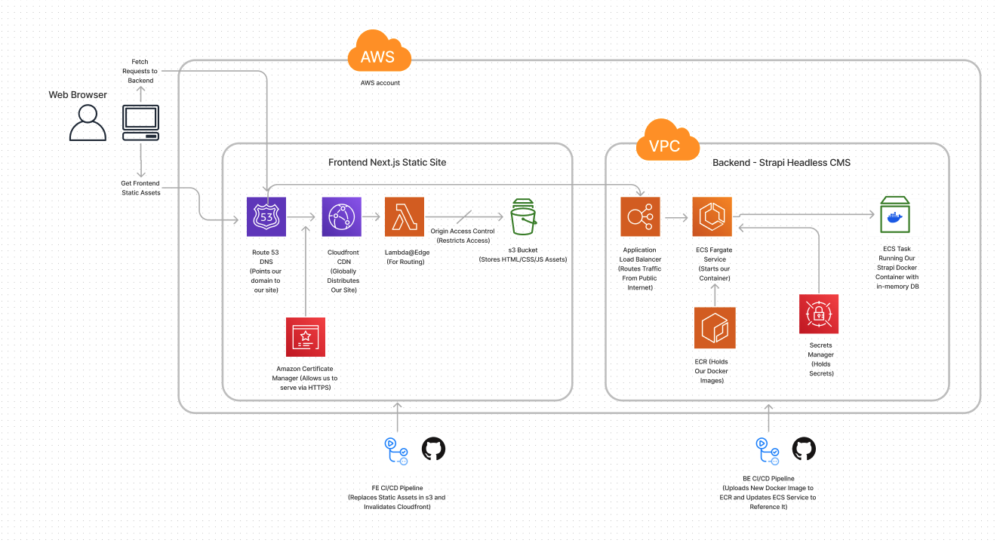

Our application might not look like much, but there's a ton of complexity involved in getting it deployed to the cloud.  At a high level, here are all the moving pieces:

### Frontend

- Requests come in from the browser to our domain (for me, https://jss.computer  - a dev site that was available using my initials 😆). Route 53 routes those requests to our CloudFront Distribution.
  - Requests are served via https, using a TLS certificate provisioned in ACM.
- Cloudfront globally distributes and caches our app for faster load times around the world.
- A Lambda@Edge Function is used to route requests correctly to our HTML files.
- Cloudfront accesses our static assets in an s3 bucket and returns them to the user (and caches them for faster load times for future users.)
- Our s3 Bucket is sealed off from the public Internet for greater security, and only Cloudfront can access it through an "Origin Access Control."
- CI/CD: When new code is merged to our deployed branch in our GitHub repo, the GitHub Actions CI/CD pipeline replaces the old static assets with the new ones in our s3 Bucket.  It creates a Cloudfront "invalidation" telling Cloudfront to fetch the new assets from our s3 bucket on the next user request.

### Backend

- Requests to our backend come into a subdomain on our domain (https://api.jss.computer for me), again served on https using the same TLS certificate.
- Route 53 routes traffic to an Application Load Balancer (ALB), which we're using here primarily for routing.
- The ALB routes traffic to Elastic Container Service.
- Our ECS Service starts our Docker containers for us.  It pulls the images from ECR, and secrets from Amazon Secrets Manager, then starts a container as an ECS "task."
- The request is routed to our Strapi Backend, running in a Docker container as an ECS task, and it responds to the request.
- CI/CD: When new code is merged to our deployed branch in our backend Github Repo, the GitHub Actions CI/CD pipeline creates a new Docker image from the new code, pushes it up to our ECR repo, then edits our ECS Service to point to the newest image, triggering a redeployment.

## Why AWS?

You could do this course with any of the major cloud providers, and Pulumi allows you to use any of them.  I chose AWS because it is the most established and still has the largest market share, so you're more likely to encounter it.

## First Principles

### Principle of Least Privilege

I said we'll be light on theory, but one overriding principle you'll see in the diagram above and throughout the course is the [Principle of Least Privilege](https://www.techtarget.com/searchsecurity/definition/principle-of-least-privilege-POLP).  For security purposes, we want to provide the bare minimum of access to accomplish our goals.  If we lose control of an access key to a hacker, we want to limit the blast radius. And hackers will exploit open ports and publicly accessible resources, so we want to lock our resources down as much as possible.  Some examples:

- When we create an access key for our CI/CD pipeline, we don't want to let it mess with every resource in our account--we want to limit it to only the necessary actions to get the job done, only on the individual resources it needs access to, and only in one environment.
- We don't want to use our root user (used for billing) to do our general admin tasks like creating resources, so we create an admin user with more limited privileges.
- When we expose our application to the Internet, we want to do so through a single point of entry, for control and monitoring.  We don't want to expose our s3 Bucket directly to the public Internet, but rather only allow access to our static assets through our Cloudfront distribution.
- We don't want to expose our backend ECS task directly to the public Internet either; instead we want to allow access only from our load balancer and only on the specified port.

AWS reflects this principle in its permissions model, which generally prohibits access to resources unless explicitly granted.  This is where a lot of the complexity comes in--you'll likely spend time debugging setting up the necessary permissions to accomplish your task.

### Tradeoffs and Cost

Every decision in DevOps comes with tradeoffs, often involving cost.  We can spend the time to stand up our own ECS cluster using our own EC2 virtual machines (more effort), or have AWS do it for us with Fargate (more cost).  We can let AWS assign a public IP to our ECS task so it can access other AWS resources through the public internet (less secure), or set up private VPC endpoints so that traffic doesn't leave Amazon's private network (more effort and more cost).  We already discussed the tradeoffs between a service like Netlify (better experience, higher cost) and a lower-level service like AWS (greater control, lower cost).  The list goes on.  The challenge is to make the right tradeoff for your application's needs.

I'll try to keep us within the AWS free tier as much as possible here, but doing so entirely is very difficult (see this meme).  You can tear down your resources when we're done to limit the damage.  I left my Fargate services and load balancers up all month (both outside the free tier) and was billed about $40 last month 😬.

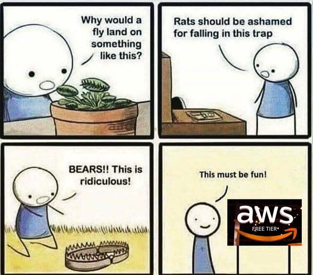

## Game Plan

Here's the game plan:

- Setup a first environment (production) with the AWS console.
  - Build our frontend locally with Next and set up our GitHub repo.
  - Set up our AWS account.
  - Deploy our frontend through the AWS console.
  - Setup our frontend CI/CD pipeline.
  - Build our backend locally with Strapi and Docker, and set up our GitHub repo.
  - Deploy our backend through the AWS console.
  - Setup our backend CI/CD pipeline.
- Setup a second environment (development) with Pulumi.
  - frontend
  - backend
  - Multiple environments in our GitHub repos.

# Build the Frontend Locally

Let's start with building our frontend so we have something to deploy!

## Why Next.js

We'll be using Next.js to build our frontend, which is a framework built on top of React that provides things like routing and server-side-rendering out-of-the-box.  The official React docs recommend using a framework like Next.js for production applications, and it is becoming broadly adopted by the React community.

Compared to vanilla React app with create-react-app, Next provides much greater control over how your application is rendered.  Vanilla React is rendered on the client--only an empty HTML file is sent to the browser, the React app attaches to an empty div, and renders the entire application with JavaScript.  This poses challenges for SEO, since web crawlers may not render the JavaScript when indexing your site.  It also can lead to slower page loads for users.

> The body of a vanilla React app's `index.html` is just:
> ```html
>  <body>
>    <noscript>You need to enable JavaScript to run this app.</noscript>
>    <div id="root"></div>
> </body>
> ```
> ... Not very informative to web crawlers that might not execute JavaScript!

Next allows much more granular control over where and when your application and its components are rendered.  You can statically render pages to HTML at build time when the content changes infrequently.  You can server-render pages at request time if content changes frequently and things like SEO and fast page-loads are still important (think of e-commerce sites).  And you can also client-render pages and components for dynamic or interactive content, though Next encourages you to client-render as little as possible.

To avoid setting up a server for our frontend, we'll primarily statically-render our site to HTML at build time, and reap all the SEO and performance benefits.  But we'll also load frequently changing data from our news feed in a client-rendered component by fetching data from our backend, so our site will always be up-to-date.  Our app will be built as static assets, just like a vanilla React site, so that we can serve it globally on a CDN for fast loads world-wide.

Check out the excellent [Next docs ](https://nextjs.org/) for a deeper dive on these concepts.  To go even deeper, Josh Comeau's [The Joy of React](https://www.joyofreact.com/) course also has some excellent Next content.

## Create Next project

### Setup your project and GitHub Repository

- Run `npx create-next-app@latest` to bootstrap the app.
- Setup linting and auto-format on save.  Shameless plug for my [lintier](https://github.com/josh-stillman/lintier) npm package, which will do it for you!
  - Run `npx lintier` in the project directory, and don't install airbnb's style guide for now.
  - Turn on auto formatting on save in your VS Code settings.json file, by adding `"editor.codeActionsOnSave": { "source.fixAll": true },`
  - Fix the linting errors in the boilerplate Next starter with `npm run lint:fix`.
- Add your first git commit, and create a [new GitHub repo](https://github.com/new).  Follow the instructions to add the git remote and push up.


### Create your first route

Next provides file-based routing out of the box.  We create new routes and pages by creating new subdirectories in the Next `/app` directory, containing a file named `page.tsx`.  So if we want to create a new page at `/foo`, we add a this new directory and file: `app/foo/page.tsx`.

We're going to create one additional route, so we can learn how to deploy an app with multiple routes. One of the main challenges in getting our frontend deployed comes in handling routing correctly, as we'll see.

- Add the new directory and file: `app/foo/page.tsx`.  It can just say hello world for now.
    ```typescript
    export default function Foo() {
        return <h1>hello world from the foo page!</h1>;
    }
    ```
- On your root page (at `app/page.tsx`), add a link to your new page.  Next's `Link` component handles client-side routing and provides a SPA-like experience, similar to a vanilla React app with React Router.
    ```typescript
    <Link href="/foo">go to foo page!</Link>
    ```

### Build a static site for production

We need to let Next know that we want to build a static site, rather than host our app on a server.  This limits the functionality we have access to (like SSR, of course), but it allows for easier, more lightweight deployment and hosting.  We'll just be uploading static HTML, CSS, and JS assets to a server, where they can be served quickly and cheaply by a CDN, with little effort on our part.

- Setup [static exports](https://nextjs.org/docs/app/building-your-application/deploying/static-exports) in `next.config.js` by adding
    ```typescript
    const nextConfig = {
        output: 'export',
    };

    ```
- Run `npm run build`.  The output shows which files were statically generated with ` ○ (Static)`.
- Checkout the `./out` directory with our built files.  You'll see that, instead of the single empty html file we'd get with a vanilla React App, we get two html files that contain all the content.  This is what enables search engines to easily crawl our site and provides for quick page loads (more specifically, a fast [First Contentful Paint](https://web.dev/fcp/)).
    ```html
    <body class="__className_20951f">
        <h1>hello world from the foo page!</h1>
        ...
    </body>
    ```
- Run the production build of your app by adding and running this script in your `package.json`: `"serve-static": "npx serve ./out",`

# Setup your AWS account

Now it's time to get our frontend deployed!  To go further in depth on a lot of the issues we'll be covering when deploying our frontend through the console, I recommend checking out Steve Kinney's great Frontend Masters course [AWS For Front-End Engineers](https://frontendmasters.com/courses/aws-v2/).

Setting up an AWS account is a bit more complex than you might think. We'll need to:
- create the account
- setup billing notifications so we know when we've gone beyond the free tier.
- setup multi-factor authentication (MFA) for our root user.
- create an Admin user and setup MFA.

We'll only use our root user for things like billing.  Any creation of cloud resources will be done with our Admin user instead, who will have most privileges aside from billing.  This is a security best practice and limits the damage that could be done if our Admin credentials were compromised.

## A note on AWS Regions

AWS has many "regions" around the world in which your cloud infrastructure can live (these correspond to physical data centers).  There are a few things that *must* be in us-east-1 in North Virgina, like CloudFront distributions and TLS certificates.  To make our lives easier, we'll use us-east-1 for everything.

If for some reason you don't see your resources, make sure the us-east-1 region is selected in the dropdown.

## Sign up

Sign up will require a personal credit card.  We'll be incurring some costs but they should be quite low--$12 or so to register a domain, and under $10 for our infrastructure if you tear it down after building it.  It's a worthwhile investment to learn valuable skills!

- Go to https://aws.amazon.com/
- Click the sign up button in the nav bar.
- Enter your personal email and account name.
- Get the verification code from your email (it might be in spam).
- Enter your root password.
- Enter your personal info.
- Enter your credit card.
- Verify with SMS (try the voice captcha option if you have trouble reading the captcha)
- Choose the basic plan.

## Setup billing alerts

The AWS [free tier](https://aws.amazon.com/free) is pretty generous for your first year.  Lots of services are covered up to a large amount of usage, but mysteriouly some smaller services aren't covered at all (load balancers and Fargate for our purposes).  As I said before, we'll mostly be within the free tier, but not entirely.

While we can't tell AWS not to do anything that costs money (how convenient), we can at least set up some notifications to alert us if we go outside of the free tier.

- Navigate to the billing page by typing “billing” in text box.  This is an easy way to navigate through AWS's many services.
- Go to billing preferences.
- Go to alert preferences.
  - Choose AWS Free Tier alerts.
  - Choose PDF invoices.
- Go to budgets
  - Click create budget, then select the zero spend budget.

## Create account alias

- Go to your console dashboard and choose create account alias.  This is useful to have an easy to remember name for your account instead of the autogenerated name.

## Setup MFA

Let's secure our console access with MFA.

- Search for IAM in the text bar.  IAM is the AWS service where we create and manager users and their access keys.  We'll be spending a fair amount of time with it.
- Setup 2FA for your root user.  I used the Google Authenticator app.

## Create our Admin user

Let's create an Admin user that we'll use for the rest of the course.  For security puposes, after creating the Admin, we'll log out of the root user and not use it again.

- In IAM, choose users, then the add user button.

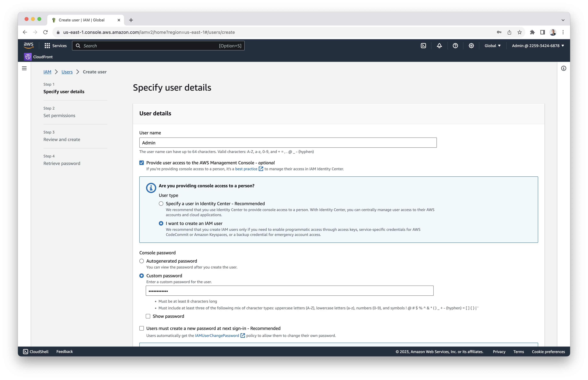

- Add a username of Admin, provide access to the console, and choose create IAM user.  Create a custom password.  Since it's a user for us, we won't create a temporary password.

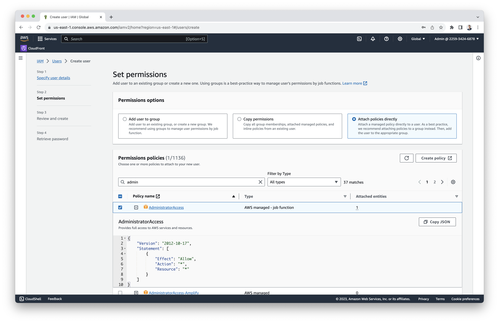

- Next, set the permissions. Choose attach policies directly, then search for admin and choose AdministratorAccess.  Push the + button to see the policy JSON, and you'll see it's as permissive as possible: this user can do everything to everything.
- Hit the next button.  No need to add tags, which are mainly used for tracking and classifying resources.  Hit create user.

## Login as Admin and add MFA

- Lot out of root and log in as the Admin user we just created.
- Add MFA for this user (under the Security Credentials tab).  Choose a different phone name (you can append -admin).

With that, our account is set up and we can start building our infrastructure!

# Register a domain

Go to [Route 53](https://us-east-1.console.aws.amazon.com/route53/v2/home#Dashboard), the AWS DNS service used for registering and managing domain names.

- Register a domain name for the course.  We're doing this first so that it has time to propagate by the time we need it.
- The cheapest ones seem to be about $12.
- I went with `jss.computer`, one of few sites with my initials available.
- Make sure privacy protection is on (the default) or your info will be public.

# Upload our frontend build directory to s3

AWS s3 is the basic service used for storing files.  We can use a s3 "bucket" to store our frontend assets and serve them up to the world.  The [free tier](https://aws.amazon.com/free) provides 5 gigs of storage.

s3 is a key/value store for names (file names) and "objects" (aka files).  They're stored in a flat hierarchy, though you can add directory paths to your file names if you want.

## Create a bucket for your site

- Click create bucket.

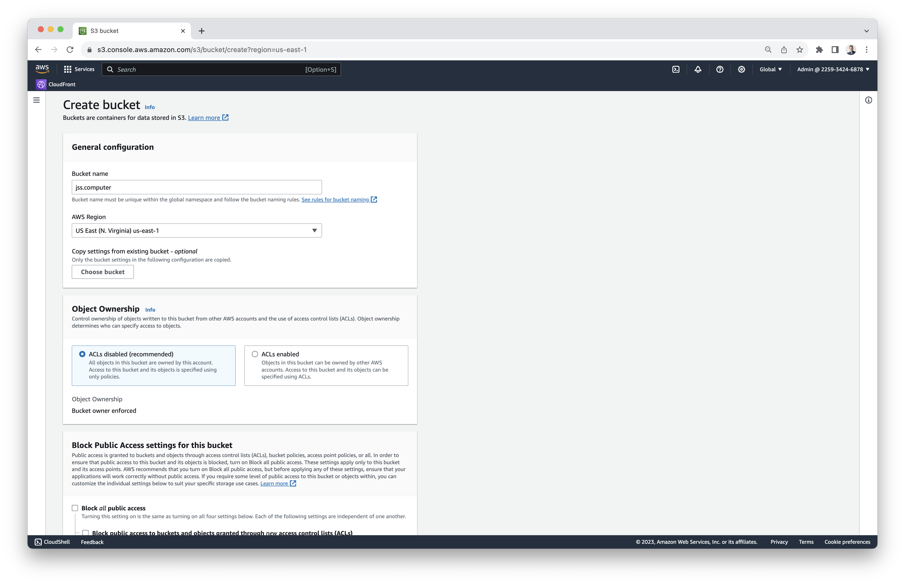

- Use your website's name for the bucket name.
- Turn off ACLs (default option).
- Unclick the Block all public access checkbox.  This will allow us to host our website directly from our bucket.  We'll turn this off later on in the course as our infrastructure gets more sophisticated.
- Keep all other default options, including disabling versioning, which we won't need for our purposes.

## Add a bucket policy allowing access

- Go to your bucket, then the Permissions tab, then click the edit button on the Bucket Policy.
- You can create a policy JSON document with the AWS [policy generator](https://awspolicygen.s3.amazonaws.com/policygen.html).
- Here, we want to let everyone access our bucket for now.
- Choose s3 Bucket policy from the dropdown
- Choose `*` for the principal, meanign we want the policy to apply to everyone.
- For actions, search for GetObject.
- For the ARN (Amazon Resource Name), copy the ARN from your bucket under the Properties tab.  ARNs are unique identifiers for cloud resrouces in AWS.  We'll be using them a lot.
- For the ARN, you need to add `/*` at the end, meaning all objects within the bucket.
- Your policy should look like this:
    ```json
    {
        "Id": "Policy1696532170133",
        "Version": "2012-10-17",
        "Statement": [
            {
                "Sid": "Stmt1696532167778",
                "Action": [
                    "s3:GetObject"
                ],
                "Effect": "Allow",
                "Resource": "arn:aws:s3:::jss.computer/*",
                "Principal": "*"
            }
        ]
    }
    ```

This is what AWS permission policy JSON docs look like.  They specify *who* can take an action (the principal), *what* actions they can perform, and *to which* resources.

- Copy this policy and paste it in to the bucket policy field.

## Upload our frontend assets

- Go to the Objects tab and click upload.
- Click add files, and upload everything from the `/out` directory.
  - If you choose upload entire directory instead, you'll have every file prefixed with the directory name.
- Click add folder and upload the `/_next` folder in `/out`.
- After uploading, click on the `index.html` object, then click the Object URL link (something like `https://s3.amazonaws.com/jss.computer/index.html`).  We're officially on the Internet!

## Enable Static Website Hosting

- We'll setup s3 to host our website.  In the bucket properties tab, scroll down to the bottom and edit the Static website hosting property.
- Click enable.

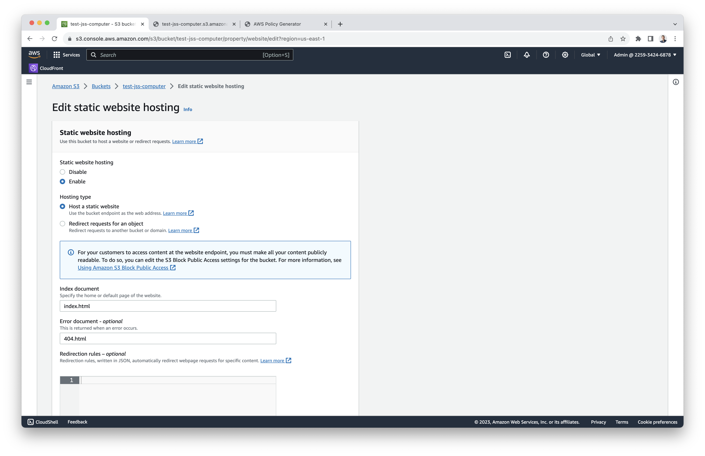

- Choose `index.html` for the index document (go figure), and choose `404.html` as the error page.  `404.html` is the 404 page automatically generated by Next.
- Back in the bucket properties tab, go to the URL in the static website hosting section (should be something like `http://test-jss-computer.s3-website-us-east-1.amazonaws.com`).

Kick the tires a bit here.  You'll see that linking between our pages works.  But refreshing at `/foo` doesn't work, and we get the 404 page (we'll fix this).  Try going to a nonexistent page and you should correctly see the 404 page.

Cool!  We've got a website up, but there are a lot of improvements left.  We're on http instead of https, and our browser says our site isn't secure.  The url is pretty gross.  We had to manually upload the files. And the files are only hosted in one AWS region rather than globally.  Let's fix all that!

# Setup the AWS CLI

Let's take a minute to set up the AWS CLI.  It's useful for all kinds of things, like listing the resources in our account.  And when we get to using Pulumi, we'll need to have the AWS CLI configured locally so Pulumi can manage our infrastructure for us.

- Install the [AWS CLI](https://aws.amazon.com/cli/).
- Generate an access token for your admin user. IAM → User → Security Credentials → Create Access Key.
- Copy paste both public key and secret.  Keep them somewhere safe and secure.  You can only view these credentials once, so make sure.
- In your terminal, run `aws configure`.
  - Add your credentials.
  - Select us-east-1.
  - Select JSON for output.
- Give it a try!  Run this command with your bucket name to list the files in it. `aws s3 ls s3://jss.computer`.

# Setup Route 53 (DNS)

Let's point our domain name to our s3 bucket.

- Go to route 53 → Click Hosted Zone → click your zone → click create record.

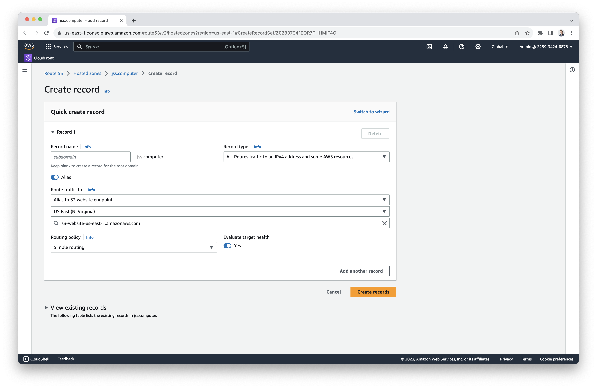

- Hit the Alias toggle.
- Choose alias to s3 website endpoint.
- Choose us-east-1.
- Auto-fill the endpoint from the drop-down.
- Click create record.
- Go to your url (on http) and test it out!  (You may need to wait a little bit for the changes to propagate).

# Setup https with ACM

Now, let's serve our site securely with https.  For that, we'll need a TLS certificate that authenticates our site.  We can provision one in the [Amazon Certificate Manager (ACM)](https://us-east-1.console.aws.amazon.com/acm/home?region=us-east-1#/welcome).

- Go to AWS Certificate Manager, and MAKE SURE you’re in us-east-1.  Only those certificates can be used with CloudFront.
- Click request certificate → request public certificate.
  - Add both the main domain name and a wildcard in Fully Qualified Name.  This will let us use this certificate for our main site as well as our subdomains (like our backend url).
  - For example, both `jss.computer` and `*.jss.computer`.
- Click request certificate.

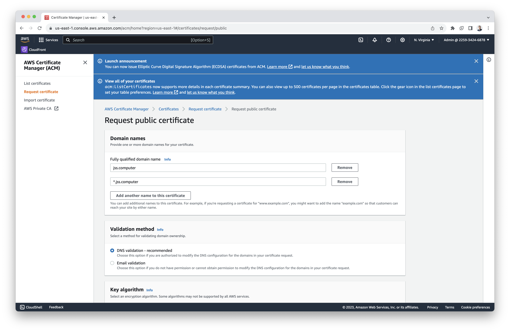

- Click the blue banner saying further action needed.
- Under domains, click "create record in Route 53."  This record proves to the certificate authority that you do in fact own the domain.

https won't work with our s3 bucket just yet.  We'll have to setup CloudFront first.

# Setup CloudFront (CDN)

CloudFront is a Content Delivery Network (CDN) that globally distributes our site for faster loads world-wide.  Right now our files are *only* hosted in Virginia.  If someone from Australia goes to our site, they are going to have a much longer load time than someone on the East Coast.

We can solve this problem with a CDN, which will put copies of our files on many "edge servers" located around the world.  When the first user from Australia goes to our site, CloudFront will intercept the request, fetch it from Virginia, cache it on an edge server in Australia, and return it to that user.  When the *next* user from Australia goes to our site, the Australian edge server will have our assets and will return it much quicker!  CloudFront "uses a [global network](https://aws.amazon.com/cloudfront/features/?whats-new-cloudfront.sort-by=item.additionalFields.postDateTime&whats-new-cloudfront.sort-order=desc#Global_Edge_Network) of 550+ Points of Presence and 13 regional edge caches in 100+ cities across 50 countries."  I told you DevOps was powerful stuff!

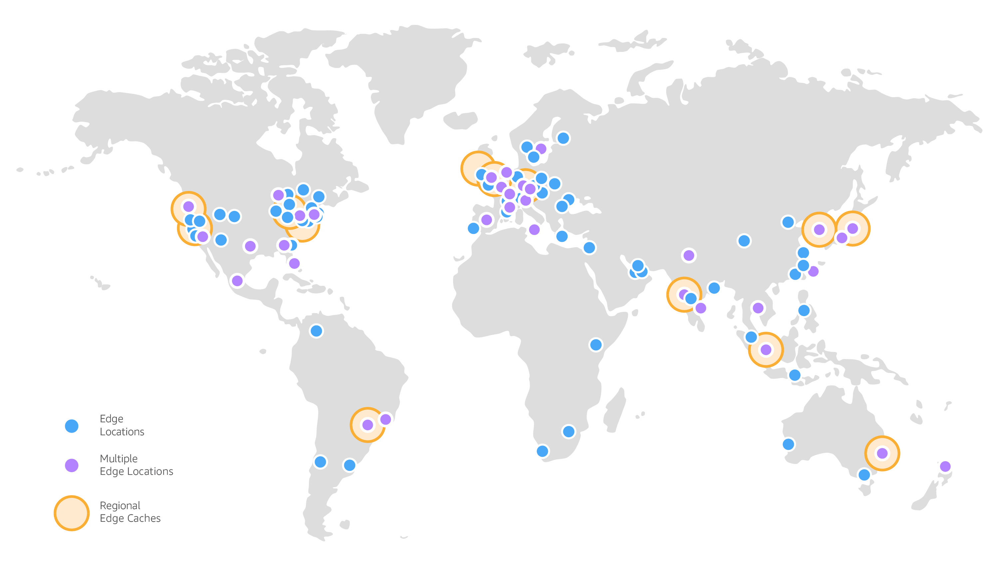

We'll create a CloudFront "distribution" to distribute our site.  Later, when we setup our CI/CD pipeline, we'll setup CloudFront "invalidations," which tell the edge servers to fetch the new assets from the "origin" server in Virgina (that is, our s3 bucket in us-east-1).

## Create CloudFront Distribution

- Go to CloudFront
- Click Create Distribution

### Origin and Origin Access Control

- Choose your s3 Bucket under Origin Domain.  It will ask you to use the website endpoint, but don't click the button.  This will allow us to secure the origin later and only allow access through CloudFront.
- Under Origin Access, select Origin Access Control (OAC), then click the Create control setting button.

An OAC is a security measure that allows CloudFront to access a non-public bucket.  It does so through a custom Authorization header signed by CloudFront.  See [here](https://aws.amazon.com/blogs/networking-and-content-delivery/amazon-cloudfront-introduces-origin-access-control-oac/) for more.

To use the OAC, we'll have to update our bucket policy after creating our distribution.

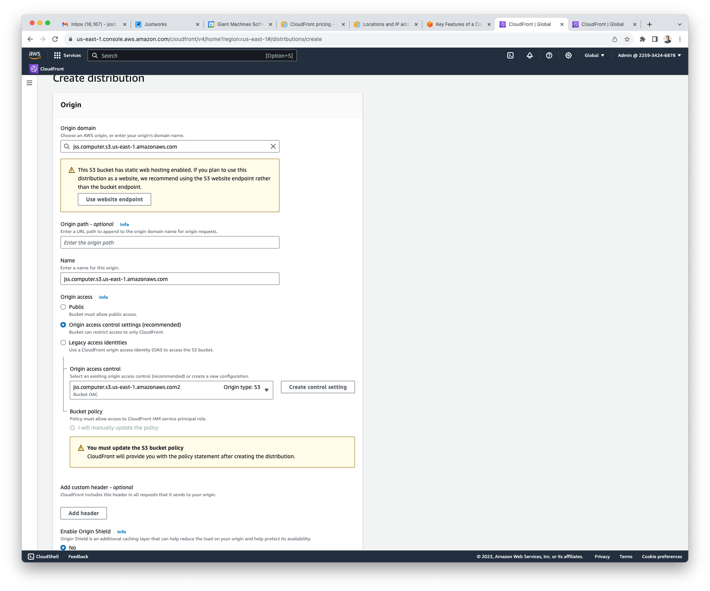

### Default Cache Behavior and Web Application Firewall

- Keep all the defaults *except* choose "Redirect HTTP to HTTPS" so our site is only available on HTTPS.
- Don't enable the WAF (it costs $).

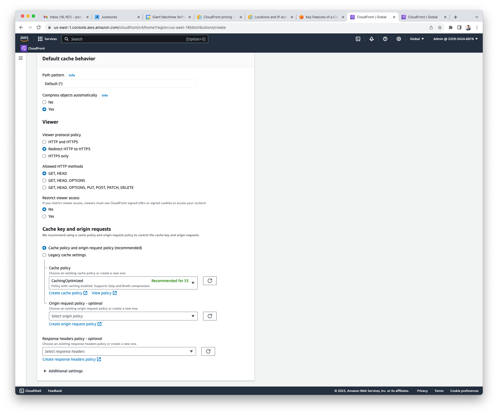

### Settings

- Under alternate domain names, enter both your domain and your domain with the www prefix: `jss.computer` and `www.jss.computer`.
- Select your SSL certificate from the drop-down.  If you don't see it, you may have created it in the wrong region!
- For the default root object, choose `index.html`.
- Click Create distribution.

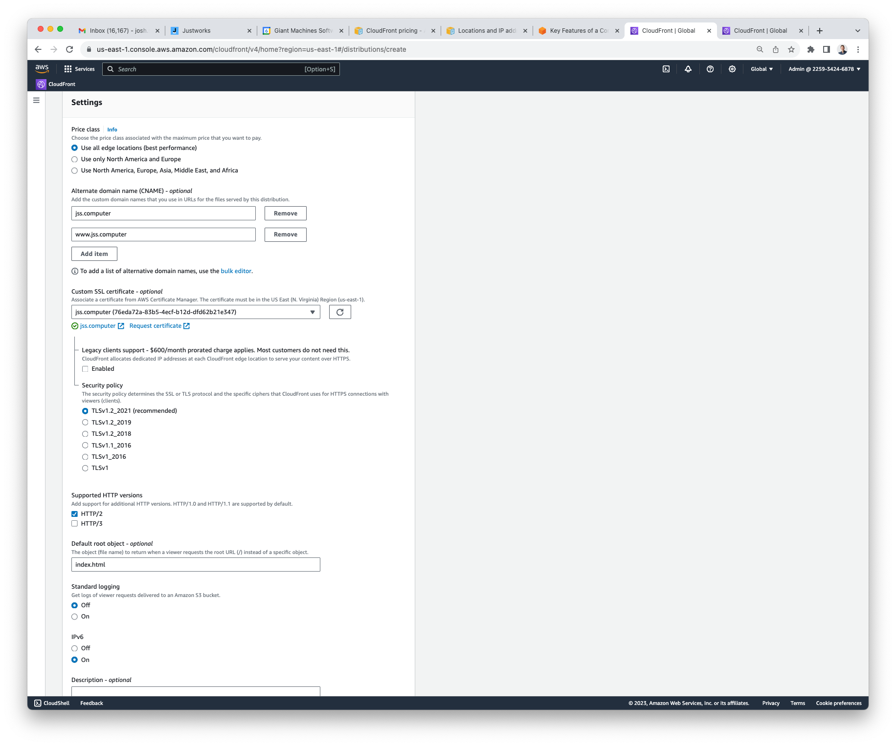

## Custom Error Response

We need to tell CloudFront how to handle errors.  Go to your distribution, click the Error Pages tab, then Create custom error response.

- Choose 404: Not found
- Keep the default TTL.
- Customize the error response to use `/404.html` and the 404 code.  Note the leading slash, which (confusingly) is required here but not when specifying index.html as the root object.
- Save Changes

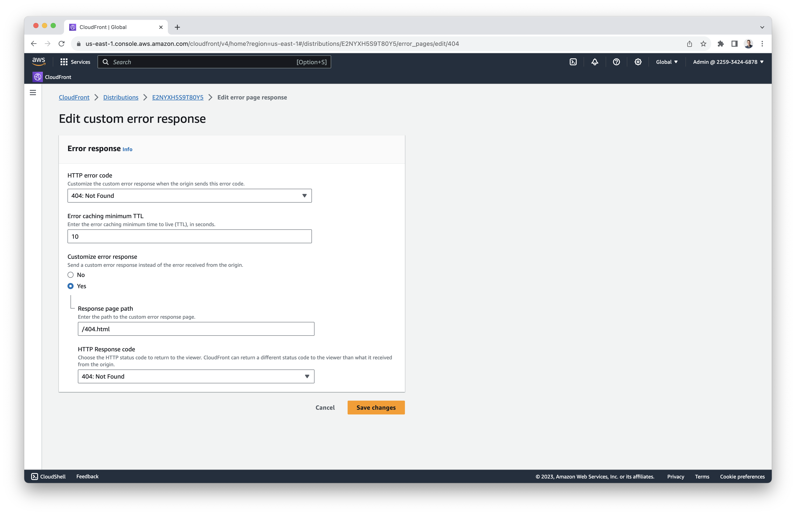

## Update Bucket Policy

Go back to your s3 bucket and then to the Permissions tab.  Under Bucket Policy, click Edit.

Here's what you'll need, with your resources in place of mine:

```json
{
    "Version": "2012-10-17",
    "Id": "Policy1692219819119",
    "Statement": [
        {
            "Sid": "Stmt1692219813668",
            "Effect": "Allow",
            "Principal": {
                "Service": "cloudfront.amazonaws.com"
            },
            "Action": [
                "s3:GetObject",
                "s3:ListBucket"
            ],
            "Resource": [
                "arn:aws:s3:::jss.computer/*",
                "arn:aws:s3:::jss.computer"
            ],
            "Condition": {
                "StringEquals": {
                    "AWS:SourceArn": "arn:aws:cloudfront::225934246878:distribution/E2NYXH5S9T80Y5"
                }
            }
        }
    ]
}
```
Some things to note here:

- The "Resource" array must include the bucket itself (no wildcard), and all the objects in it (with wildcard) as separate entries.
- This is because the the Actions array includes both `s3:ListBucket` for listing the contents of the bucket, and `s3:GetObject` for getting the individual objects in the bucket.
  - CloudFront needs to be able to list the objects in the bucket to determine whether to serve the 404 page.
- The principal is CloudFront.
- We can limit *which* CloudFront distribution has access with the condition block where we specify the distribution's ARN.  Copy it from your distribution's console page.

## Double-check behavior

Go to your domain (such as https://jss.computer).

- You should see your site by accessing your domain.
- It should be on https.
- Try going to http and it should redirect to https.
- Try going to a page that doesn't exist and you should see the 404 page.
- Try clicking the link from the root page to go to `/foo` and it should work (this is client-side routing).
- Try reloading the page at `/foo` (server routing) and you should instead see the 404.  Don't panic, we'll fix it!

## Seal off your bucket

The bucket still allows direct public access.  We want to seal it off and require traffic to go through our CloudFront distribution (principle of least privilege!).

- In your s3 bucket under the Permission tab, go to Block public access setting and turn on "Block all public access."
- In the Properties tab, under static website hosting, go to the link.  You should get a 403!
- Verify that you can still go to your domain through CloudFront.

Major progress!

# Setup routing with Lambda@Edge Function

Let's fix the issue where reloading the page at `/foo` give us a 404.

Why is it happening? If you go to https://jss.computer/foo, CloudFront is looking for a file in s3 called `foo`, not `foo.html`, and only the html file exists!  Solving this is more work than it should be, but it's a good introduction to Lambda@Edge.

To fix this, we'll create a function that will intercept each CloudFront request.  If the request is for a path *without* a file extension, we'll append `.html` at the end, and then the request will be routed to our s3 bucket.  This allows us to correctly serve up these files while keeping our routing looking clean (the user doesn't see the file extension in the URL, as is typical on modern websites).

[AWS Lambda](https://aws.amazon.com/lambda/) is a service that allows us to run serverless functions in JavaScript and other languages.  [Lambda@Edge](https://aws.amazon.com/lambda/edge/) allows you to run them on CloudFront's edge servers to do things like intercept and rewrite requests.

If we were running our own servers, tasks like this would typically be handled by a [reverse proxy](https://www.nginx.com/resources/glossary/reverse-proxy-server/#:~:text=A%20reverse%20proxy%20server%20is,traffic%20between%20clients%20and%20servers.) like NGINX or Caddy.  But with CloudFront, these tasks are handled with Lambda@Edge.

## Create Function

First we need to create a function.

- Go to Lambda.
- Click Create Function
- Add a name (such as add-html-extension)

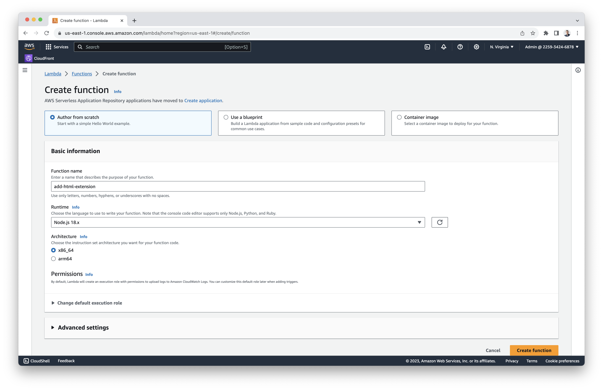

We can use the web editor to write our function.  Here's what we need:

```javascript
'use strict';
export const handler = (event, context, callback) => {

    // Extract the request from the CloudFront event that is sent to Lambda@Edge
    const request = event.Records[0].cf.request;

    // Extract the URI from the request
    const oldURI = request.uri;

    // Match any route after the final slash without a file extension, and append .html
    if (oldUri.match(/\/[^/.]+$/)) {
      const newUri = oldUri + '.html';
      request.uri = newUri;
    }

    // Return to CloudFront
    return callback(null, request);
};

export default handler;
```

I know--DevOps for *Typescript Developers*.  Don't worry, we'll use TS when we start using Pulumi.

Most of the heavy lifting here is done by the regex, `/\/[^/.]+$/`.  What it's doing is:

- Looking for a trailing slash, then one or more characters that is *not* `/` or `.`, then the end of the URI string.
- By doing this, we *exclude* requests for the root both with and without a trailing slash (https://jss.computer and https://jss.computer/), since CloudFront already knows to serve index.html as the root object.  And we exclude requests for files with extensions, like `/foo.svg`.  We also correctly handle nested routes like `/foo/bar`.
- **TODO**: a final trailing slash won't work here!  Need to update to `/\/[^/.]+\/?$/`

## Create Role

We need to let CloudFront execute this function by letting it assume the Lambda's role.  Go to IAM, then Roles, then find the Role for your function.  It should have the same name as the function you created with some extra text (something like add-html-extension-role-dnrn2cz1).

- Click the Trust Relationships tab, then the Edit trust policy button.
- Under Principal, convert the Service key to an arrary and add the Lambda@Edge service.

```json
{
  "Version": "2012-10-17",
  "Statement": [
      {
          "Effect": "Allow",
          "Principal": {
              "Service": [
                  "lambda.amazonaws.com",
                  "edgelambda.amazonaws.com"
              ]
          },
          "Action": "sts:AssumeRole"
      }
  ]
}
```

## Create Trigger

Now let's deploy the function to the edge.  On your function page, click the Add Trigger button.

- Select CloudFront
- Click the Deploy to Lambda@Edge button
- Select Origin Request.

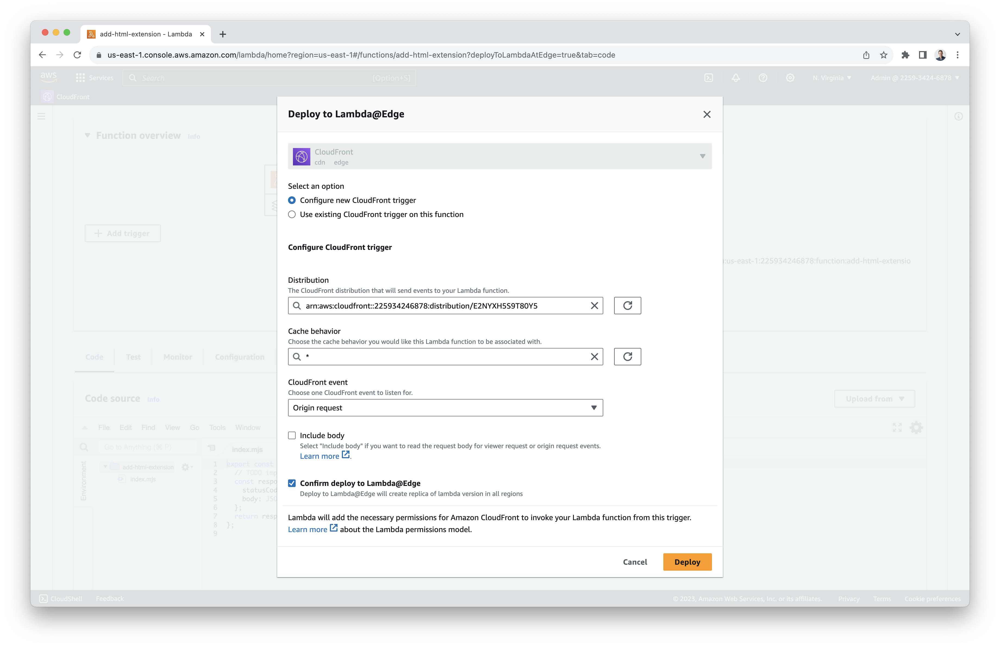

## Test it

Cloudfront can take some time to deploy, which makes sense.  Give it a little time, then try refreshing at `/foo` and it should work!

# Frontend CI/CD pipeline

Next, let's stop uploading files directly from our computer!  We can setup a CI/CD pipeline in our GitHub repository using GitHub Actions.  When new code is pushed to our `main` branch, it will trigger the pipeline, which will build our code, upload the build to our s3 bucket, and create a CloudFront invalidation telling CloudFront to fetch the new version from the bucket.

## Create Pipeline User

The pipeline will need an AWS access key to use the AWS CLI to upload files to s3 and create the CloudFront invalidations.  We could use our Admin account, sure, but that would be super insecure.  What if someone gets access to our GitHub repo (which stores the keys)?  They'd have our Admin keys and could do almost *anything* 🙀.  Instead, we'll create a new user for the pipeline, and this user will only have the minimum permissions needed to accomplish the job.

### Create Policy

- Go to IAM.
- Create Policy.  We'll attach this policy to our pipeline user.
- It should look like this, with your resources:

```json
{
    "Version": "2012-10-17",
    "Statement": [
        {
            "Sid": "VisualEditor0",
            "Effect": "Allow",
            "Action": [
                "s3:PutObject",
                "s3:ListBucket",
                "s3:DeleteObject",
                "cloudfront:CreateInvalidation"
            ],
            "Resource": [
                "arn:aws:s3:::jss.computer/*",
                "arn:aws:cloudfront::225934246878:distribution/E2NYXH5S9T80Y5"
            ]
        }
    ]
}
```

**TODO** Is the resource /*?  Do you need ListBucket?  Check back on the Cloudfront policy, /* might be all that is needed.

We want the pipeline to be able to add files to the bucket with the `aws s3 sync --delete` command, which requires `s3:PutObject`, `s3:ListBucket`, and `s3:DeleteObject`.  We're deleting the old files in the bucket so we start with a clean slate (what if there was a page at `/baz` that we end up removing in a new pull request -- we need to clear the bucket on each push or it will remain).

We also need the user to be able to create invalidations on our CloudFront distribution with `cloudfront:CreateInvalidation`.

We scope these permissions to the specific bucket and distribution for our environment.

### Create User

- Create a new user in IAM
- Don't grant console access.
- Attach the policy you just created to the user.

### Create Access Key

- Go to your user, then the Security Credentials tab.
- Under Access Keys, hit the Create Access Key button.
- Bypass the warnings.
- Copy down the credentials and store them somewhere safe and secure.  You can only view them once!  We'll add these to GitHub in a minute.

## Update s3 Bucket Policy

AWS's [permissions evaluation model](https://docs.aws.amazon.com/IAM/latest/UserGuide/reference_policies_evaluation-logic.html) can be complex when multiple policies are in play, such as is the case here with an IAM user policy and an s3 bucket policy.  Generally one "Allow" would be enough to grant access in either an IAM or resource policy.  But here, we've configured a [public access block](https://docs.aws.amazon.com/AmazonS3/latest/userguide/access-control-block-public-access.html) on our bucket.  If we tried to upload to the bucket with our user, we'll get an error saying the bucket policy forbids it.  So, belt-and-suspenders style, we'll add permissions to our bucket policy that will allow our pipeline to work.

- Go back to your s3 bucket's Permissions tab.
- Click the Edit button on the bucket policy.
- Within the "Statement" array, add another object like this, referencing your resources.

```json
{
    "Effect": "Allow",
    "Principal": {
        "AWS": "arn:aws:iam::225934246878:user/FE-CI-CD-Pipeline"
    },
    "Action": [
        "s3:PutObject",
        "s3:GetObject",
        "s3:ListBucket",
        "s3:DeleteObject"
    ],
    "Resource": [
        "arn:aws:s3:::jss.computer/*",
        "arn:aws:s3:::jss.computer"
    ]
}
```

## Create the GitHub Action

In your frontend repo, create a new `.github` directory, with a `/workflows` subdirectory.  In `./github/workflows`, add a file called `build-deploy.yml`.

We can adapt an action file from a couple starting points, including the [starter workflow for Next](https://github.com/actions/starter-workflows/blob/main/pages/nextjs.yml).

Let's use this workflow:

```yml
name: Deploy Next.js site to AWS
on:
  # Runs on pushes targeting the default branch
  push:
    branches: ["main"]
  # Allows you to run this workflow manually from the Actions tab
  workflow_dispatch:

# Allow only one concurrent deployment, skipping runs queued between the run in-progress and latest queued.
# However, do NOT cancel in-progress runs as we want to allow these production deployments to complete.
concurrency:
  group: "frontend"
  cancel-in-progress: false

jobs:
  # Build job
  build-and-deploy:
    runs-on: ubuntu-latest
    steps:
      - name: Checkout
        uses: actions/checkout@v3
      - name: Setup Node
        uses: actions/setup-node@v3
        with:
          node-version: "18"
          cache: "npm"
      - name: Restore cache
        uses: actions/cache@v3
        with:
          path: |
            .next/cache
          # Generate a new cache whenever packages or source files change.
          key: ${{ runner.os }}-nextjs-${{ hashFiles('**/package-lock.json') }}-${{ hashFiles('**.[jt]s', '**.[jt]sx') }}
          # If source files changed but packages didn't, rebuild from a prior cache.
          restore-keys: |
            ${{ runner.os }}-nextjs-${{ hashFiles('**/package-lock.json') }}-
      - name: Install Modules
        run: npm ci
      - name: Build Application
        run: npm run build
      # Deploy to AWS
      - name: Configure AWS
        uses: aws-actions/configure-aws-credentials@v2
        with:
          aws-access-key-id: ${{ secrets.AWS_ACCESS_KEY_ID }}
          aws-secret-access-key: ${{ secrets.AWS_SECRET_ACCESS_KEY }}
          aws-region: us-east-1
      - name: Deploy to S3
        run: aws s3 sync ./out s3://${{ secrets.BUCKET_NAME }} --delete
      - name: Create Cloudfront Invalidation
        run: aws cloudfront create-invalidation --distribution-id ${{ secrets.DISTRIBUTION_ID }} --paths "/*"
```

Here's what this workflow is doing:

1. It will run on every push to `main`
2. It checks out our code and installs Node.
3. It sets up caching such that if our `package.json` hasn't changed, we won't have to re-download node modules from npm.
4. It installs and builds our Next app with `npm ci` and `npm run build`.
5. It configures our AWS credentials for our pipeline user so it can use the AWS CLI.
6. It deletes the old files in our bucket and uploads the build directory (`./out`) to our s3 bucket.
7. It creates a CloudFront invalidation for all paths on our site.

Commit this file.  But before pushing it up, we need to add our secrets to our GitHub repo.

### Add Secrets to GitHub Repo

- In your GitHub repo, go to Settings -> Security -> Secrets and variables -> Actions
- We need to add 4 variables:
  - `AWS_ACCESS_KEY_ID` and `AWS_SECRET_ACCESS_KEY`, which you copied and saved earlier.
  - `BUCKET_NAME`.  You can get it from the console, or the CLI with `aws s3 ls`.  It should look like `jss.computer` (not an ARN).
  - `DISTRIBUTION_ID`.  You can get it from the console, or the CLI with `aws cloudfront list-distributions`.  It should look like `E2NYXH5S9T80Y5` (also not an ARN).

### Push and Test

Make a change to your app so we can verify that our pipeline is working.

- In `app/page.tsx`, add something new, commit, and push up.
- Go to your GitHub repo and go to the Actions tab.
- Verify that your action is running and succeeds.

## Summing up the Frontend

We've got a fully functional frontend environment now, complete with a working CI/CD pipeline!  Next up, let's extend our application with some backend functionality.

# Setup Strapi Locally

To keep our backend simple we're going to use [Strapi](https://strapi.io/), a headless CMS.  Out of the box, Strapi will let us set up an admin user, log into an admin dashboard, add items to a collection, and serve those items as JSON via an API endpoint.  In production, Strapi would be a good choice when you need to let non-technical users edit frequently changing information, like a news feed.

We'll use Strapi to create a news feed.  Each item will just have a headline and a body and a publication date.  Then we'll display our newsfeed on our frontend.

We can follow the [quickstart guide](https://docs.strapi.io/dev-docs/quick-start#_1-install-strapi-and-create-a-new-project).

## Bootstrap Strapi

- Run `npx create-strapi-app@latest code-along-api --quickstart --typescript`
  - This creates a Strapi project with a sqlite database saved to the `/tmp/data.db` file.
- Strapi starts at the signup page.  Create an account.
- You now have access to the admin panel.
- Click Create Content Type.
- Name it NewsItem.
- Add two text fields: Title (short text) and Body (long text).
- Create a hello world NewsItem.
- Allow public access to this collection.  Go to Settings → Roles → Public → News-item
  - Select `find` and `findOne`, and save.
- Test it out!  run `curl http://localhost:1337/api/news-items`, and you should see your news item!

## Dockerize Strapi

For deployment, we'll containerize Strapi with Docker.  Docker is an industry standard way to package our applications.  It allows us to create "containers" which hold not only our application code, but also let us specify the operating system and any additional system dependencies (like Node for instance) our application needs.  Then, our application can dependably be run on any machine that can run Docker, regardless of any other differences between machines.  It solves the "but it works on my machine!" problem for us!  And it allows us to quickly spin up multiple instances of our application for easy scalability.

It also opens up some interesting possibilities for deploying our application without having to manage servers, which we'll explore later.

Docker is a deep subject.  For more, take a look at the [docs](https://docs.docker.com/get-started/), or check out Brian Holt's excellent [Complete Intro To Containers](https://frontendmasters.com/courses/complete-intro-containers/) course on Frontend Masters.

If you haven't already, install and start [Docker](https://docs.docker.com/desktop/install/mac-install/).

### Create Dockerfile

Add a file called `Dockerfile` in your Strapi root dir (no file extension).  We can mostly copy it from the [official sample](https://docs.strapi.io/dev-docs/installation/docker#production-dockerfile).  One important difference is the `FROM --platform=linux/amd64` which you will need if you are on an M1/M2 Macbook.

```dockerfile
# Creating multi-stage build for production
FROM --platform=linux/amd64 node:18-alpine as build
RUN apk update && apk add --no-cache build-base gcc autoconf automake zlib-dev libpng-dev vips-dev > /dev/null 2>&1
ARG NODE_ENV=production
ENV NODE_ENV=${NODE_ENV}

WORKDIR /opt/
COPY package.json package-lock.json ./
RUN npm config set fetch-retry-maxtimeout 600000 -g && npm install --only=production
ENV PATH /opt/node_modules/.bin:$PATH
WORKDIR /opt/app
COPY . .
RUN npm run build

# Creating final production image
FROM --platform=linux/amd64 node:18-alpine
RUN apk add --no-cache vips-dev
ARG NODE_ENV=production
ENV NODE_ENV=${NODE_ENV}
WORKDIR /opt/
COPY --from=build /opt/node_modules ./node_modules
WORKDIR /opt/app
COPY --from=build /opt/app ./
ENV PATH /opt/node_modules/.bin:$PATH

RUN chown -R node:node /opt/app
USER node
EXPOSE 1337
CMD ["npm", "run", "start"]
```
At a high level, what's happening here is:

- We're starting our build stage from a Docker image with Alpine Linux and Node installed already.  [Alpine Linux](https://www.alpinelinux.org/) is a lightweight Linux distribution.
- We're installing some additional dependencies that Strapi needs to build the app.
- Next, we're running `npm install`, followed by `npm run build`.
  - The order is important here, as is the fact that this is done on two separate lines.  Docker evaluates whether it can use the last cached version of each step (called an image layer) line-by-line.  So if the dependencies don't change, this will let Docker skip re-downloading them, even if the code has changed.
- Next, we create a new image for our final stage.  We copy over only what we need from the build stage.  And we install only what we need to *run* the app, not *build* the app, into this final stage.  This keeps our images smaller.
- Finally, we're exposing port 1337 that Strapi will run on, and we run `npm run start` when the docker container starts, which starts Strapi.

### Add Dockerignore

We need to make sure not everything is copied into our image when this line is executed: `COPY . .`.  We don't want to copy over our node modules, which aren't compatible with Linux, as well as other unnecessary files.

Add a `.dockerignore` at the top level of your Strapi project.

```ignore
# Keeping our local DB in place for now
# .tmp/

.cache/
.git/
build/
node_modules/
.env
data/
```

Note that we're commenting out the line ignoring our .tmp directory holding our db file.  This will copy over our local db into our docker container for now.

### Test Docker Locally

- Run `docker build -t strapi-test .`  This builds your docker image.
- Run `docker images ls` to verify your strapi-test image was built.
- Run `docker run -rm -p 1337:1337 --env-file .env strapi-test`.  This runs our docker image on port 1337, using the environment variables in our `.env` file.
- Run `curl http://localhost:1337/api/news-items` and you should see your news items.
- Log into the admin dashboard at http://localhost:1337/admin.

If you run into trouble logging into the admin dashboard, the latest Strapi version might be broken.  4.12.6 doesn’t work in production, so use 4.12.1 instead.

# Setup Elastic Container Registry (ECR)

Now we need to upload our Strapi Docker image to AWS.  They're stored in the Elastic Container Registry (ECR) service, and then other AWS services can access them and run containers from those images.

- Search for ECR and make sure you're in us-east-1.
- Click Create Repository.
- Add a name, keep the repo private, and keep the other defaults, then click Create.

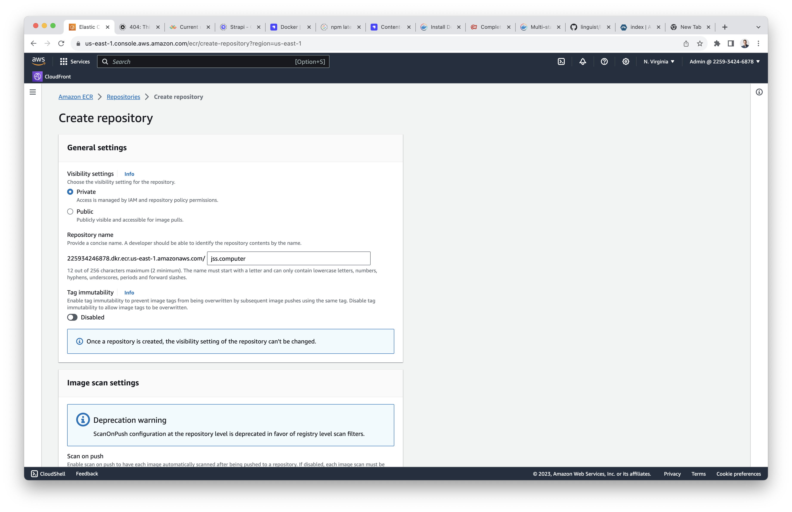

Let's cap the number of images in our repo at 1 for now so we don't run up a bill.

- Go to your new repo, and click Lifecycle Policy, then Create rule.
- Keep the priority at 1.
- Add a description.
- Apply the policy to any image status.
- Select Image Count More than from the dropdown, and choose 1.
- Click Save.

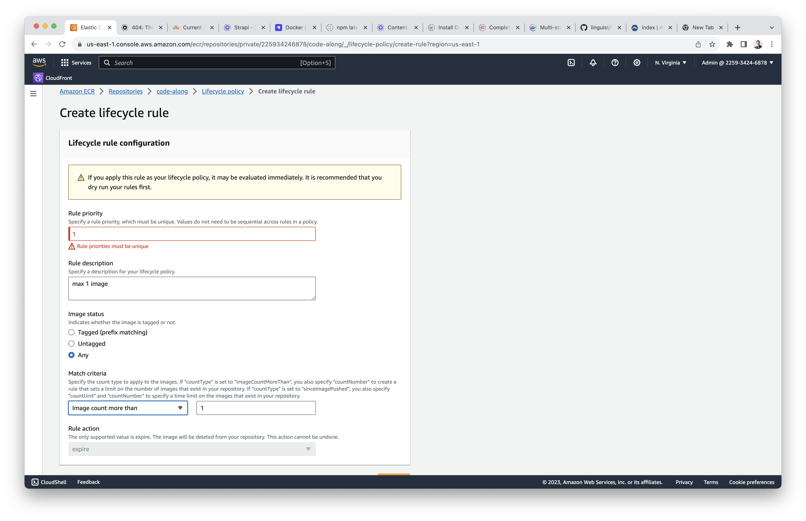

## Push your image

Click the View push commands button on your repo's page to show instructions for pushing up your first image.

- Login with `aws ecr get-login-password --region us-east-1 | docker login --username AWS --password-stdin <your repo id>.dkr.ecr.us-east-1.amazonaws.com`
- We already built our image, so you can skip running `docker build -t strapi-test .`
- Tag the image with your repository URI with `docker tag strapi-test:latest <your repo id>.dkr.ecr.us-east-1.amazonaws.com/strapi-test:latest`
- Push the image to ECR with `docker push <your repo id>.dkr.ecr.us-east-1.amazonaws.com/strapi-test:latest`
- Verify you see the image in your repository.

# Setup Secrets Manager

Next, we need a place to store our secrets when we run our container in the cloud.  Locally they're stored in .env, but we exclude that file in our docker ignore for security purposes.

AWS provides the Secrets Manager that allows us to store secrets and provide access to other AWS services.  We'll create a single "Secret" in Secrets Manager that will store all of our secrets as JSON.

- Go to Secrets Manager and click Store a new secret
- Select Other type of secret
- Add the following secrets from your local `.env` file:
  - APP_KEYS
  - API_TOKEN_SALT
  - ADMIN_JWT_SECRET
  - TRANSFER_TOKEN_SALT
  - DATABASE_CLIENT
  - DATABASE_FILENAME
  - JWT_SECRET
- Keep the default encryption.

The database environment variables aren't sensitive, but we'll keep all our environment variables here for simplicity.

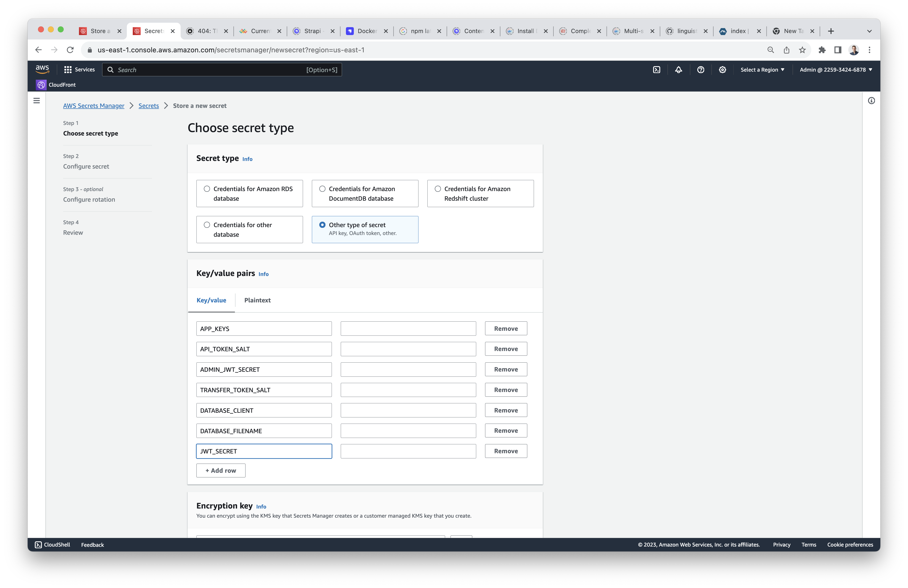

- Click Next.
- Add a name and description for your secret.
- Keep the other defaults, and click Next.
- Keep all default on the secrets rotation page (don't enable it), and click Next.
- On the review page, click Store.

# Setup ECS Service and Load Balancer

We'll run our Docker container with [Elastic Container Service](https://aws.amazon.com/ecs/) (ECS).  ECS is the principal way containers are run on AWS.

There are a few different pieces in ECS that all work together to run our container: A Cluster, a Service, a Task Definition, and a Task.

- ECS Cluster.  This tells ECS on which compute resources to run the container.  It could be EC2 virtual machines that we provision ourselves.  Or it could be AWS's Fargate service, which essentially lets AWS handle allocating the compute resources for us, without us having to worry about provisioning our own EC2 instances.
  - We'll go with Fargate for now, since its easier to get up and running.  Sadly, it's not in the free tier, so you'll need to stop your service after deploying or you'll be charged.
- ECS Service.  This is responsible for starting and stopping your containers.  You can configure how many containers you wish to run, setup scaling rules, setup networking, and more.
- Task Definition.  This is the set of instructions the Service uses for starting each container.  You can configure things like how much cpu and ram to allocate for your container, as well as setup environment variables.
- Task.  An ECS "Task" here is a single running container instance.  (A Task can have [multiple](https://docs.aws.amazon.com/AmazonECS/latest/bestpracticesguide/application.html) running Docker containers if you need to run "sidecar" tasks, but generally a task definition should have one main container with a single purpose.)

In addition, we are going to place an [Application Load Balancer](https://docs.aws.amazon.com/elasticloadbalancing/latest/application/introduction.html) (ALB) in front of our ECS Service.  The ALB will let us easily point a subdomain to our service using Route 53 (like https://api.jss.computer) and use https.  Then, we'll only allow traffic going to our container from the ALB, rather than directly.

We're mainly using the ALB here for networking purposes, but it can do much more.  As the name suggests, it can route traffic between multiple instances of your application using various strategies to handle increased usage.  It also performs health checks on our containers and will restart containers that have crashed.  Sadly, the ALB is also outside of the free tier.  While the ECS Service can be stopped without deleting it, you'd have to delete the ALB to prevent being charged.

## Create a Cluster

- Go to ECS and click Create cluster.
- Add a name, and keep the defaults, including Fargate.
- Click Create.

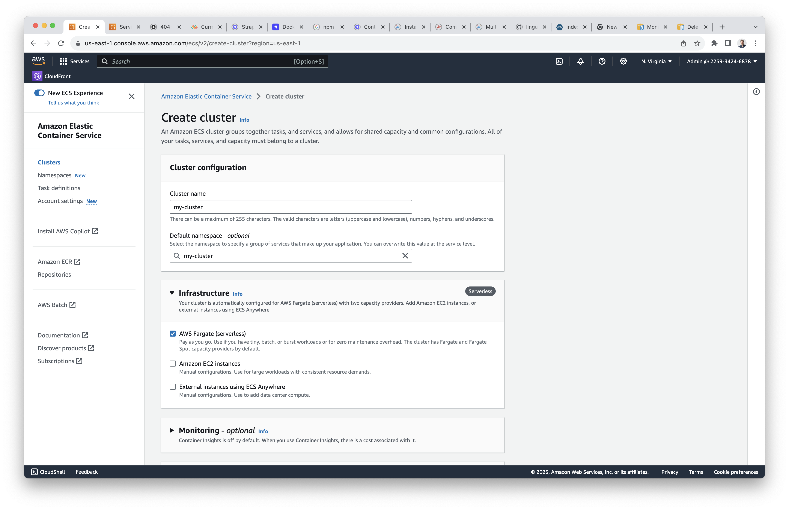

## Create a Task Definition

- On the ECS side bar, click Task Definitions, then the Create new task definition button, and choose the non-JSON option.
- Add a family name, like strapi-task-def.

### Intrastructure Requirements

- Under Infrastructure Requirements, keep Fargate.
  - Scale down the resources to the minimum, .25 vCPU and .5 GB Memory.  This is [lower](https://docs.strapi.io/dev-docs/deployment) than what the Strapi docs call for, but seems to work for our limited usage.  You could always scale it up later.
  - Don't create a Task Role.
  - Let AWS create a Task Execution Role for you.

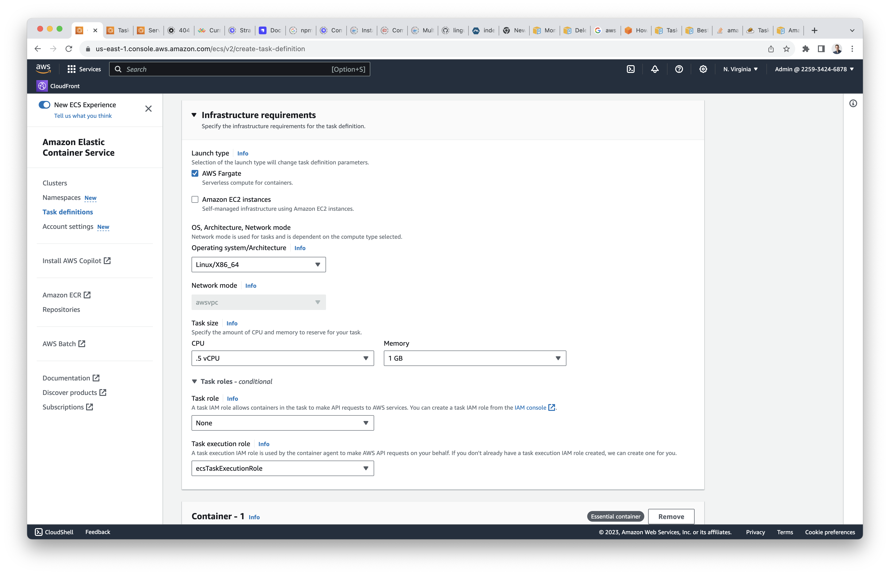

What are these roles?  The [Task Execution Role](https://docs.aws.amazon.com/AmazonECS/latest/developerguide/task_execution_IAM_role.html) is the role assumed by the ECS Service in starting the container.  It needs permissions to do things like access ECR to get your image and access Secrets Manager for environment variables.  The [Task Role](https://towardsthecloud.com/amazon-ecs-task-role-vs-execution-role), on the other hand, is the role assumed by the running task, and is used for things like uploading files to s3 buckets or accessing other AWS services.

### Container Definition

- In the container definition section, add a name for your container.
- Use the URI of the image you uploaded, which you can find in ECR.  It should look like `<your repo id>.dkr.ecr.us-east-1.amazonaws.com/strapi-test:latest`.
- Add a port mapping for 1337 on tcp, which is the port Strapi runs on.
- Match the CPU and Memory Hard and Soft limits to what you set above for the task: .5 vCPU and 1 GB.
- Keep the other defaults.

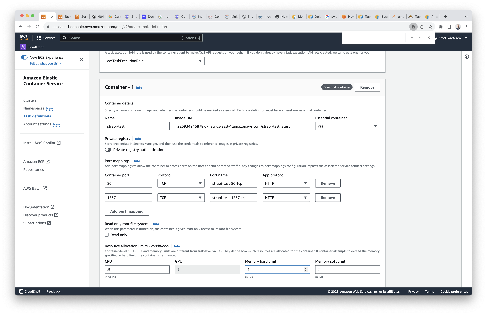

### Environment Variables

Expand the environment variables dropdown.

- Add the environment variables you added to the Secrets Manager.
- For each, choose ValueFrom.
- For each value, you need to construct a URI for the secret.  It takes [this form](https://docs.aws.amazon.com/AmazonECS/latest/developerguide/secrets-envvar-secrets-manager.html): `arn:aws:secretsmanager:region:aws_account_id:secret:secret-name:json-key:version-stage:version-id`
  - So, for the `APP_KEYS` secret, it would look like this: `arn:aws:secretsmanager:us-east-1:225934246878:secret:prod/code-along-api-W3kDvu:APP_KEYS::`.
  - This is the ARN of your Secret (which you can copy from Secrets Manager), followed by the name of the particular environment variable, followed by two colons.
  - The two colons at the end are required!  They just mean that we don't want to specify versioning information and that we want the default, [current version](https://docs.aws.amazon.com/AmazonECS/latest/developerguide/secrets-envvar-secrets-manager.html) of the secret.

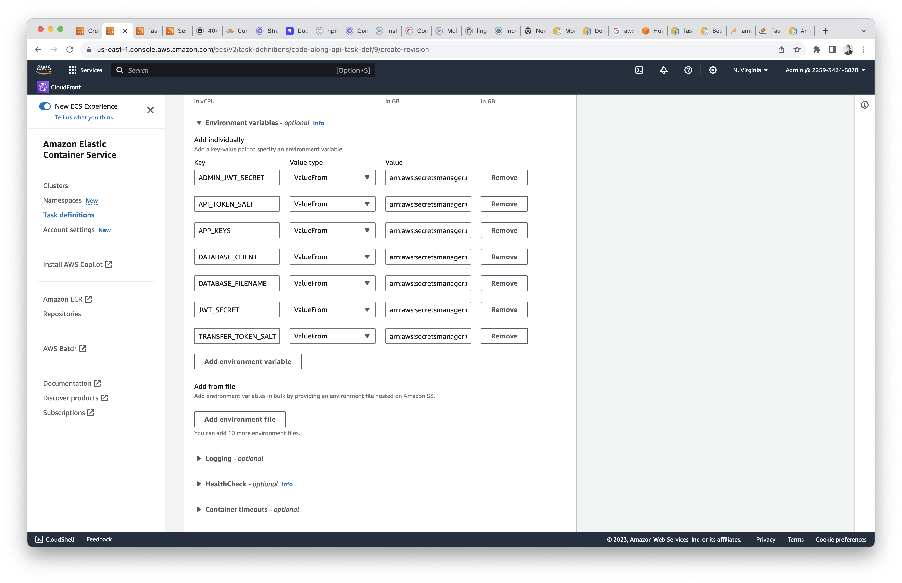

Click create!

## Allow ECS to Access Secrets

Now we need to allow the Task Execution Role, which starts our tasks, access to the secrets in Secrets Manager.

- Go to IAM.
- Go to Roles.
- Find the ecsTaskExecutionRole that AWS created for you when you created the Task Definition.
- Click Add Permissions, then Create inline policy.
- Add this policy JSON.  You'll need your Secret's ARN, which you can get from the Secrets Manager console or the CLI with `aws secretsmanager list-secrets`.

```json
{
	"Version": "2012-10-17",
	"Statement": [
		{
			"Sid": "VisualEditor0",
			"Effect": "Allow",
			"Action": "secretsmanager:GetSecretValue",
			"Resource": "arn:aws:secretsmanager:us-east-1:225934246878:secret:prod/code-along-api-W3kDvu"
		}
	]
}

```

## Create an ECS Service

We've got our Cluster to run our Service on, we've got a Task Definition that our Service can use to start our Task, and we've got our secrets set up.  Now we can create the Service itself.

- Go to your cluster, and under services, click Create.

### Environment

- In the Environment section keep all the defaults.

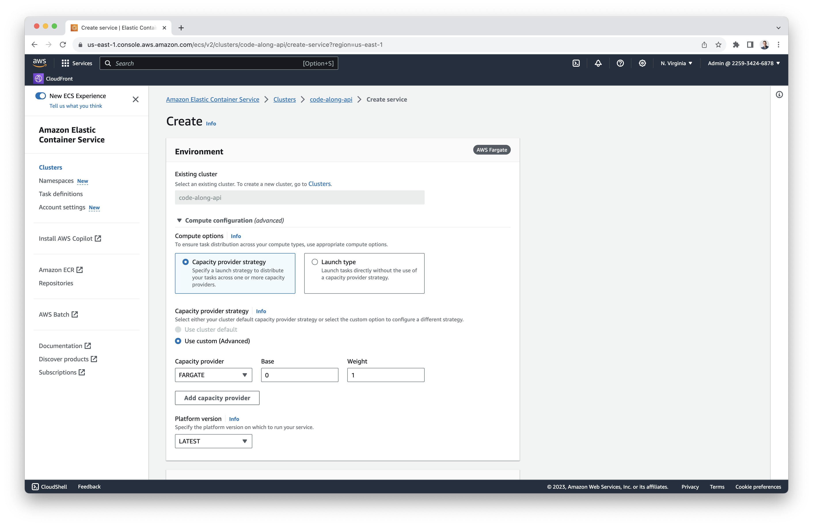

### Deployment Configuration

- In the Deployment Configuration, select the Task Definition you created from the dropdown, and choose the latest revision.
- Add a service name.
- Keep the other defaults, including keeping the desired tasks at 1.
  - If you expand the Deployment Options section, you'll see the Min and Max running tasks are set to 100% and 200% of the desired number (1).  This allows ECS to perform a [rolling update](https://docs.aws.amazon.com/AmazonECS/latest/bestpracticesguide/service-options.html) when new code is deployed: it first spins up a new container, verifies that it is healthy, then stops the old container.


### Networking

In this section, we setup networking rules for our service.  There are a number of new concepts in this section.

#### VPC

VPC stands for "[Virtual Private Cloud](https://docs.aws.amazon.com/vpc/latest/userguide/what-is-amazon-vpc.html)," which is an isolated set of cloud resources in a virtual network.  Every AWS account comes with a default VPC, which we'll use here.  You can setup additional VPCs if you need [additional isolation](https://stackoverflow.com/questions/66115482/when-should-i-create-different-vpcs-and-not-just-different-subnets) (something you might do for multiple environments in a production application, for example).  Think of them as a private network for your AWS resources.

Most of the frontend resources we created are not in your VPC, which makes sense given that these services are designed to be publicly available (CloudFront, public DNS Service, public Certificate Authority, etc.).  The same is true of the AWS services we've used where you don't control the underlying compute resources, like [ECR](https://docs.aws.amazon.com/AmazonECR/latest/userguide/vpc-endpoints.html), [Secrets Manager](https://aws.amazon.com/blogs/security/how-to-connect-to-aws-secrets-manager-service-within-a-virtual-private-cloud/), and [s3](https://stackoverflow.com/questions/52093540/s3-buckets-are-not-residing-in-vpcs).

In contrast, our server-side code and associated resources are within our VPC (ECS Service and ALB).  This gives us control over networking and how and whether to expose them to incoming traffic.

#### Subnets and Availability Zones

Within each AWS Region, there are sub-regions called [availability zones](https://docs.aws.amazon.com/whitepapers/latest/get-started-documentdb/aws-regions-and-availability-zones.html), which are geographic groupings of physical data centers.

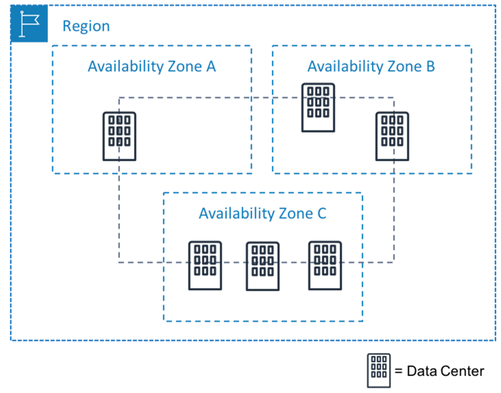

Within your VPC, you have access to a number of "[subnets](https://docs.aws.amazon.com/vpc/latest/userguide/configure-subnets.html)," which each reside in a single availability zones.  Thus, subnets are subdivisions of your VPC that are located in the various availability zones in your AWS region.

Subnets can be made public by assigning public IPs to resources in them and allowing public Internet traffic.  You might do this if, for instance, you were hosing a web application (such as a Next server for SSR).  You can also keep subnets private for additional security for services like Databases.  You don't assign public IPs to resources in private subnets, and only allow access to those resources from other subnets within your VPC.

Here's an example diagram from the [AWS docs on VPCs and Subnets](https://docs.aws.amazon.com/vpc/latest/userguide/vpc-example-web-database-servers.html) showing such a setup with a web server in public subnets and a database in private subnets across two availabilty zones.

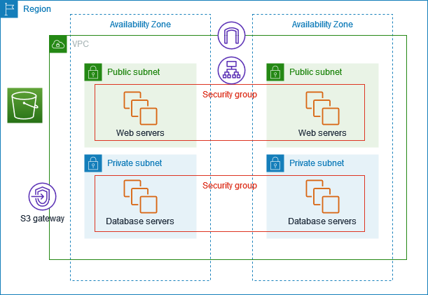

#### Security Groups

[Security Groups](https://docs.aws.amazon.com/vpc/latest/userguide/vpc-security-groups.html) function like network firewalls for resources in your VPC.  They permit or deny network traffic from certain sources to resources in the group on certain ports.  Here, for instance, we want to allow incoming traffic on port 1337 to our Strapi app, and block all other ports.  For the permitted traffic source, we can specify specific IPs, IP ranges, or other Security Groups.

The ability to link together two Security Groups will allow us to require incoming traffic to flow through our load balancer.  The ECS Service's Security group will permit incoming traffic on port 1337 only from the load balancer's Security Group.

#### Setup

Now that we have a better understanding of these AWS networking concepts, let's setup networking for our ECS Service.

- Keep the default VPC and subnets selected.
- Choose Create a new Security Group for our ECS service.
  - Add an inbound rule: Custom TCP on port 1337 from anywhere. We'll update this shortly to restrict access to only our load balancer.
- Keep the Public IP turned on.  We'll limit access later using a second Security Group for our load balancer.
  - Turning off the Public IP would be more secure, but would add a lot of complexity and cost.  We could use [Private VPC endpoints](https://docs.aws.amazon.com/whitepapers/latest/aws-privatelink/what-are-vpc-endpoints.html) to route traffic between our ECS Service and other AWS services without using the public Internet, but they would take more work to setup and they're not free.
  - Here, we'll settle for restricting all public access with Security Group, even though a public IP is assigned.

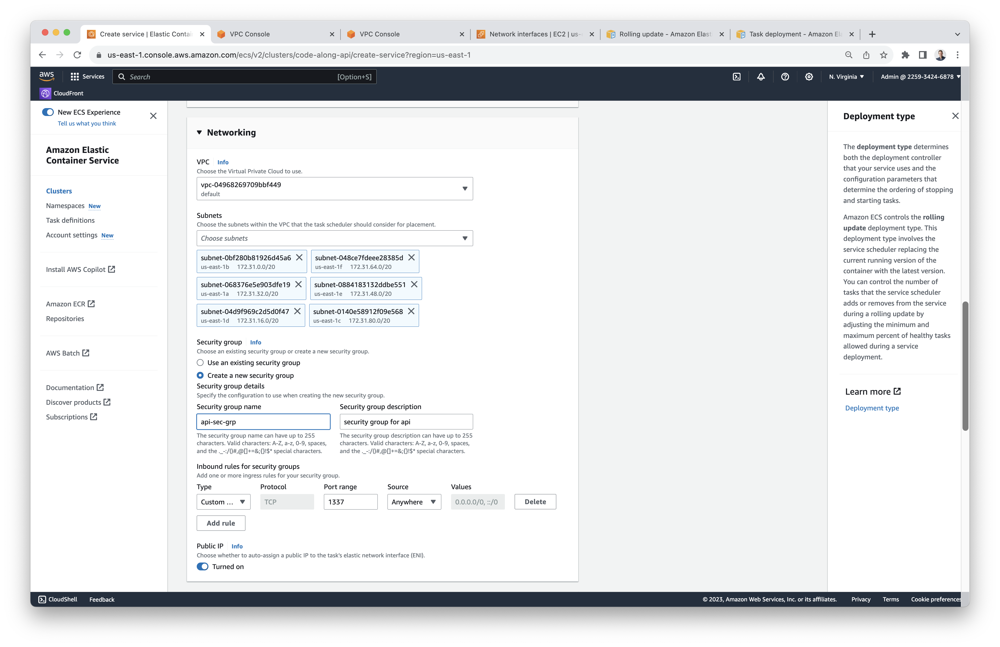

### Load Balancing

Expand the Load balancing section and add a load balancer, which we'll use for routing.

- Choose Application Load Balancer.
- Add a name.
- Increase the health check grace period to 60 seconds or more.
- Under Container, choose your container on port 1337.
- Create a new listener on Port 443 for HTTPS (the default HTTPS port).  Choose your existing ACM certificate.  This will allow incoming public HTTPS traffic to our load balancer.
- Under Target Group, create a new Target Group.
  - Add a name.
  - Keep the healthcheck protocols as HTTP.  We’ll use HTTP internally so we don’t need more certs.
  -  Update the healthcheck path to be Strapi's healthcheck path, `/_health`.
-  Click Create.

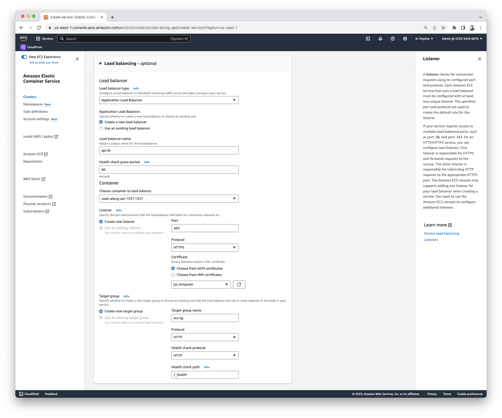

A "[Target Group](https://docs.aws.amazon.com/elasticloadbalancing/latest/application/load-balancer-target-groups.html)" is a group of resources to which the Load Balancer will route traffic (for instance, multiple EC2 Virtual Machines).  It will "balance" the load between the targets in the Target Group using various algorithms (round-robin by default).  With ECS, [multiple tasks](https://docs.aws.amazon.com/AmazonECS/latest/userguide/create-application-load-balancer.html) can be added to the Target Group, and the Load Balancer can then balance the load of incoming traffic between the tasks.  But here, we're only using 1 task and just using the ALB for routing purposes.

Load balancers perform health checks on the target group, regularly pinging the designated endpoint to ensure the target is still up.  If the healthcheck is misconfigured, it will lead to the Load Balancer repeatedly stopping and restarting your ECS service.

## Update Healthcheck settings

We need to update our healthcheck settings because the ALB is expecting a code 200 response, but Strapi sends an empty [204](https://www.webfx.com/web-development/glossary/http-status-codes/what-is-a-204-status-code/#:~:text=A%20204%20status%20code%20is%20used%20when%20the%20server%20successfully,such%20as%20a%20DELETE%20request.) response instead

- Go to EC2, where we'll manage our Load Balancer and Security Groups.
- Click Target Groups on the left-hand side.
- Select your Target Group.
- Select the Health checks tab, and click Edit.
- Expand the Advanced health check settings dropdown.
- Under Success codes, use the range 200-204, and click Save.

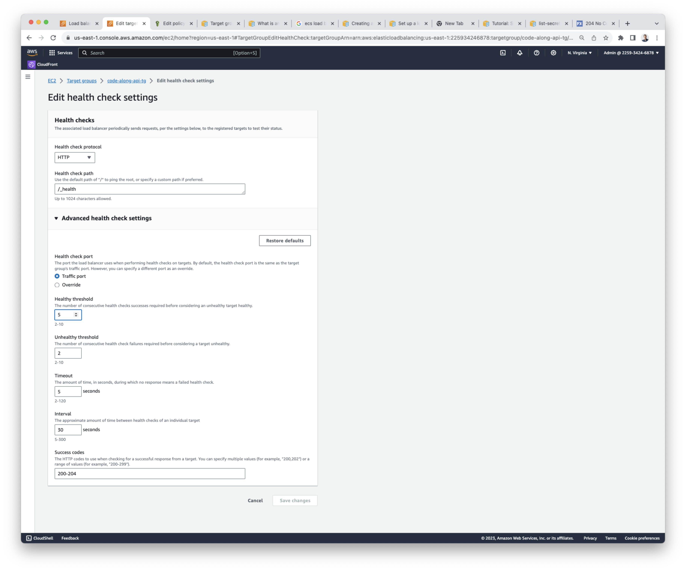

## Restrict Public Access to ECS Service

Next, let's require traffic to flow through the Load Balancer.

### Create Load Balancer Security Group

- Still in EC2, select Security Groups on the left-hand side, and click the Create Security Group button.
- Create an inbound rule allowing HTTPS traffic from a source of Anywhere-IPv4.
- Create a second inbound rule allowing HTTPS traffic from a source of Anywhere-IPv6.
- Leave the default Outbound rule in place, allowing all outbound traffic.
- Click Create Security Group.

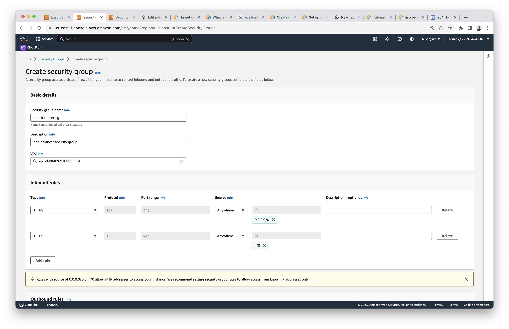

There are a couple new concepts in this section as well:

#### IPv4 vs. IPv6

[IPv4](https://levelup.gitconnected.com/how-to-tell-if-you-are-on-ipv4-or-ipv6-1f33d8a1bf06) is the older version of the IP protocol created in the 1980s, which most of the Internet still uses.  IPv6 is newer and was created to allow for many more IP numbers as the Internet grows. About [55% of Internet traffic](https://www.google.com/intl/en/ipv6/statistics.html) to Google was still on IPv4 as of late 2023. IPv6 isn't backwards compatible, so you need separate inbound rules for each protocol.

#### CIDR Blocks

[CIDR (Classless Inter-Domain Routing) Block notation](https://aws.amazon.com/what-is/cidr/) is used in AWS security groups for [matching IP address ranges](https://community.canvaslms.com/t5/Canvas-Resource-Documents/IP-Filtering-in-Canvas/ta-p/387089).  When you select a source of Anywhere-IPv4, AWS adds the IPv4 CIDR block for all IP addresses: `0.0.0.0/0`.  When you select a source of Anywhere-IPv6, AWS adds the IPv6 CIDR block for all IP addresses: `::/0`.  So here, we're matching all IP addresses for our inbound rules.

### Attach Security Group to Load Balancer

- Next, still within EC2, go to Load Balancers, and select you Load Balancer.
- Go to the Security Tab, and Click Edit.
- Attach the Security Group you just created to the Load Balancer.

### Update ECS Security Group

- Go back to Security Groups in EC2.
- Now, you should see 3 groups: the default VPC group, the Load Balancer's Security Group we just created, and the ECS Service's Security Group.
- Select the ECS Service's Security Group.
- Edit the inbound rule on 1337.  Choose a custom source, then choose the Load Balancer's Security Group.
- Click Save rules.

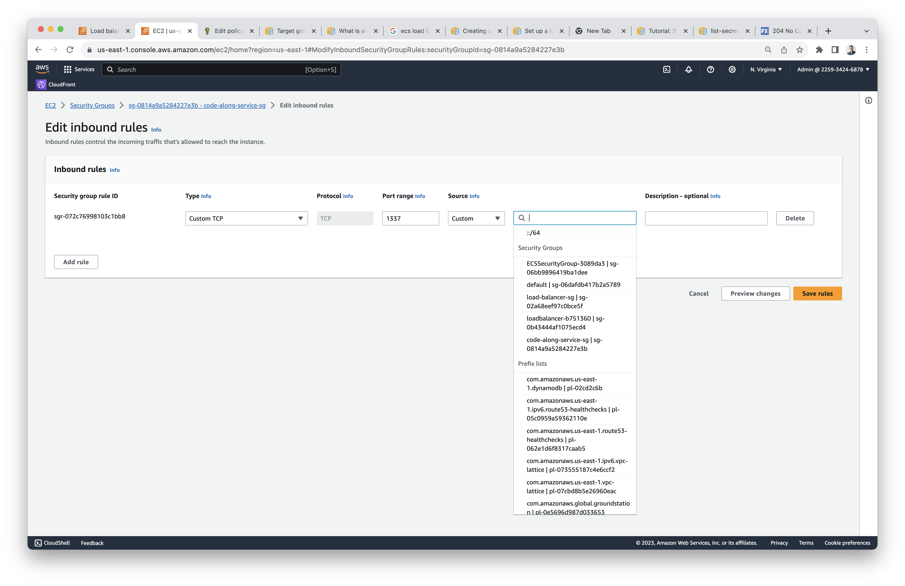

- Verify that you can't reach Strapi directly on its public IP.  To to ECS -> your Cluster -> your Service -> Tasks tab -> your Task -> Public IP on port 1337.

# Setup DNS and SSL


# Setup Backend CI/CD


